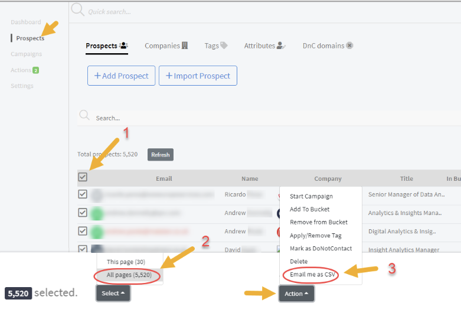
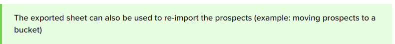
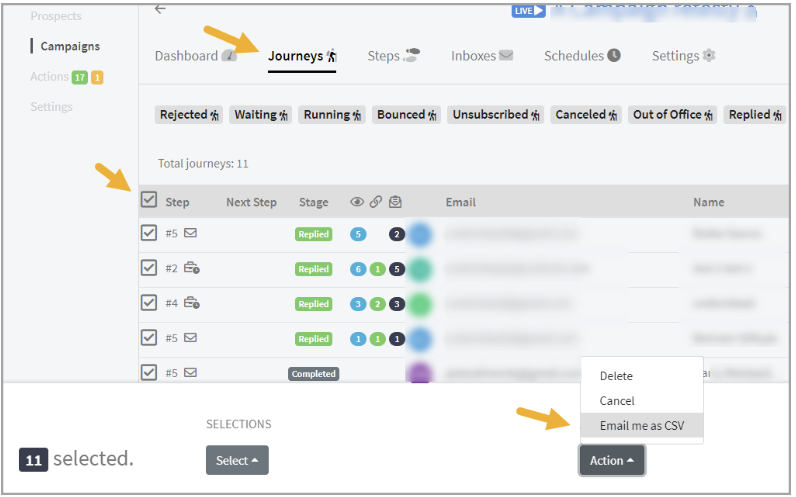

# Exporting Prospects and Journeys

**

## Exporting Prospects:

Prospects can be exported to a .csv on the Prospects list page.

To export all prospects in the account, select all the prospects on the list and hit the Action "Email me as CSV"

Depending on how many prospects are exported, the export process can take some time to complete.

You can also export prospects that have been filtered.

To download the .csv, just click the link in the email and it should download the .zip file that contains the csv list.

The exported sheet will contain the basic information about the prospects.

## Exporting Journeys

Exporting journeys from campaigns provide you with the list of prospects currently running a specific campaign and a detailed record of the prospects' activity in the campaign.

To export Journeys, view the campaign you want to export from -> go to Journeys -> Select the journeys you want to export -> Email me as csv.

To download the exported file, just click the link in the email and it should download the .zip file that contains the csv list.
