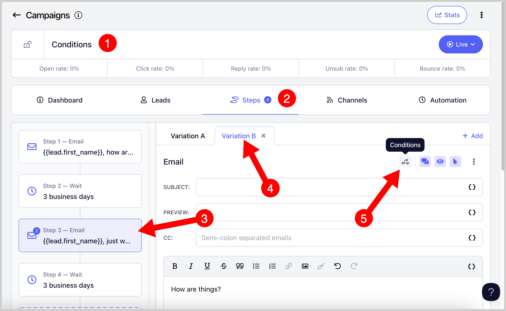
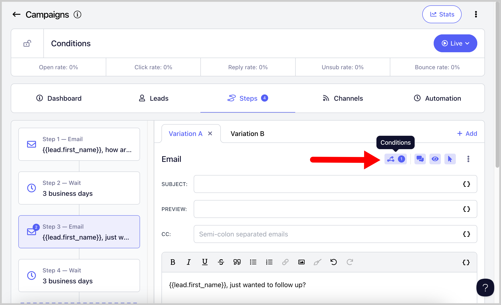
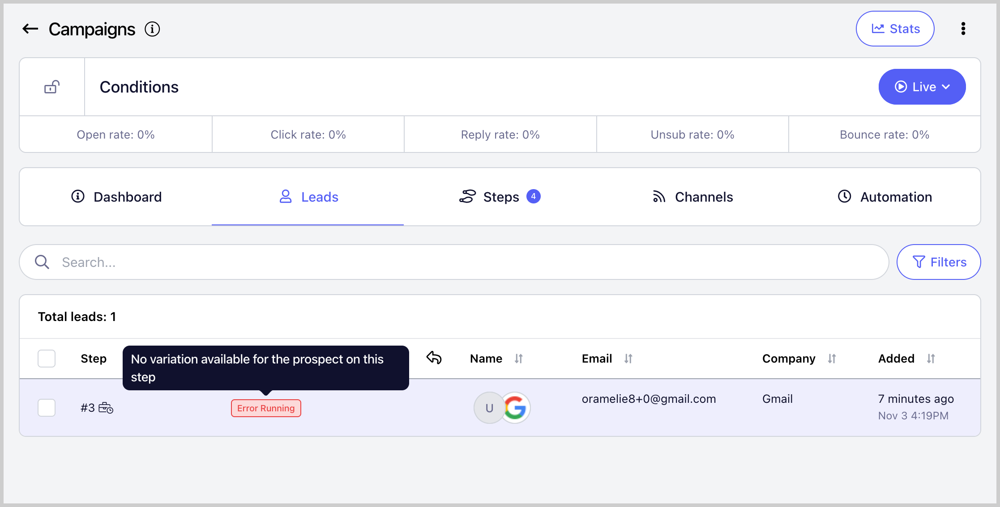

# Sending Email Variations Based on Conditions

**In this article: **

- Why use Conditions?

- What are the Conditions available?

- How to add a Condition?

- What happens when a lead doesn’t meet the Conditions?

**Important:** Conditions are currently available only in the Pro/Growth and Expert/Agency plans.

## Why use Conditions?

Conditions help you send the right email to each prospect based on specific criteria they meet or stop a lead’s progress in a campaign if they don’t meet certain criteria.

By using conditions, you can control which email variation a lead receives when they move to a step in a campaign.

## What are the Conditions available?

At the moment, users can add Conditions based on:

- Minimum number of clicks

- URL clicked

- Minimum number of opens

- Tags

## How to add a Condition?

Conditions must be configured individually for each step in a campaign.

To do this, go to your campaign → Steps tab → click on your preferred step → select your preferred email variation (if there are multiple) → click the Conditions icon

**Pro-tip**: Avoid adding conditions based on clicks or opens to the first step. Since no emails have been sent to the lead yet, they won’t be able to meet those conditions.

Select the type of Condition you want to apply to the email step or variation → Review the overview panel on the right → Click Save. You can set conditions based on Tags, Opens, and Clicks.

Once conditions are added to a step, the Conditions icon will turn blue and display a number beside it, indicating how many conditions have been added.

## What happens when a lead doesn’t meet the Conditions?

Campaigns in QuickMail work in a linear way. The lead's campaign progress will stop if they don’t meet a certain condition, and their status will appear as *Error Running*.

This happens because their progress doesn’t have a specific variation or step to move forward to.

If you don’t want a lead’s progress to stop, create multiple email variations that cover both positive and negative outcomes.

For example, if one variation is set for the condition *“never clicked a link,”* there should also be another variation for *“clicked a link at least once.”*

Otherwise, leads that don’t meet any of the specified conditions will not be able to continue through the campaign and will run into an error.

Meanwhile, if a lead runs into an error and you still want the campaign to continue sending emails to that lead, you’ll need to create an email variation that allows the lead to pass the condition that caused the error. Once that’s done, you can resume the lead and the campaign will continue from where it left off.

Technically, leads that have encountered an error or have already completed the campaign are considered stopped, so they will not automatically receive any newly added email steps. Only leads that are currently in a running status will continue into additional steps added to the campaign.
