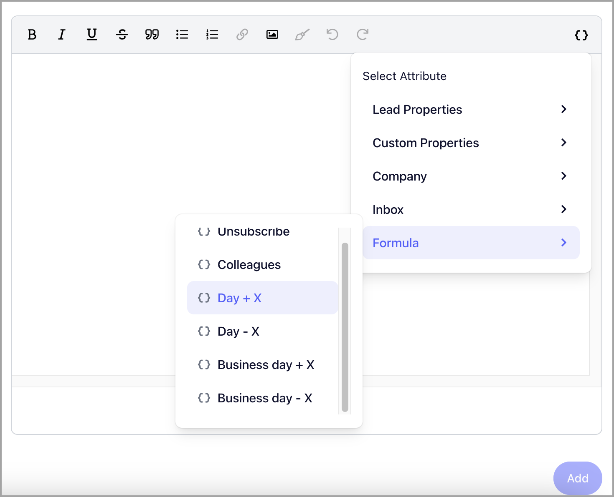

# Days of the Week Attributes

**

The `{{=day+0}}` and `{{=bday+0}}` attributes let you include a specific day of the week in your email body or subject line based on the date the email is sent, adding real-time relevance to your messages.

**Note: **Offsets can also be added to transform to a specific day of the week after a certain number of days the email was sent.

- ## {{=day+0}}

The `{{=day+0}}` attribute can be used to mention the current day of the week in the email body or subject line.

For example, you send the email:

How are you this fine '{{=day+0}}

If the email was sent out on Monday, it will transform to:

How are you this fine Monday?

- ## {{=bday+0}}

The '`{{=bday+0}}`' on the other hand, transforms to the current business day.

Business days are currently defined as weekdays (all the days of the week except for Saturdays and Sundays).

For example, the email contains:

Can we set a meeting on '{{=bday+2}}?'

If the email was sent on a Thursday, it will transform to:

Can we set a meeting on Monday?

This is because Saturday and Sunday will be skipped.
