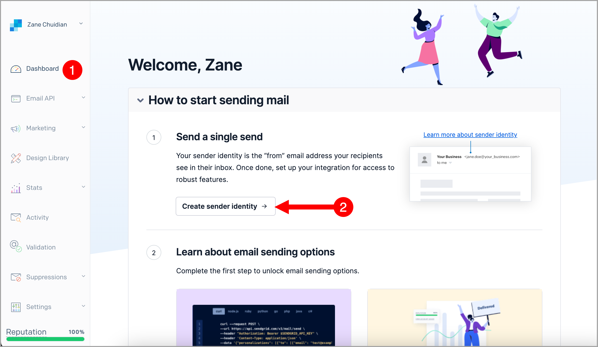
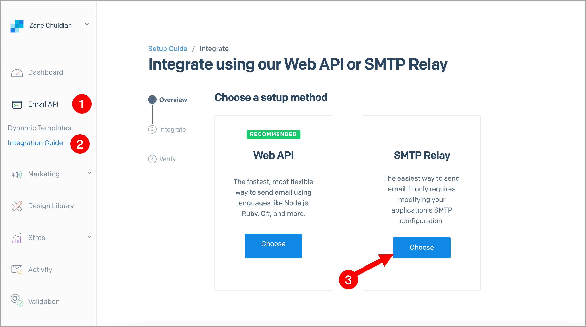
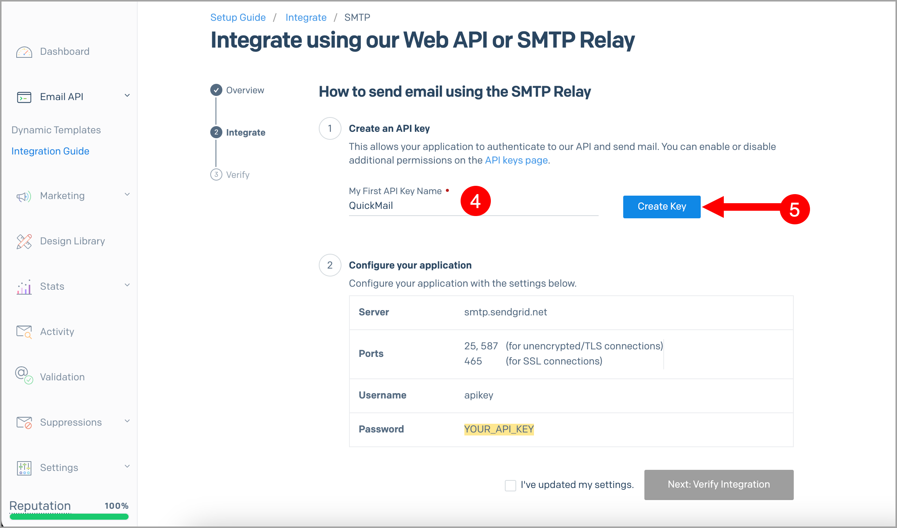
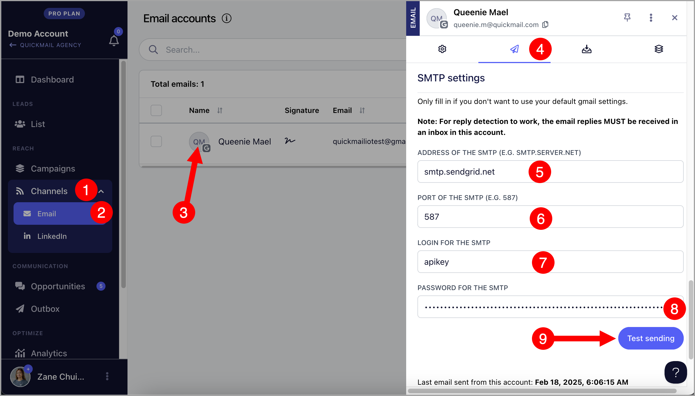
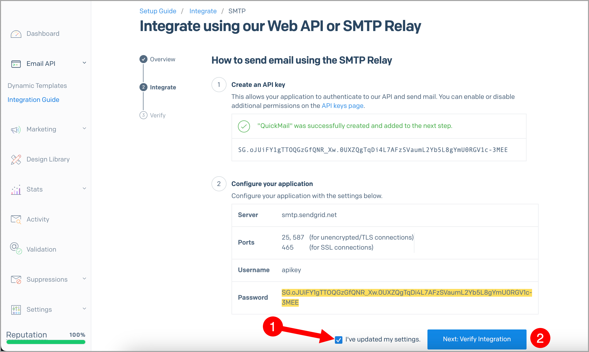
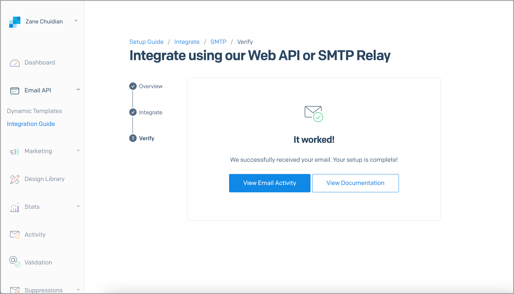

# Sending with SendGrid's SMTP

Using a custom SMTP like SendGrid with QuickMail lets you send emails without relying on your email account's default sending service. This means you can send a higher volume of emails while reducing the risk of being flagged by your email provider.

<<<<<<< HEAD
**Important:** Using Custom SMTP has Pros and Cons. If you'd like to know more, check out this guide: Should I use Custom SMTP?

=======
>>>>>>> 910cb1ed6f6b830f8f43f3328efbcb5b359da688
## How to use QuickMail with SendGrid's SMTP?

**Step 1**. Log in to your SendGrid account → Dashboard → Create sender identity

**Step 2.** Fill in the details needed to create a sender

**Step 3.** After creating a sender, check your inbox for an email from **no-reply@sendgrid.com** and verify the single sender through that email.

You'll be directed to this page in SendGrid once verified.

**Step 4.** Once sender is verified, go to SendGrid → Email API → click Integration Guide → choose SMTP relay.

**Step 5**. Next, generate the API key by adding the API Key Name → Create Key

This is how it should look after generating the API key.

**Step 6.** Copy the SMTP configuration from SendGrid

**Step 7.** Go to your QuickMail account → Channels → Emails → Click on the email account where you'd like to use SendGrid's SMTP → Sending tab → Fill in the SMTP details → Test Sending

**Step 8.** If the configuration is correct in QuickMail, click I've updated my settings and Verify Integration in SendGrid.

**Step 9.** Click 'Verify Integration' to send a test email

If the test email worked, you'll see a message saying it worked.

## Forwarding Bounced Emails from SendGrid

By default, SendGrid does not send bounce reports to the sender's inbox. This means follow-ups may still be sent to bounced leads in QuickMail, which isn't ideal as repeated bounces can negatively affect your sender reputation.

To prevent this, bounce forwarding must be set up in SendGrid so QuickMail can detect bounces and stop follow-ups to those prospects:

While logged in to the SendGrid account, go to Settings → Mail Settings → Forward Bounce Messages

Select 'Use the From address of the outgoing email' or 'Specify email address' if you'd like to send the bounced emails to a different email → Toglle 'Enabled' → Save

## White-labeling your domain

Authenticating the emails sent out from SendGrid will help with email deliverability.

Setting up SPF and DKIM records in the domain's control panel will improve email deliverability and will remove the "via SendGrid" text in the emails sent out from SendGrid's SMTP.

More information on how to set up SPF and DKIM records here: https://sendgrid.com/docs/ui/account-and-settings/how-to-set-up-domain-authentication/

<!-- images-start -->
## Screenshots

<!-- images-end -->
