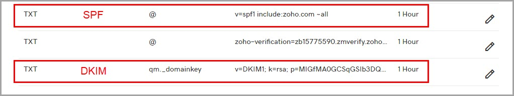
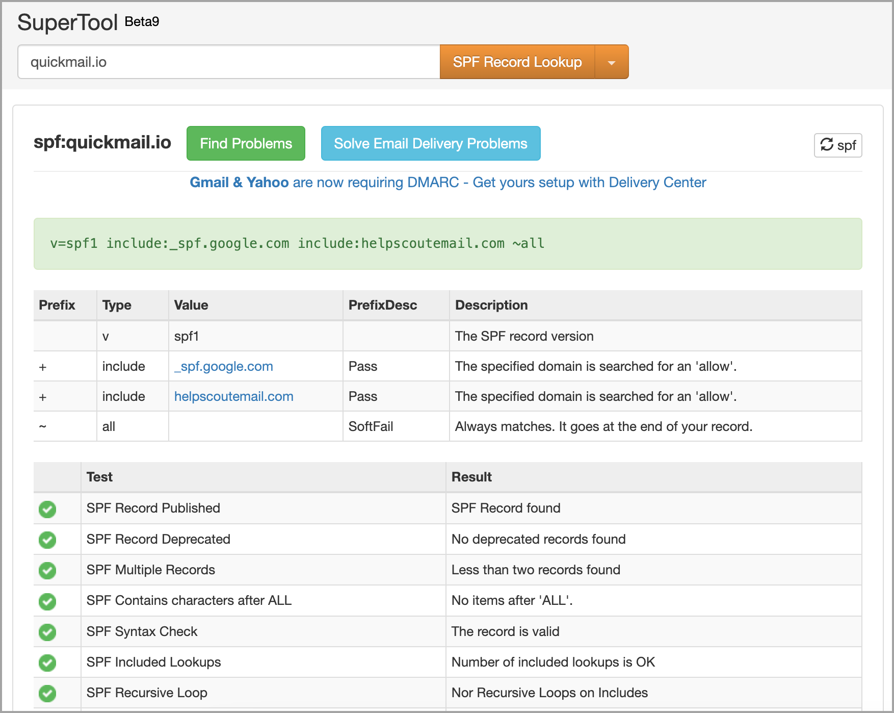

# Adding SPF, DKIM, and DMARC Records

**Important:** We don't have our own IP address or servers for sending emails. Instead, we send emails directly from your inbox. As a result, there are no QuickMail-specific records to add to your domain's DNS. The records you need to use should come from your email service provider (e.g., Google, Outlook, etc.).

## SPF, DKIM, and DMARC records - What are they for?

Setting up SPF and DKIM records is crucial for good email deliverability. Good deliverability means your emails are more likely to land in the recipient's inbox rather than their spam or promotional folder.

**SPF**, **DKIM**, and **DMARC** are standard authentication methods used to fight spam and other malicious email practices. These records are added to your domain's DNS to help email providers verify that the emails are sent by the domain owner.

- **SPF (Sender Policy Framework)**: This is an email validation record added to the DNS as a text record to confirm that the emails sent from your email service are authorized by the domain owner.
- **DKIM (DomainKeys Identified Mail)**: This method links a domain name to an email message, allowing the sender to claim responsibility for it.
- **DMARC (Domain-based Message Authentication, Reporting, and Conformance)**: DMARC tells ISPs how to handle emails that spoof your domain, such as quarantining or blocking them.

## **How to Add SPF, DKIM, and DMARC Records?**

The process for adding records to your DNS may vary based on your email provider and domain host. Here's how to do it for different services:

- **For Outlook**:
  * SPF for Outlook
  * DKIM for Outlook
  * DMARC for Outlook
- **For GSuite**:
  * SPF for GSuite
  * DKIM for GSuite
  * DMARC for GSuite
- **For Custom Inboxes or Custom SMTP**: Check your email service provider's help page, such as:
  * SPF for Zoho
  * DKIM for Zoho
  * DMARC for Zoho

The records are added to the DNS records as TXT records.

## How to check your SPF, DKIM, and DMARC records?

The simplest way to check the records is by using a DNS lookup tool like [MXToolbox](https://mxtoolbox.com/) and [UltraTools](https://www.ultratools.com/tools/dnsLookup).

You can also check the records by checking the emails sent from the email account with [Spamtester](https://spamtester.ai/).

<!-- images-start -->
## Screenshots

<!-- images-end -->
