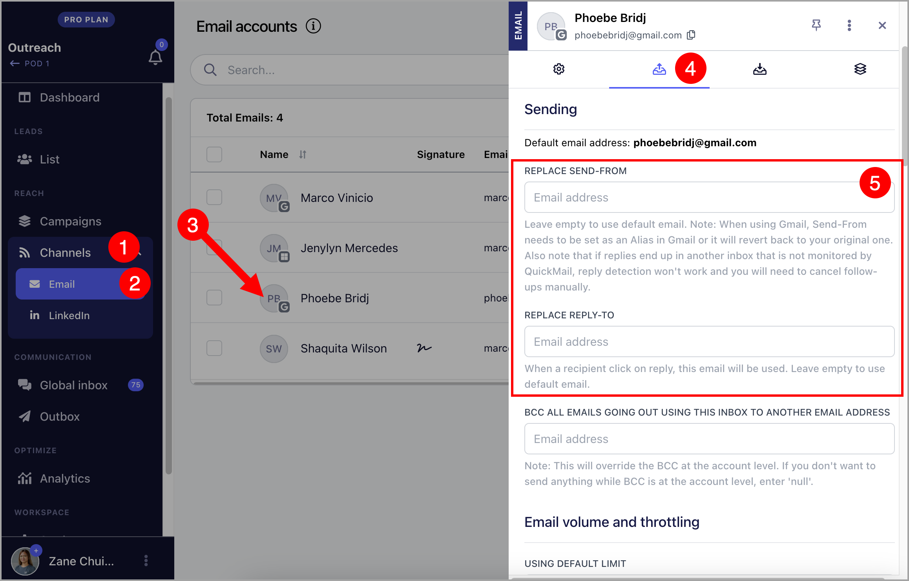
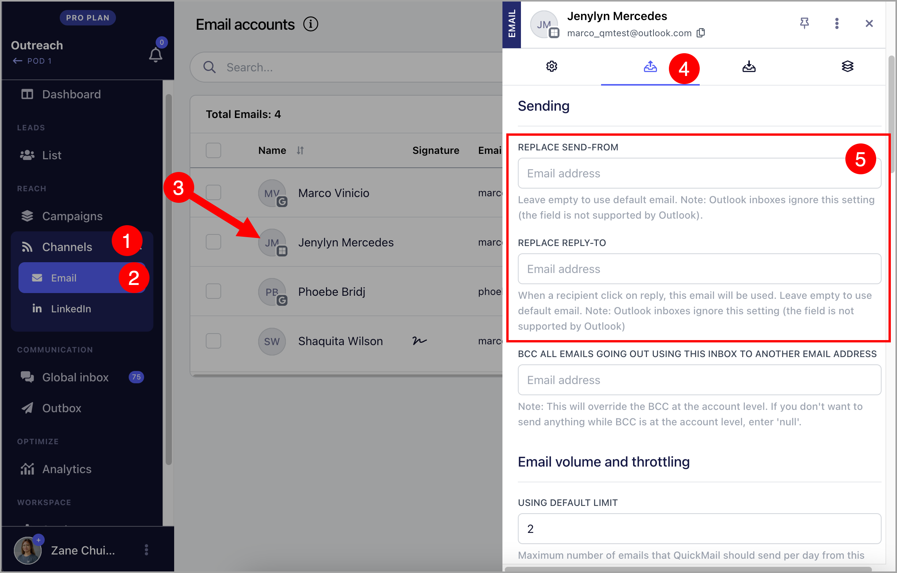

# Setting up an email alias (Replace Sent-From&Reply-to)

**

In this article:

- [Why set up an alias?](#Why-set-up-an-alias-Shw7V)

- [How to use an alias with a Gmail inbox?](#How-to-use-an-alias-vA2Cl)

- [How to use an alias with a Microsoft inbox?](#How-to-use-an-alias-with-a-Microsoft-Inbox-F6Fcd)

- [How to use an alias with a Custom inbox?](#How-to-use-an-alias-with-a-Zoho-Inbox--0psuZ)

## Why set up an alias?

Setting up an alias allows users to send emails from or receive a reply to a different address. It can serve as a disguise and help you sort your emails easily.

## Can I add an alias email account as a seprate sender?

No, it's not possible to add an alias email account (or an email account without their own login or license) as a seprate sender.

**Note: **Changing the send-from & reply-to email address may cause replies to not get detected in QuickMail. So it's best to add the send-from & reply-to email address in QuickMail so we can also scan that email account for replies.

## How to use an alias with a Gmail inbox?

1. Set up an alias directly in your Gmail account. Here’s a [guide](https://support.google.com/mail/answer/22370?hl=en) on how to set up an alias in Gmail.

**Note: **If you would like to use a secondary domain in your Google Workspace as an alias, it must set it up as an alias in Gmail too.

2. After setting up an alias in Gmail, go to your QuickMail account → Channels → Emails → Click on an email account → Sending Tab → Add your preferred email under "Send-From" or "Reply-To"

## How to use an alias with a Microsoft Inbox?

1. Set up an alias directly in your Microsoft account. Here’s a [guide](https://support.microsoft.com/en-us/office/add-or-remove-an-email-alias-in-outlook-com-459b1989-356d-40fa-a689-8f285b13f1f2) on how to set up an alias in Microsoft.

- After setting up an alias in Gmail, go to your QuickMail account → Channels → Emails → Click on an email account → Sending Tab → Add your preferred email under "Send-From" or "Reply-To"

## How to use an alias with a Custom Inbox?

1. Set up an alias directly in your email account. Here’s a list of guides for custom inboxes that are usually added in QuickMail.

- [Zoho Mail](https://www.zoho.com/mail/how-to/create-email-alias.html) (Make sure to setup the email address as sent from email address in Zoho)

- [Amazon Workmail](https://docs.aws.amazon.com/workmail/latest/userguide/email-messages.html#send_alias)

- [FastMail](https://www.fastmail.help/hc/en-us/articles/360060591073-How-to-set-up-aliases)

2. After setting up an alias in your email account, go to your QuickMail account → Channels → Emails → Click on an email account → Sending Tab → Add your preferred email under "Send-From" or "Reply-To"

