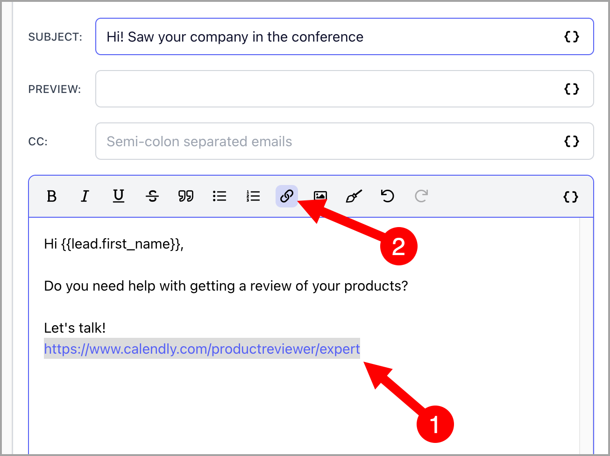
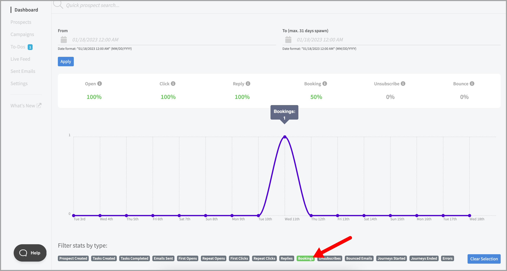

# Integrating Calendly with QuickMail

**

## What is Calendly integration for?

Calendly integration allows you to track the leads who booked in your Calendly link.

## How to Use Calendly in QuickMail?

To set up a Calendly integration in QuickMail, simply paste your Calendly link on an email step and then add a hyperlink.

**Note: **The email address associated with the Calendly link must be added as an inbox in QuickMail. Otherwise, bookings won't be detected.

**Note: **When a lead books a call from your Calendly link, the lead status in the campaign will be marked as 'Booked'. This will stop follow-up emails from being sent to the lead.

## How to Track the Number of Bookings?

The number of total bookings can be found in the Dashboard.

To see the number of bookings for a specific period, simply use the 'Booked' filter in the Dashboard.

