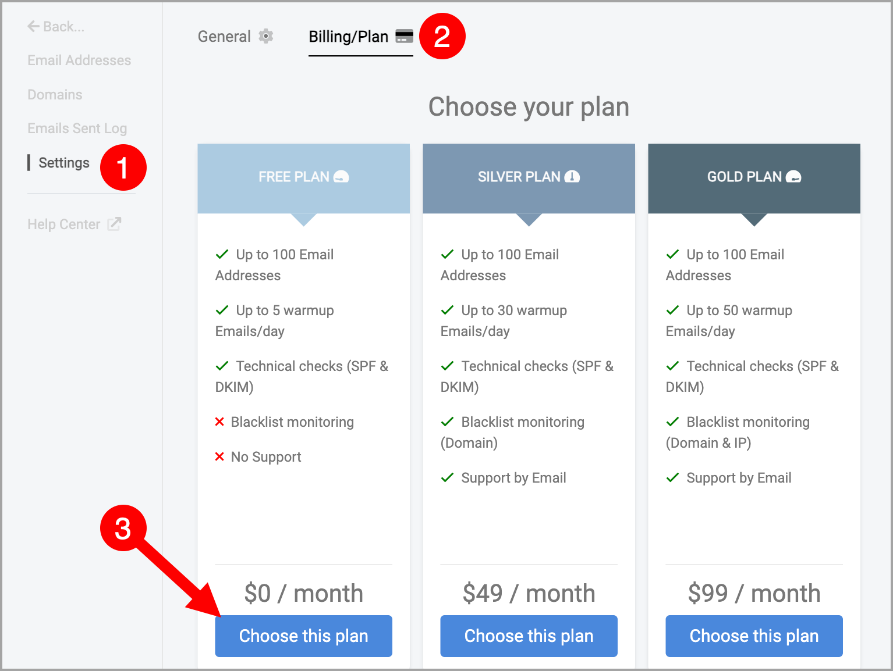

# Auto-Warmer for Non-QuickMail Inboxes 🔥

**
**

QuickMail’s built-in Auto-Warmer is currently only available for Google inboxes purchased directly through QuickMail.**

If you're using external inboxes or custom email accounts, you can still warm them up using [Mailflow.io](https://www.mailflow.io/)at no additional cost as part of your QuickMail subscription.

## Getting Started

Mailflow provides a step-by-step guide to help you set up inbox warming: [Quick Setup Guide](https://help.mailflow.io/article/428-getting-started)

## Daily Warm-Up Limits

By default, the Mailflow Free Plan allows up to:

- **5 warm-up emails per day per inbox**

If you have a paid QuickMail subscription, you can request higher limits by sending an email to [support@maillfow.io](mailto:support@maillfow.io) once a Mailflow account is created:

- **30 daily warm-up emails** — Basic / Starter Plan

- **40 daily warm-up emails** — Pro Plan

- **50 daily warm-up emails** — Expert / Agency Plan

New Mailflow accounts automatically start with a **14-day trial**. To keep your warm-up running after the trial ends, make sure to subscribe to Mailflow’s **Free Plan**.

## Helpful Docs:

- [Adding Google inboxes to Mailflow](https://help.mailflow.io/article/410-adding-google-inboxes)

- [Adding Outlook inboxes to Mailflow](https://help.mailflow.io/article/411-adding-outlook-inboxes)

- [Adding Custom inboxes to Mailflow](https://help.mailflow.io/article/412-adding-custom-inboxes)

- [Mailflow Error - Can't send emails](https://help.mailflow.io/article/418-error-cant-send-emails)

- [Mailflow Error - Can't receive emails](https://help.mailflow.io/article/415-error-cant-receive-emails)

- [Mailflow Error - SPF not specified](https://help.mailflow.io/article/421-error-spf-not-specified)
