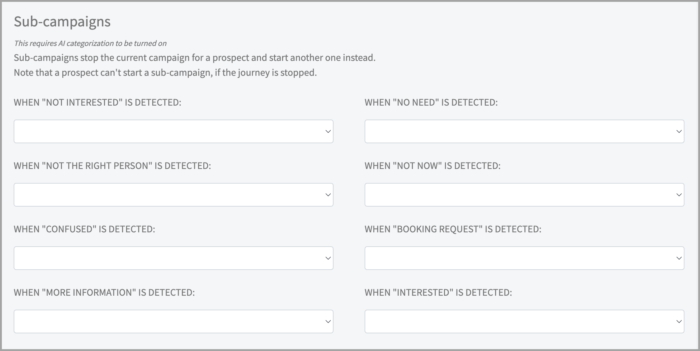
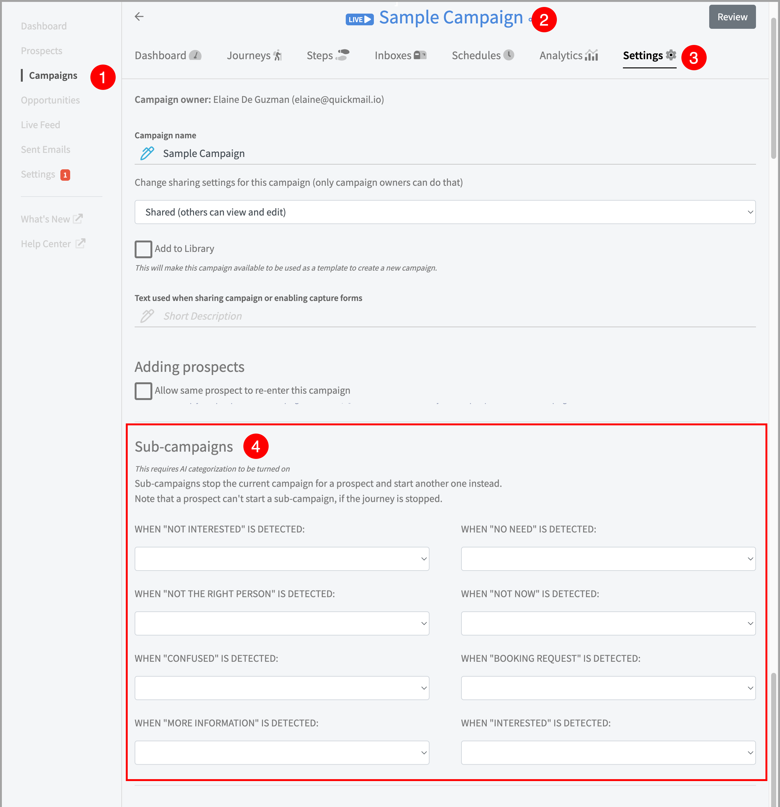

# Sub-Campaigns for All Replies

**
**

Sub-campaigns allow users to automatically send follow-up emails based on their replies. This saves tons of time answering commonly received emails.

In this article:**

- [How do sub-campaigns for all reply types work?](#How-do-sub-campaigns-for-all-replies-work-YLGJV)

- [How to use sub-campaigns?](#How-to-use-sub-campaigns--yDwe)

## How do sub-campaigns for all reply types work?

Prospects are added automatically to sub-campaigns when replies in opportunities are categorized, either manually or by using AI and their journey will be marked as 'Replied' in the parent campaign.

Different sub-campaigns can be triggered depending on the prospect's reply category. Here are the available reply categories at the moment:

- Not interested

- Not the right person

- Confused

- More information

- No need

- Not now

- Booking request

- Interested

# How to use sub-campaigns?

Subcampaigns require using Opportunities and AI reply categorization. If your account is still using To-Dos, and sub-campaigns are greyed out, send us an email at [support@quickmail.io](mailto:support@quickmail.io).

- Create a parent campaign and sub-campaign, and make sure they are Live.

- To assign a sub-campaign to the parent campaign, from Campaigns → Open the parent campaign → Settings → Scroll down to Sub-Campaigns → Assign the desired sub-campaigns

