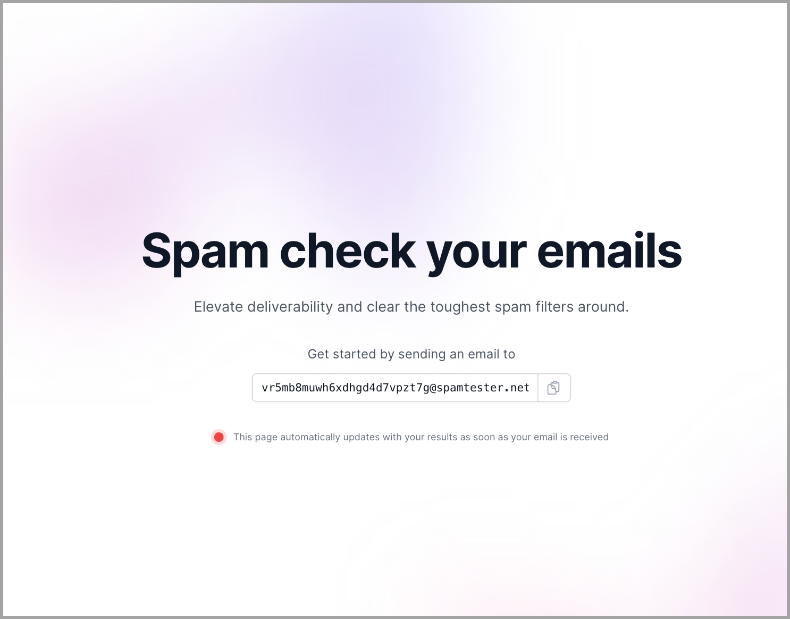
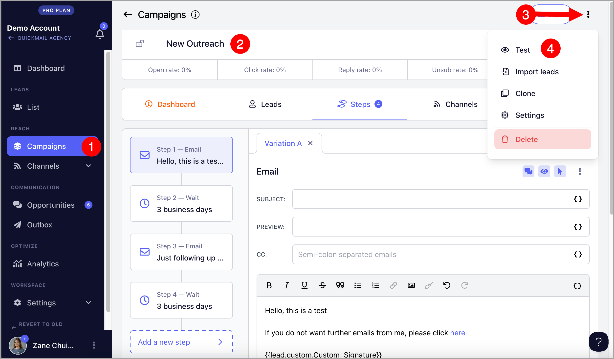
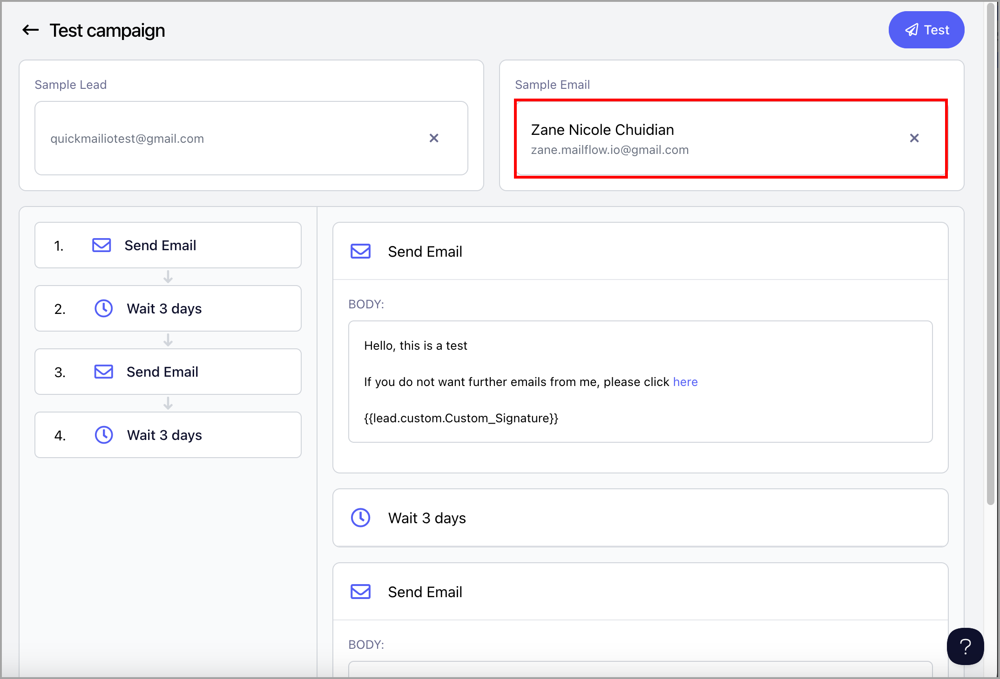
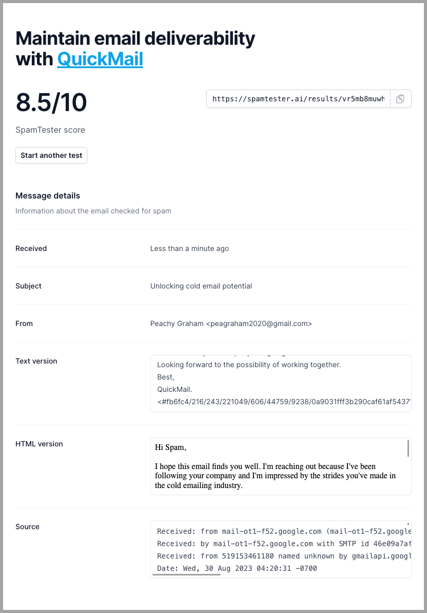
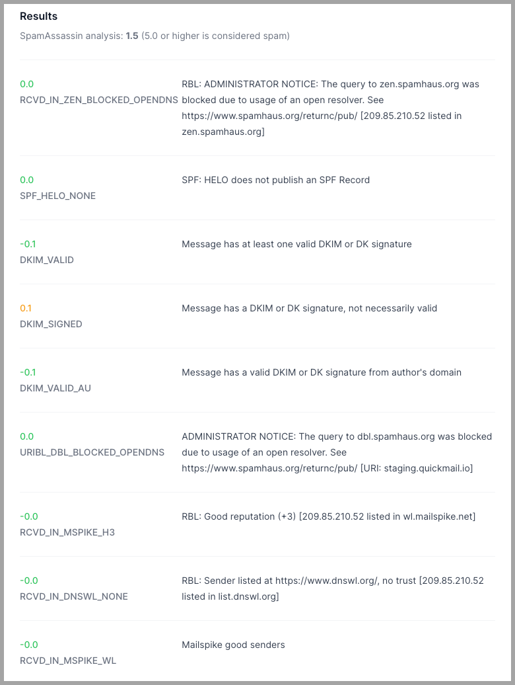

# Testing Deliverability with SpamTester.ai

## Why should I use it?

[Spamtester.ai](http://Spamtester.ai) is a powerful tool designed to help users improve email deliverability. It can help identify issues with the DNS settings of your domain and spammy content in your emails. This saves users' time in troubleshooting issues with email deliverability.

## How to use SpamTester.ai with Quickmail?

**Step 1.** On a separate browser window/tab, go to [https://spamtester.ai](https://spamtester.ai/)

**Step 2.** Copy the email address provided on the page (don't close the browser window)

**Step 3.** Go to QuickMail, head to the campaign you'd like to run → Menu → Send Test

**Important:** The email copy of the first step in the campaign will be checked for testing. Make sure it contains the email copy you'd like to send for the test, as it will be scored too.

**Step 4:** Select the email account you'd like to test the deliverability of, then click **Test** to send the test email.

**Step 5** . After an email has been sent, head back to the SpamTester.ai browser window. It will automatically get updated and show the test results

