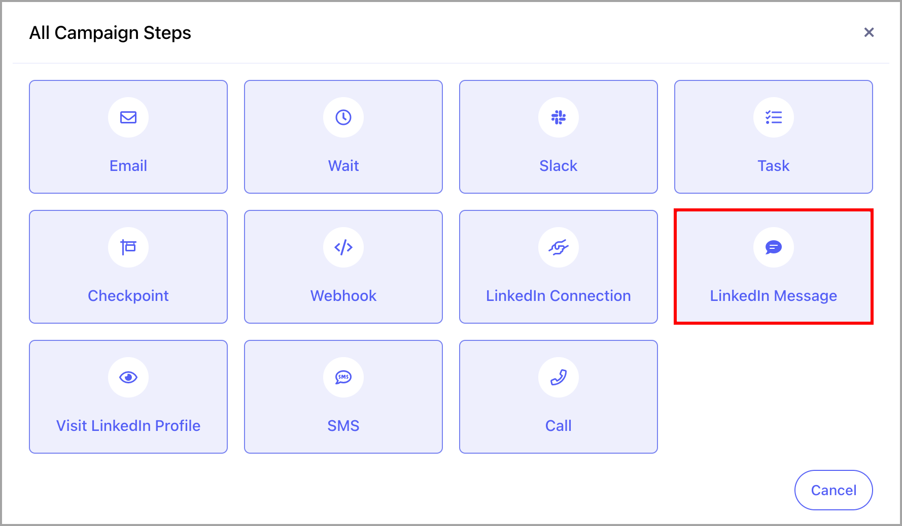
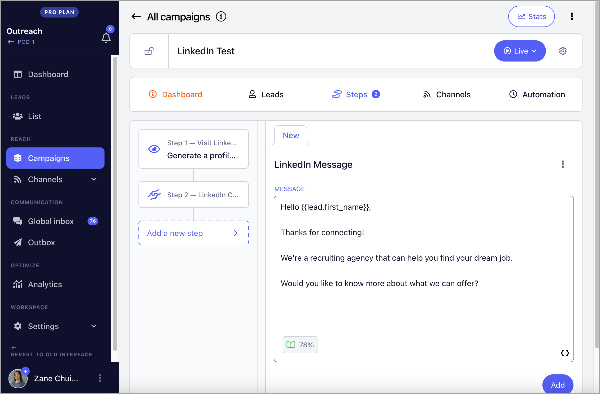
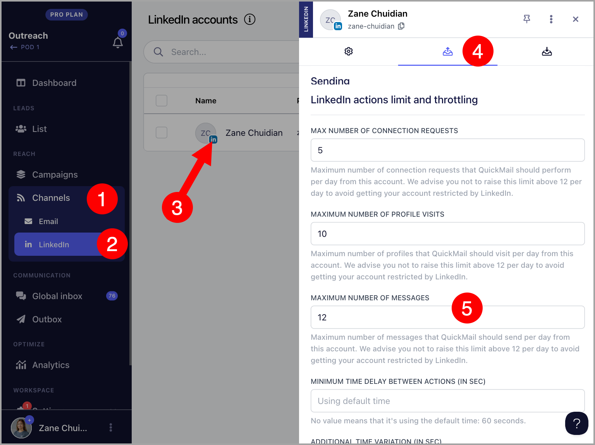
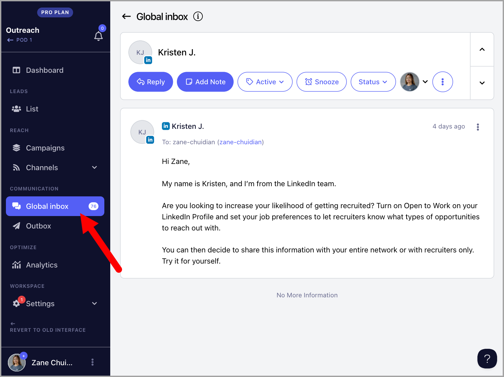

# Sending LinkedIn Messages 💬

💡 The number of LinkedIn accounts that you can add will depend on your plan. It's 1 for Basic, 5 for Pro, and 15 for Expert.

**In this Article:**

- How does sending LinkedIn Messages work

- How many LinkedIn Messages can I send?

- How to send LinkedIn Messages?

- How can I change the daily limit for my LinkedIn Messages?

- Where can I see replies to LinkedIn messages?

##

## How does sending LinkedIn Messages work?

In QuickMail, you can seamlessly create custom-tailored messages for your LinkedIn connections.

By incorporating LinkedIn Message steps into your campaigns, you have the capability to send multiple personalized messages to your prospects.

**IMPORTANT:** It's not yet possible to send a LinkedIn message to prospects you're not connected with. So a LinkedIn Connection request must be sent first. To send a LinkedIn Connection request, check out this guide

##

## How many LinkedIn Messages can I send?

To prevent the account from being restricted by LinkedIn, we put a daily limit of 40 LinkedIn messages per account.

If there's a need to send more, it's possible to add more LinkedIn accounts as needed without additional cost.

On the other hand, you can also set a limit to the LinkedIn messages you send daily.

##

## How to send LinkedIn Messages?

**Step 1.** Setup LinkedIn Automation

**Step 2.** From your campaign, go to Steps and add a LinkedIn Message step

**Step 3.** Add the LinkedIn message you want to send. You can use custom fields to personalize your message.

## How can I change the daily limits of my LinkedIn messages?

Go to Channels → LinkedIn → Select a LinkedIn account → Sending Tab → Maximum number of messages

## Where can I see replies to LinkedIn messages?

Once a LinkedIn account is added to QuickMail, we will automatically scan it for replies every 15 minutes.

The replies are then collected and displayed on the Global page, allowing direct responses to LinkedIn messages.

##
