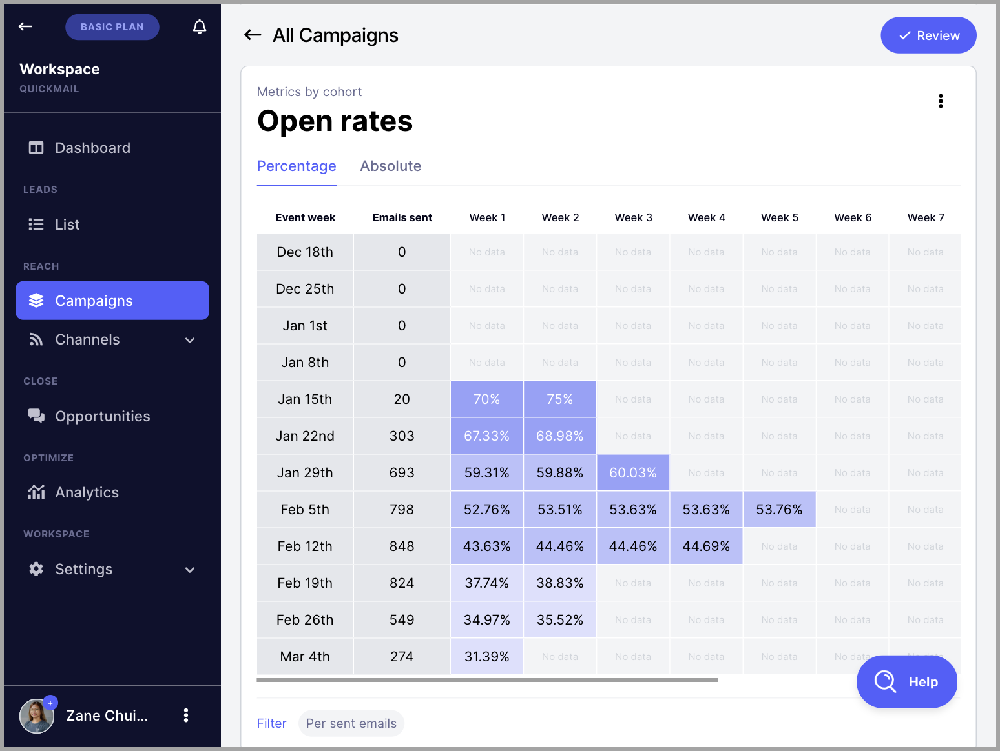
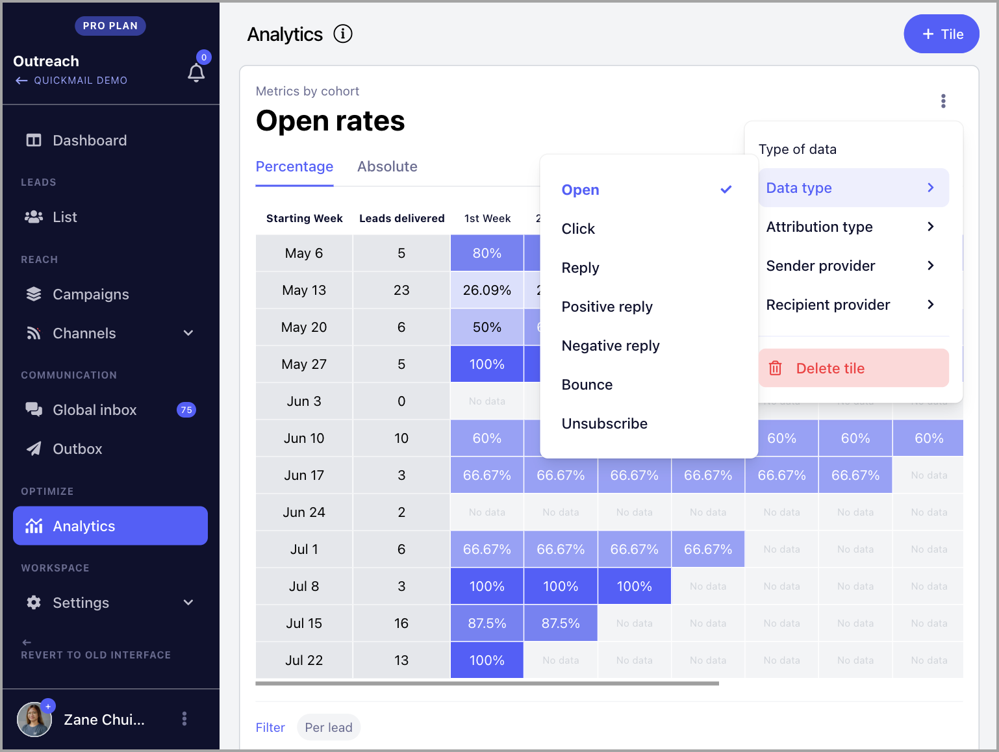
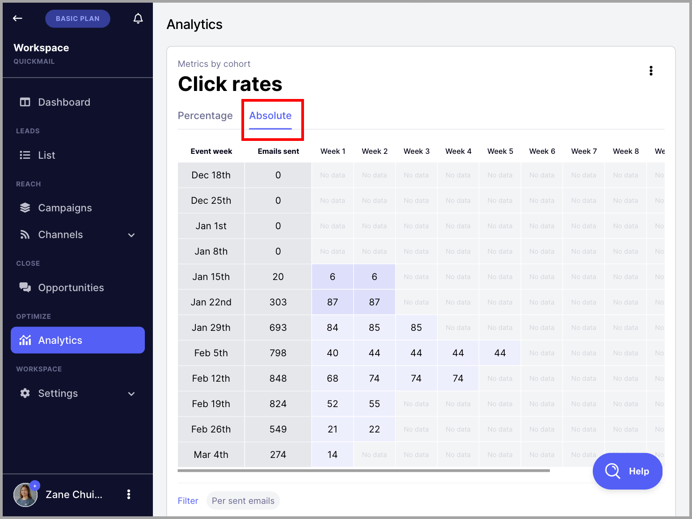
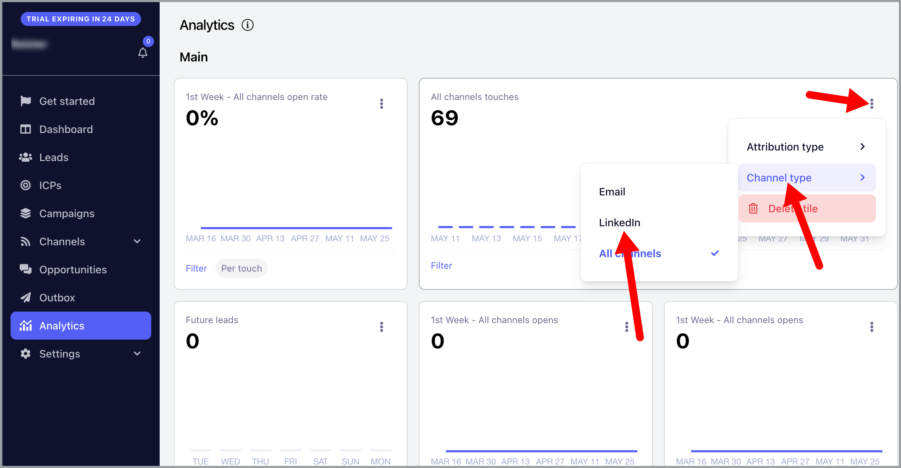

# Understanding Metrics by Cohort (Advanced Analytics)

**In this article:**

- Where can I find Metrics by cohort?
- What are the types of data in the analytics?
- Absolute vs. Percentage
- Understanding Metrics by cohort

QuickMail's Advanced Analytics gives a deep dive into email effectiveness, offering insights into the actual deliverability of emails sent from your inbox or a campaign based on email stats.

If you want to see how revolutionary that is, here is an article from our founder explaining why our metrics are unique: https://www.linkedin.com/pulse/why-were-all-wrong-open-rates-jeremy-chatelaine-/

## Where can I find Metrics by cohort?

There are two ways to see the metrics by cohort in QuickMail.

### Overall Metrics

The overall metrics by cohort can be found on the Analytics page

### Per Campaign

The metrics per campaign can be found on the dashboard of each campaign.

To view the campaign dashboard, go to the Campaigns page → Select a campaign → Scroll down to see the metrics by cohort

## What are the types of data in the analytics?

### Data type

At the moment, the available data in the metrics are as follows:

- Opens
- Clicks
- Replies
- Positive & Negative Replies (Based on Reply Categorization)
- Bounces
- Unsubscribes

### Attribution type

You can change the data in the analytics based on either the:

- number of emails sent
- number of leads started

### Sender Provider

The data can also be sorted based on the email provider of the email account used for sending. These email providers include:

- Gmail
- Outlook
- Custom IMAP/SMTP
- Any

### Recipient Provider

If you would like to check the stats per recipient email provider, this is also possible. Data can be sorted based on the following email providers:

- Gmail
- Outlook
- Any

## Absolute vs. Percentage

### Percentage

The default view in the metrics by cohort is in percentage, which expresses values as a proportion of the whole per statistic.

### Absolute

Absolute metrics represent the numerical values of the tracked statistics

## Understanding Metrics by cohort

Metrics for Opens, Replies, Positive Replies, Negative Replies, and Unsubscribes are attributed to the date the email was sent or when the journey started every week rather than only the date the event occurred.

Here's what each column means:

- **Event Week** - the week the journeys started or the emails were initially sent
- **Emails Sent / New Journeys** - the number of new journeys or emails sent on the event week
- **Week 1** - the open, click, reply, bounce, or unsubscribe rate on the event week
- **Week 2 and subsequent weeks** - the open, click, reply, bounce, or unsubscribe rate on the subsequent weeks. Still attributed to the journey that started or emails sent based on the event week

To better understand how analytics work, let's talk about the open rate based on the number of emails sent for the week of October 9th in the image above.

For the week of September 4th, the total number of emails sent was **19.**

In the same week, the open rate was **50.31%**

The following week, the open rate increased to **50.94%**

There were no additional opens the week after, so the open rate remained at **50.94%** on week 3.

The last time an open was detected was on week 4 which increased the open rate to **51.57%**

In summary, the open rate of the emails sent on the week of September 4th increased from **50.31%** to **51.57%** in 5 weeks.

Therefore, we can also conclude that more than **51.57%** of the emails were delivered.

<!-- images-start -->
## Screenshots

<!-- images-end -->
