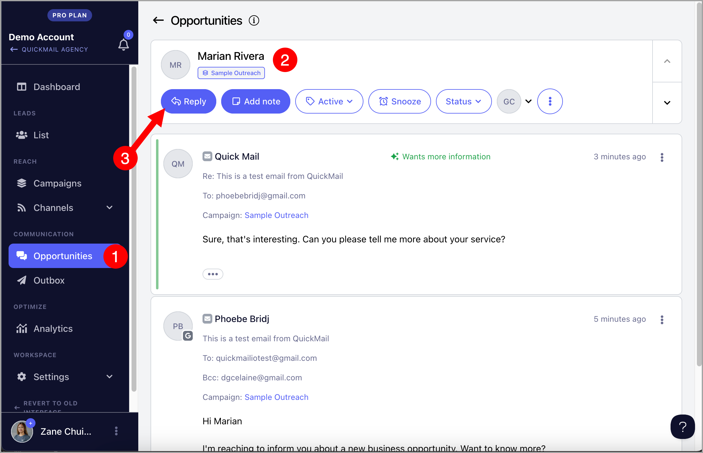
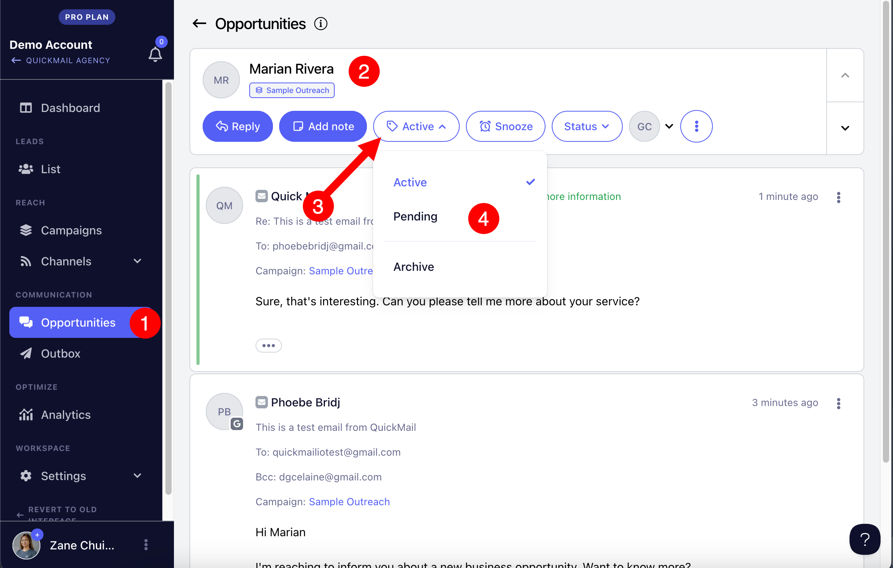
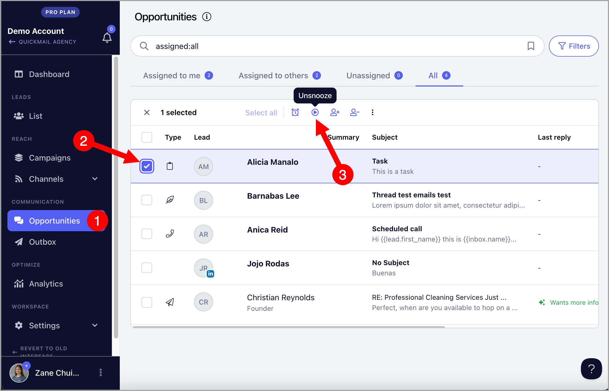
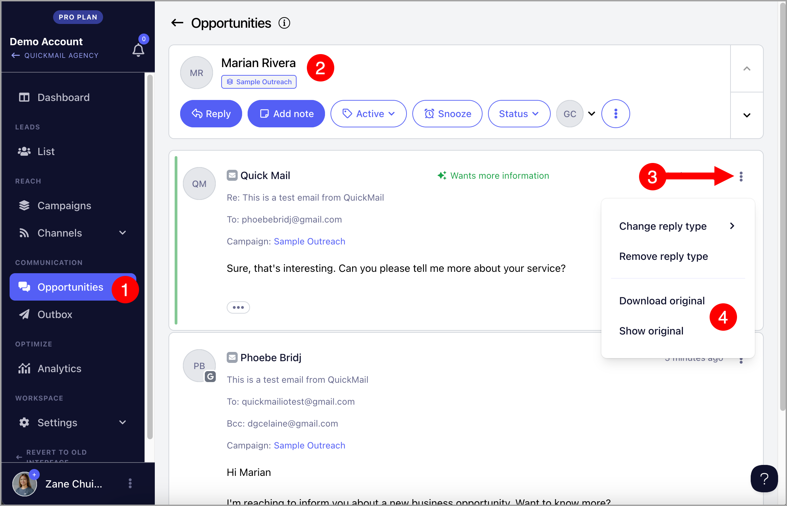
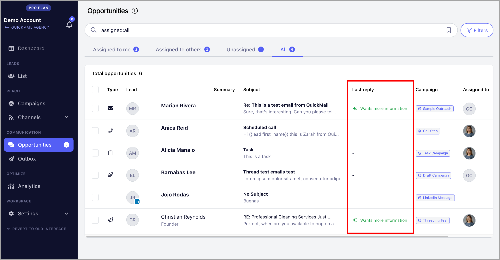
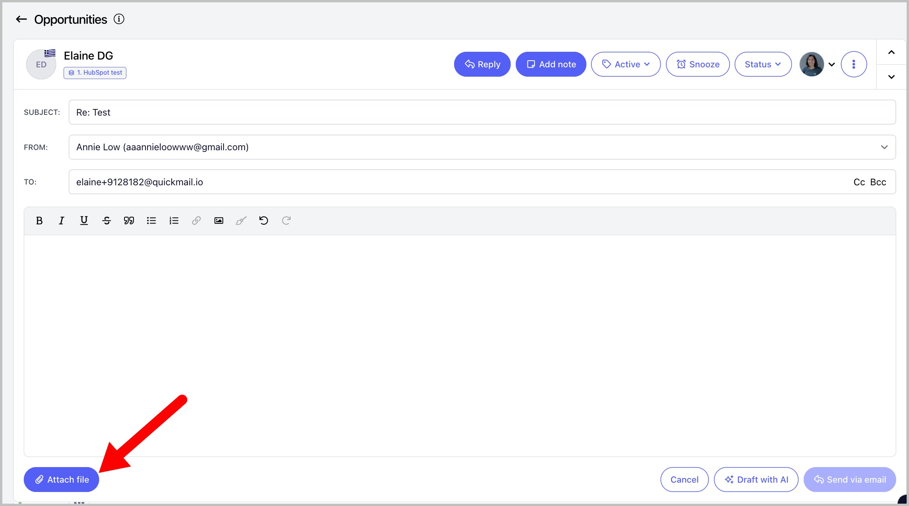
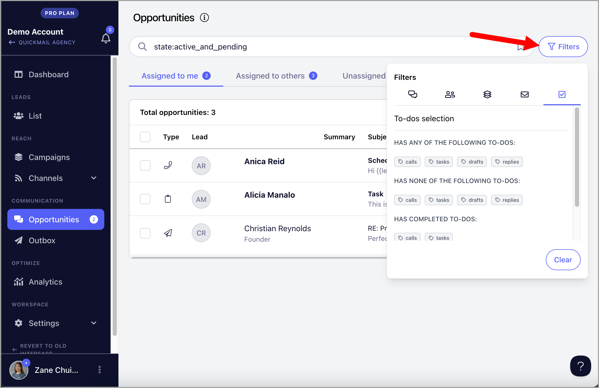
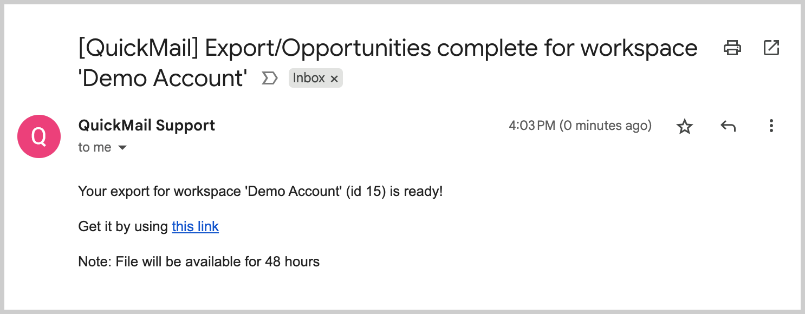

# Handling Replies with Opportunities

**In this article:**

- Why use the Opportunities?

- What can I do with Opportunities?

- What are the types of Opportunities?

- Where can I find Opportunities?

- Responding to a Lead's Reply

- Selecting an email account to send from

- Marking Replies as Pending (Mark as read)

- Marking Replies as Won or Lost

- Snoozing/Unsnoozing Conversations

- Viewing or Download Original Email (EML)

- Categorizing Replies

- Completing a Task

- Completing a Call

- Completing a Draft

- Managing Opportunities

- Opportunity Reports

- Filtering Opportunities

- Assigning Opportunities to team members

- Adding Notes

- Exporting Opportunities

- Status Bar

- Bulk Actions

## Why use Opportunities?

"Opportunities" is a handy tool that keeps all your lead replies from different campaigns and email accounts in one place, so you never miss a response. It lets you see your whole conversation with a lead in one thread, making it easier to keep track of what’s going on. You can also manage tasks, calls, or even draft emails right from the same spot.

Additionally, Opportunities leverages AI to summarize your conversations, suggest responses, and categorize replies, helping you stay organized and focus on what matters most. With these smart insights, managing and nurturing your leads becomes much simpler!

## What can I do with Opportunities?

- Respond to, view, and manage email replies

- Respond to, view, and manage LinkedIn replies

- Complete tasks

- Complete call tasks and make calls directly via third-party phone dialers (like Aircall)

- Edit and send drafts for manual emails

- Send attachments

## Types of Opportunities

- Email replies (Envelope icon)

- Linkedin replies (LinkedIn icon in lead's thumbnail)

- Accepted Linkedin connection requests

- Tasks (Clipboard icon)

- Call tasks (Phone icon)

- Drafts (Leaf icon)

- Sent emails (Paperplane icon)

## Where Can I Find Opportunities?

You can find Opportunities either on the Opportunities page** or in a lead’s **Quickview**. Note that it will only appear in the lead’s Quickview if there’s an opportunity associated with that lead.

## Responding to Replies

All the replies that are in bold text mean are active Inbox items that need to be addressed. Simply opening the reply will not unbold it.

To respond to the lead's reply, click the message in the Opportunities list, then select "Reply."

Once you've sent your reply, the opportunity will automatically be marked as pending and will no longer appear in bold.

**Tip:** If you're having a hard time composing a reply, or following a long email thread with the lead, Drafting Replies with AI might help.

## Selecting an email account to send from

To select which channel to send, select one of the options in the "From:" field.

Tip: When an inbox gets deleted, the leads replies from that inbox won't get deleted. You can still reply to the lead using a different inbox

## Marking Replies as Pending (Mark as read)

Once you’ve responded to an opportunity, it will automatically be marked as pending and will no longer appear in bold.

If you want to mark a conversation as read without replying, simply set it to pending.

This action moves the conversation to the bottom of the list and removes the bold text from the subject, making replies easier to differentiate.

To do this, open a reply in Opportunities → Click the "Active" button → Set to Pending

## Marking Replies as Won or Lost

Each reply can be marked as Won or Lost, to easily identify and close potential replies.

**Note:** Marking a reply as won or lost will automatically archive it. If you'd like to see archived opportunities, simply use filters.

To mark a reply as lost or won, open a reply in Opportunities → Click the "Status" button → Select Won or Lost

## Snoozing/Unsnoozing Conversations

If a reply doesn’t need your attention yet, you can snooze it so that you can focus on more urgent conversations that need to be replied to immediately.

**Note:** Snoozed replies will not show on your list until the snooze ends or until the prospect sends another reply. If you'd like to see snoozed opportunities, simply use filters.

To snooze or unsnooze an opportunity, go to the opportunity list and select an opportunity → Snooze/Unsnooze button

## Viewing or Downloading Original Email (EML)

By default, the Opportunities page shows a readable version of the email, including the full subject and the message content. However, you can also view the original email in its entirety for additional details, such as the email’s source, attachments, and any other relevant information not displayed in the preview.

To do that, go to the opportunity → menu (vertical ellipsis) → Download or Show original

## Categorizing Replies

Categorizing replies generates stats for positive and negative replies in the analytics. If you are on the Expert Plan, replies will be categorized automatically.

If you'd like to manually categorize replies, go to the opportunity → menu (vertical ellipsis) → change reply type → select reply category

**Note:** It's not yet possible to personalize the reply categories available to choose from

**Tip:** If you'd like to learn more about AI Reply Categorization, check out this guide:Categorizing Replies with AI

## Attaching Files

You can attach files to opportunities if you'd like to send files to a lead. To do this, simply click on the "Attach File" button

## Completing a Task

Tasks are automatically generated when a lead goes into a task step. To complete tasks in opportunities, open the opportunity with a clipboard icon → click "Mark as complete"

## Completing a Call Task

Call tasks are automatically generated when a lead goes into a call step. To complete tasks in opportunities, open the opportunity with a phone icon → click "Mark as complete"

**Tip:** You can make calls from QuickMail as long as you have a phone dialer app installed on your computer. Moreover, the lead must have a phone number attached to its info.

Check out this guide for more info: Call Steps

## Completing a Draft

If you set an email step to be manually sent, a draft will be generated. From the opportunities, you can view, edit, and send the draft.

To complete drafts in opportunities, open the opportunity with a lead icon → click "Mark as complete"

## Filtering Opportunities

Opportunities can be filtered for ease of access to specific types or replies. Many different criteria can be used to filter replies such as:

- State (All, Active, Pending, Archived)

- Status (Won, Lost, Open)

- Snoozed

- Last Updated

- Team members assigned

- Campaign

- Email account

- Type of To-dos

- Incomplete/Complete To-dos

## Assigning Opportunities to Team Members

QuickMail will automatically assign the replies to the owner of the email account that received the reply. The team member who added the email account becomes its owner by default.

Inboxes added via an invite link do not have an owner, so replies from these inboxes will appear under the 'Unassigned' tab.

If you'd like to automatically assign new opportunities from a specific inbox to a specific team member, go to Channels → Email Accounts → Change Inbox owner

Meanwhile, if you'd like to manually assign a team member to an existing opportunity, go to Opportunities → select opportunity → assign team member

## Opportunity Reports

Replies are detected when we scan your email accounts for responses. As a result, no email notifications are sent for new opportunities. However, if you'd like to receive a daily summary of opportunities, simply enable Opportunity Reports.

Enabling Opportunity Reports is only available in the old interface. So if you're using the new interface, follow these steps:

**Step 1** . get your workspace number from the URL. For example, on the Opportunities page, you’ll see a URL like this - The number after workspace/ is your workspace number (in this case, it's 15).

*https://next.quickmail.com/workspace/15/opportunities/list*

**Step 2.** Once you have your workspace number, go to this URL and replace XXX with your workspace number:

https://next.quickmail.com/account/XXX/settings/replies

**Step 3.** Check the 'Opportunity Reports' box → select the days and times you'd like to receive the reports → Make sure to click 'Update'

## Adding Notes to the Conversations

Notes are internal memos that can be added to any conversation. To add a note, from the conversation click on the "Add Note" button.

This will open a text editor where you will be able to edit the text and add a note directly in the conversation thread.

## Exporting Opportunities

This feature allows you to download detailed information about your opportunities, including message history, sender and recipient addresses, and the dates each message was received into a CSV/

To export Opportunities, go to Opportunities → Select Opportunities → Export.

CSV will be sent to the email address you're using to login

## Status Bar

Whenever there is a change in the status of the reply, the change will be logged and displayed in a status bar. This will allow users to see which team members have previously managed the opportunity.

A status bar will appear on top of the last reply, showing whether the opportunity was changed to Active, Pending, Won, Lost, or assigned to a different team member

## Bulk Actions

It's possible to handle multiple opportunities in bulk to streamline actions. These includes:

- Snoozing

- Un-snoozing

- Adding an assignee

- Removing an assignee

- Archiving

- Deleting

To do this, select multiple replies: you can select them one by one, by page, or select all. Then, click on the action from the different options.

