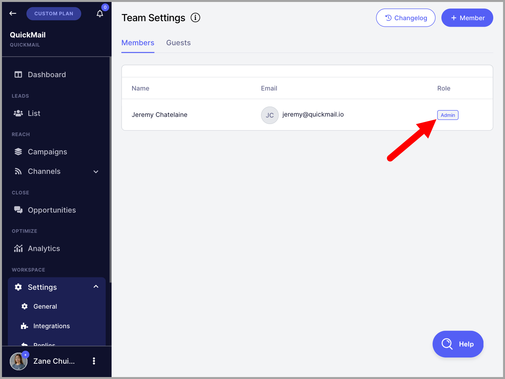
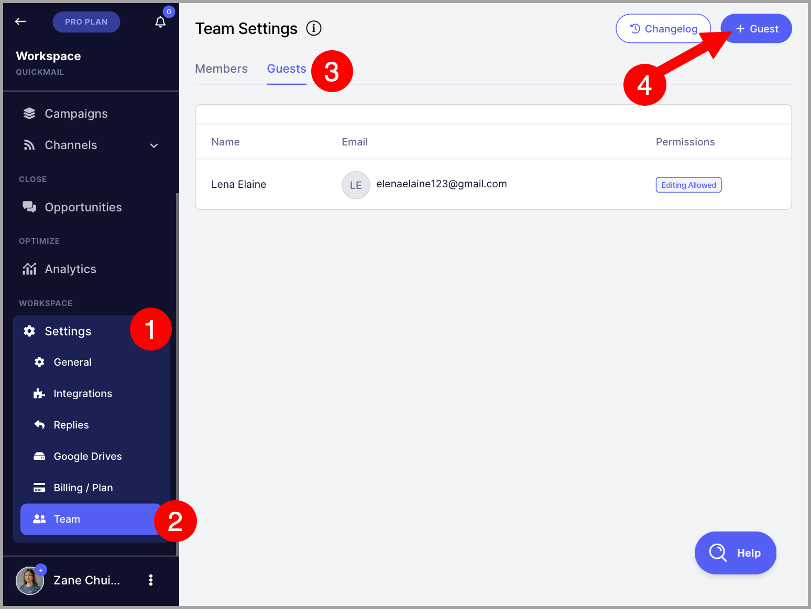
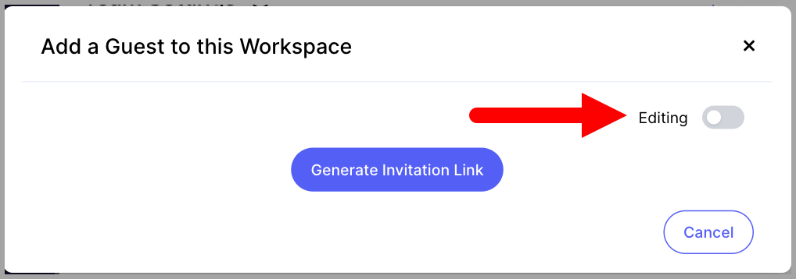
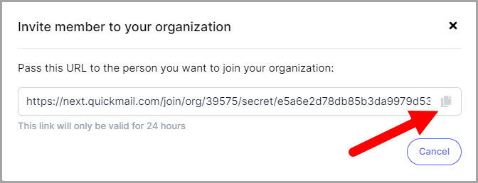
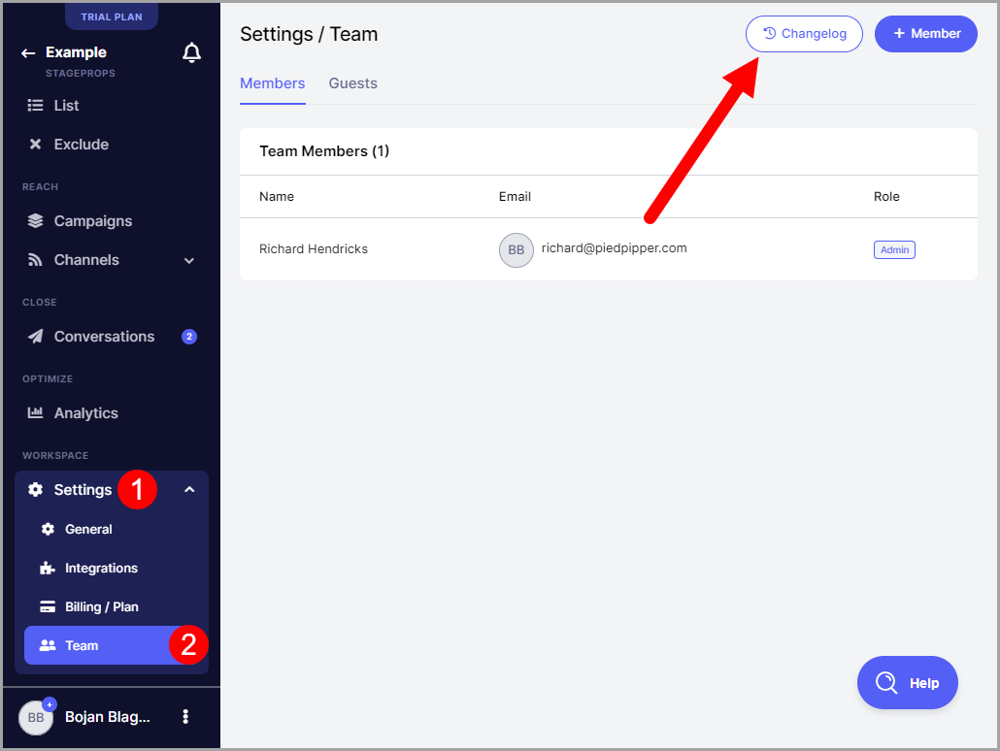
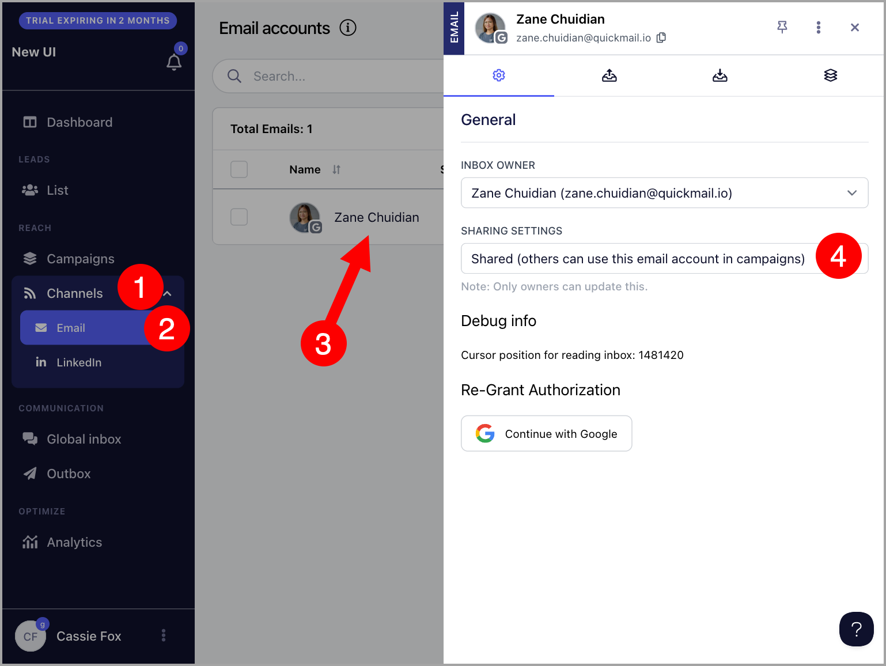
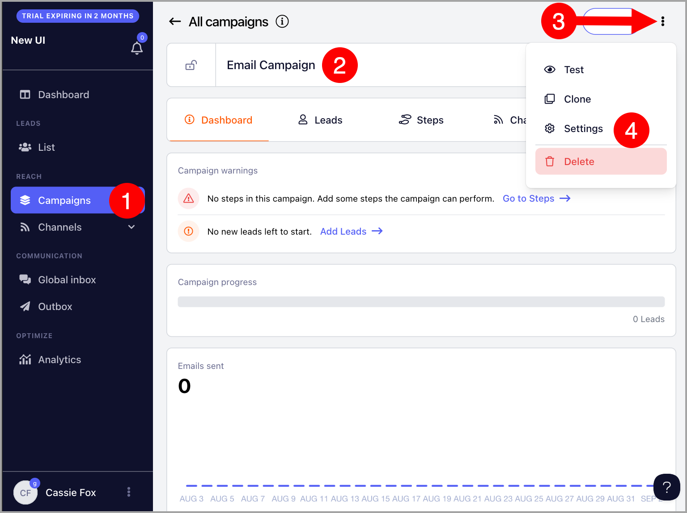

# For Teams: Team Members

**In this article:**

- Types of team access in QuickMail

- Admins

- Team Members

- Guests

- How to add a Team Member?

- How to change Team Member roles?

- How to add Guests?

- Where can I see each Team Member's activities?

- Why are campaigns, replies, or email accounts not visible to other team members?

- FAQs

In QuickMail, users can easily grant access to colleagues or clients by utilizing their own email addresses. This allows seamless collaboration in managing an account without the need to share logins.

**Note:** Users can add as many team members and guests as needed for no additional charge.

# What are the types of team access in QuickMail?

There are three types of team access in QuickMail: **Admins**,** Team Members**, and **Guests**

## Admins

Admins can do everything except for:

- Manage private inboxes and campaigns owned by a different team member

## Team Members

Team members can do everything except for:

- Manage private inboxes and campaigns owned by a different team member

- Change the card on the billing page

- Purchase or update the subscription

- Buy email verification credits

## Guests

Guests can or cannot have edit access. If a guest has an edit access, they can do everything except for:

- Manage private inboxes and campaigns owned by a different team member

- Access workspace settings

# How to Add a Team Member?

To add a team member, go to Settings  → Team  → click + Member → Toggle Admins rights (If you would like to provide admin access) → Generate Invitation Link

Copy the invite link  →  Send it to the person you want to add to the team.

The new team members can choose to log in with their email (Google/Outlook) or LinkedIn account.

**Note:** An invite link will automatically expire once used. So if there's a need to add another team member, another invite link must be generated

# How to Change Team Member's Role?

Once a team member is added, it will show under Members tab in Team Settings and indicate whether they are an admin or not.

To remove or provide admin access, simply click on the team member listed and change admin access.

# How to invite clients as guests?

Go to Settings → Team → Guests tab → click "+ Guest" at the top right corner

Select your preferred editing permission → Generate Invite Link

Copy the invite link → provide it to your client.

**Note:** Invitation links are only valid for 24 hours.

## Where can I see each Team Member's activities?

All activities can be seen and filtered on the Changelog page.

To access the Changelog, go to Settings → Team → Changelog

# Why are my email accounts, Opportunities, and campaigns not visible to my team members?

The reason Email accounts, Opportunity items, and campaigns are not visible to other Team Members is that they are Private. Private inboxes and campaigns are only visible to owners.  To fix this, the campaign must be 'Shared'

**Share an Email Account**

To share an Email account, go to Channel → Email →  click the thumbnail of the email → change sharing settings.

### Share a Campaign

To share a Campaign, go to the Campaign and click the gear icon.

Change the Sharing Settings to 'Shared'

# FAQs

**Q:*****Can I limit my team member's activity? ***

A: Nope, that's not possible yet. Please send an email to support@quickmail.io about why you'd need to have that option so we can check what we can do.

However, the workaround is to add them as guests.

***Q:******Why can't I generate an invite link?***

A: Only team members of the account can generate an invite.  If the email address you're using to access QuickMail is not added as a team member of the account, when you try to generate an invite link, it will lead to a permission error.
