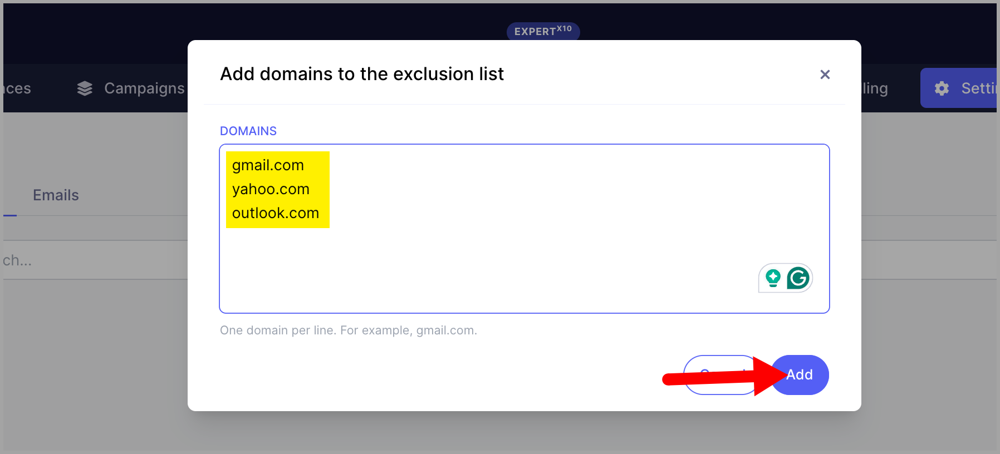
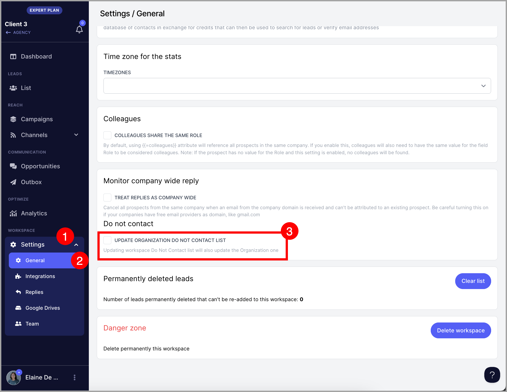

# Managing Exclusion Lists (For Agencies)

**

### In this article:

- [Why keep an agency exclude list?](#Why-keep-an-exclude-list-n7QaV)

- [How does it work?](#How-does-it-work-xXIz0)

- [How to add domains to the agency exclude list?](#How-to-add-domains-to-the-agency-exclude-list-ZOKzz)

- [How to add email addresses to the agency exclude list?](#How-to-add-email-addresses-to-the-agency-exclude-list-KH1vP)

- [How to automatically add prospects to the email exclude list if a prospect unsubscribes from one of the workspaces?](#How-to-automatically-add-prospects-to-the-email-exclude-list-if-a-pros-zv8Fz)

- [How to automatically add a domain to the domain exclude list if a prospect unsubscribes from one of the workspaces?](#How-to-automatically-add-a-domain-to-the-domain-exclude-list-if-a-pros-tUSEE)

- [What if I want the email address to be excluded only from certain workspaces?](#What-if-I-want-the-email-address-to-be-excluded-only-from-certain-acco-4YKGs)

- [What if I want the domain to be excluded only from certain workspaces?](#What-if-I-want-the-domain-to-be-excluded-only-from-certain-accounts-NnEDF)

# Why keep an exclude list?

Keeping an exclude list is important because it does the following:

- Helps comply with laws like CAN-SPAM, GDPR, and CASL, which require honoring opt-out requests.

- Reduces the risk of being blacklisted by email providers.

- If someone has opted out before, sending emails again can damage your sender reputation.

- Filters out bad or irrelevant contacts to improve targeting

# How does it work?

If a domain or an email is added to your agency exclude lists, none of them can be contacted from any workspaces under the agency.

If you mistakenly add them to any campaign, they won't get added because the system will simply skip them.

If an email is only added to the exclude list, all other prospects from the same domain will still be contacted.

If a domain is added to the exclude list, all prospects using the same domain will not be contacted.

# How to add domains to the agency exclude list?

To get started, go to your agency dashboard and go to the Exclude tab.

Then, click Domain -> Add domains.

**Important:** Do not include ‘www’ before the domain, as it will be interpreted as a subdomain.

You can add multiple domains at a time, just make sure to only have 1 domain per line.

# How to add email addresses to the agency exclude list?

From the same page, go to Emails and do the same, making sure you only have 1 email per line.

Once done, click Add.

All added domains or emails to the exclude list will show who added them to the workspace and when. There are also other sources if the email addresses are added to the exclude list via automation.

## Source types and what they mean

- **API:** Marked as Do Not Contact via API.

- **Zapier:** Marked as Do Not Contact via Zapier automation.

- **Campaign:** Marked after completing a Do Not Contact sub-campaign.

- **AI:** Marked after replies are categorized as unsubscribe requests

Learn more about Automatically Handling Unsubscribe here.

# How to automatically add prospects to the email exclude list if a prospect unsubscribes from one of the workspaces?

To update the agency email exclude list after a prospect unsubscribes from your email, go to the workspace settings.

Under General Settings, enable "Update Organization Do Not Contact" to automatically add prospects to your agency's email exclude list if they are:

- Manually marked as Do Not Contact

- Unsubscribed from a campaign

- Marked via Zapier/API

Domains that will get added to the DNC domain of a workspace will automatically be added to the agency's exclude list if this is turned on.

**Note:** This has to be turned on for all workspaces for it to work for the whole agency.

# How to automatically add a domain to the domain exclude list if a prospect unsubscribes from one of the workspaces?

We don't support this so the workaround is to manually add the domain to the agency's domain exclude list.

# What if I want the email address to be excluded only from certain workpaces?

You can add them to those workspaces and mark them as Do Not Contact.

Here's a quick guide on Marking Prospects "Do Not Contact."

# What if I want the domain to be excluded only from certain workspaces?

You can add them to the DNC domain list of those workspaces.

Here's a quick guide on Setting Do Not Contact by Domain.

**Note: **In this case, to make sure that domains and email addresses will only be excluded from certain workspaces, before marking them as Do Not Contact or adding domains to the DNC domain list, turn off the setting [Update Organization Do Not Contact](#How-to-automatically-add-prospects-to-the-email-exclude-list-if-a-pros-zv8Fz).
