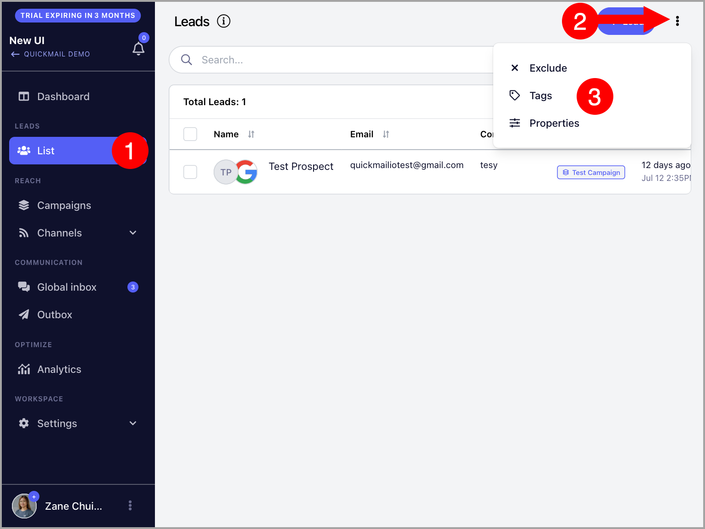
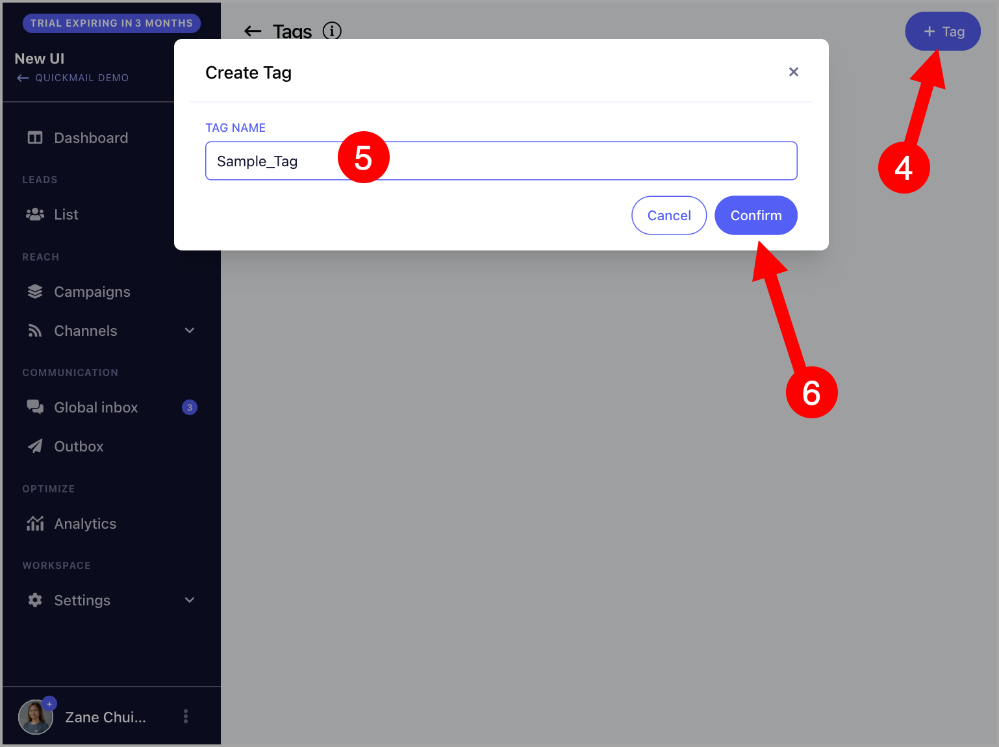
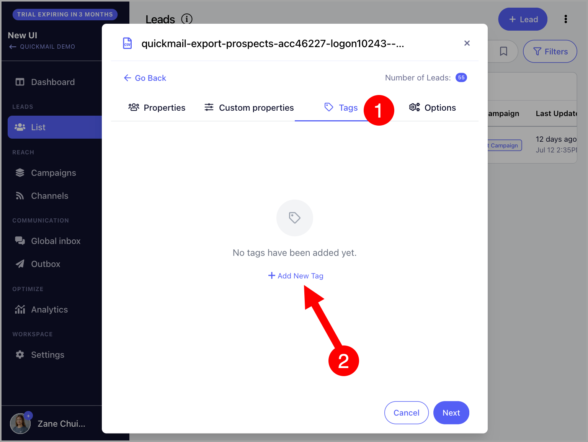
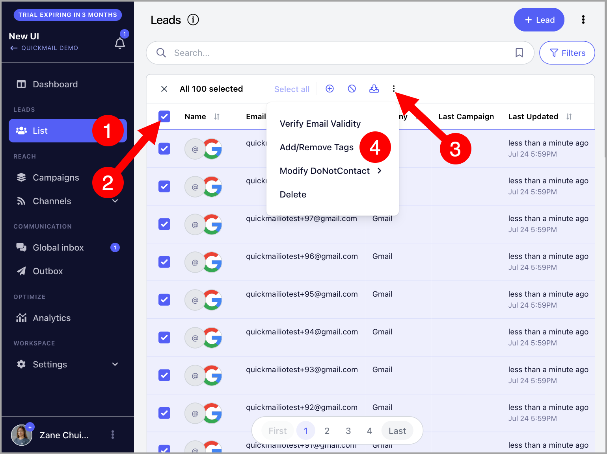
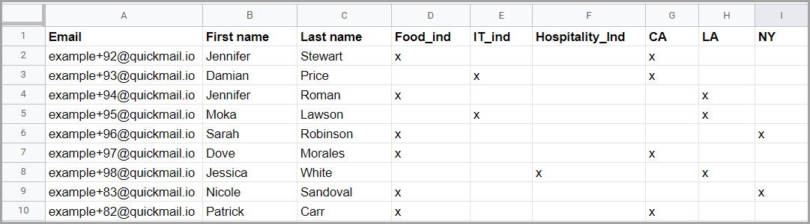
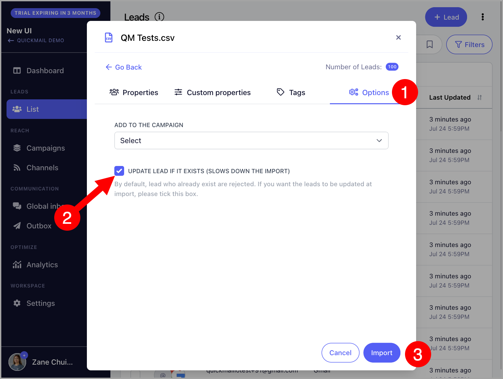

# Segmenting Leads with Tags

**
**

In this article:**

- [How to create Tags?](#How-to-create-Tags-RpJLc)

- [How to manually apply tags?](#Manually-applying-tags-M1sme)

- [How to bulk-add tags upon import?](#Bulk-applying-tags-by-an-import-uCG15)

- [How to delete Tags?](#How-to-delete-Tags--_UaZ1)

## Why use tags?

Tags are useful for categorizing leads. By tagging leads, you can also quickly search for specific leads using Advanced Filters.

Tags can also be used as quick filters when searching for specific leads.

## How to create Tags?

### From the List page

To create a tag, navigate to List → Click on the three vertical dots at the upper right-hand corner → Tags

You'll be directed to the Tags page, from there click on "Add tag" → Name the tag → Confirm

### While importing leads

To create tags while importing leads, simply go to the Tags tab → Add new tag

## How to apply Tags to leads?

There are 3 ways to apply tags to leads:

### From the List page

It's possible to manually add tags to specific leads or in bulk. To do that, go to the List page → Select your preferred leads → Click on the three vertical dots → Add/Remove tags

### From Lead's Quickview

The lead's quickview can be accessed by clicking on the lead's thumbnail or email address on the:

- Campaign's Leads page

- Global inbox page

- List page

From there, users have the option to manually add tags to a specific lead. (Applied tags are in blue)

### Bulk-applying tags by an import

When importing leads, tags can also be applied in bulk.

To get started, make sure that the CSV has columns for tags. After creating the columns for tags, put any value (like x) on the row of the leads that must be tagged.

Leaving a row blank means the Tag won't be applied.

Here's an example of a CSV with columns for Tags.

**Note:** If the leads that will be imported are already in the list, make sure to check the checkbox "Update Lead if Exist." This is so that the tags will be applied to the leads.

**Pro-tip:** A lead can have multiple tags and you can also filter specific leads by combining tags.

To learn more about how to filter leads with specific tags, here's a detailed article on how to use advanced filters - Filtering Leads

## How to delete Tags?

To delete tags, navigate to List → Click on the three vertical dots at the upper right-hand corner → Tags

From the Tags page, click on a specific tag → Click on the three vertical dots at the upper right-hand corner → Delete

