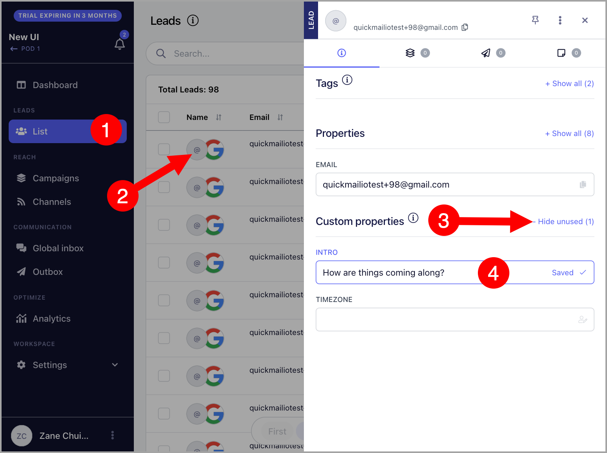
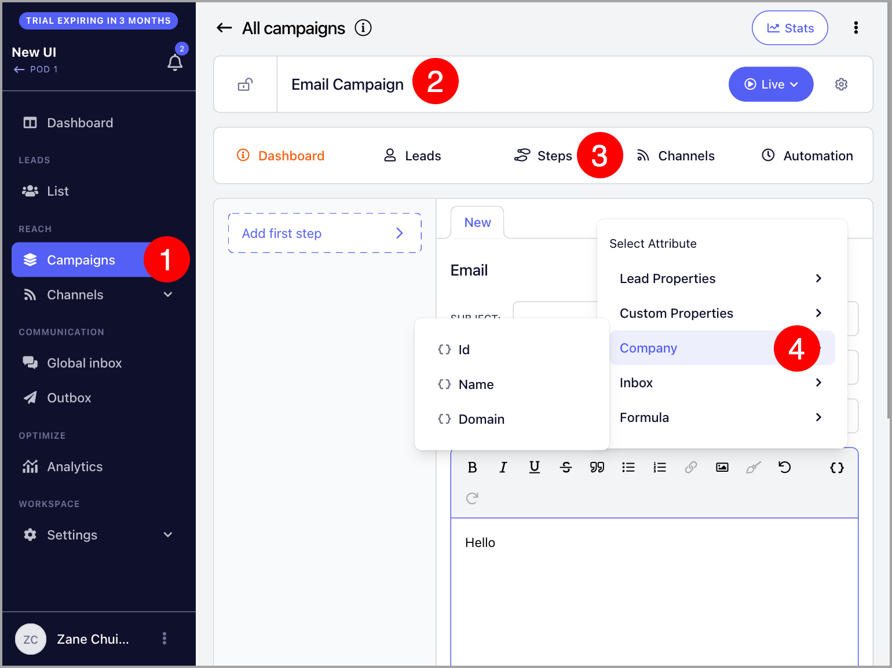
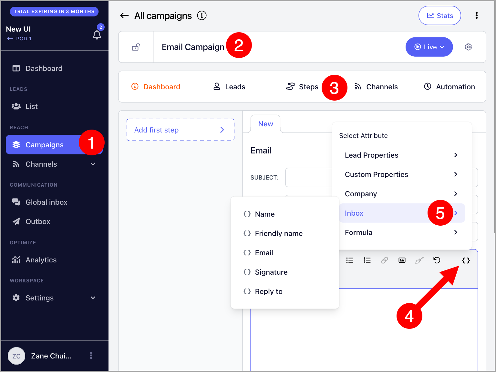
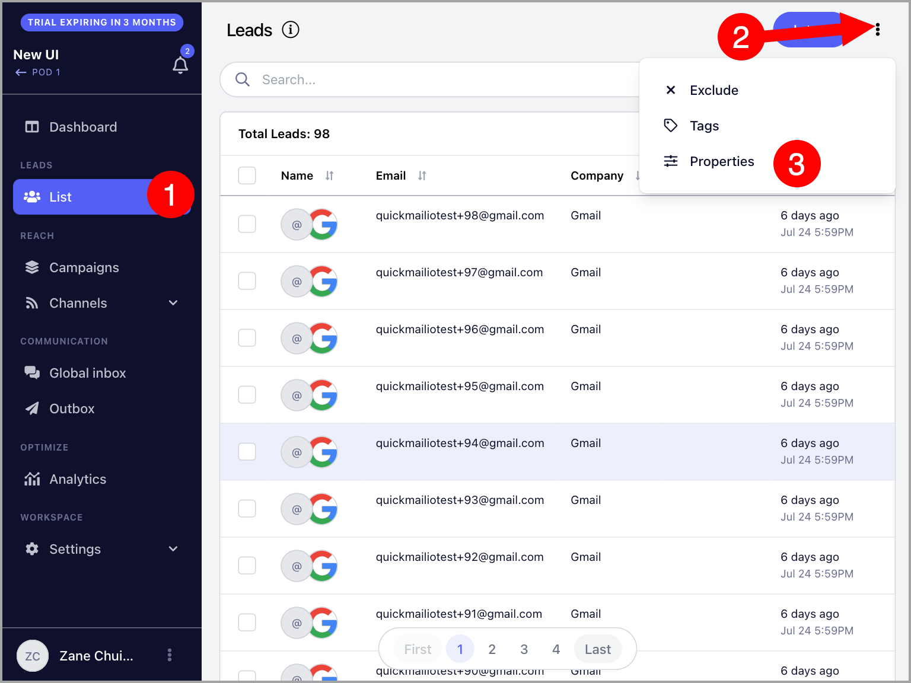
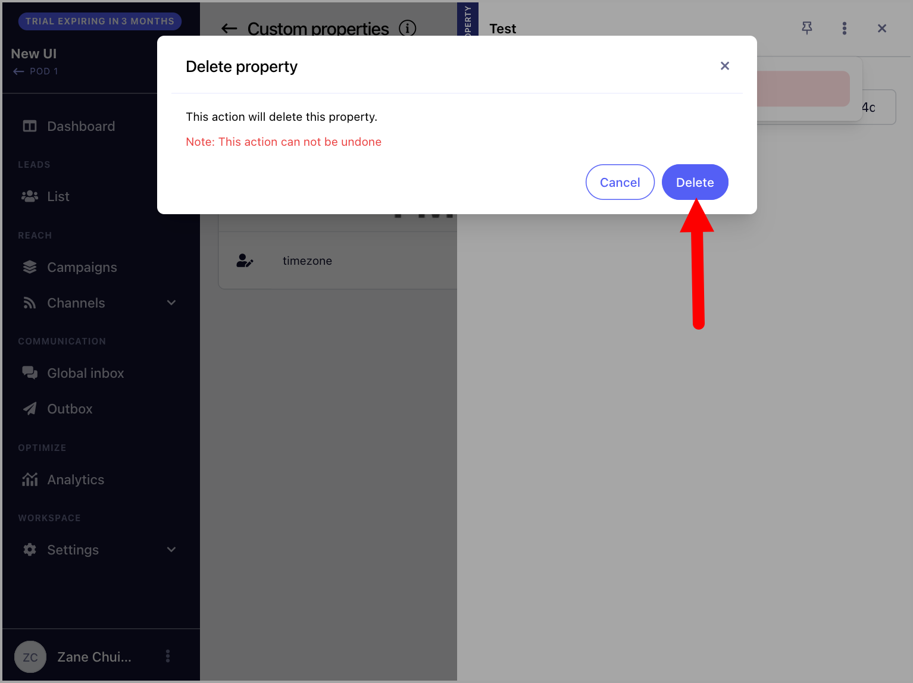

# Custom Fields for Personalizing Emails

#### In this article:

- Why use properties?
- How to add properties to Email Steps?
- How to delete custom properties?
- Why am I getting an error?

## Why use properties?

Properties are placeholders that can be added to Email Steps.

Using properties makes it easier to give your emails a personalized touch and greatly helps with email deliverability.

## How to add properties to Email Steps?

You can add properties to the email subject or email body by heading to an email step, then clicking properties on either the email subject or the body.

There are several properties that you can use to customize your email.

## Lead properties

The lead properties are the basic way to personalize your emails.

Using lead properties, you can mention a lead's first and/or last name, email, title, role, phone, and score.

For example:
> *Hey {{lead.first_name}}, how is it being the new {{lead.role}}?*

This will translate to:
> *Hey Richard, how is it being the new Regional Supervisor?*

## Custom properties

Custom properties enable you to include personalized details in your emails for each lead.

These properties can include specific information about your leads, such as their city or industry.

Moreover, custom properties can also incorporate unique sentences tailored to individual leads.

**Important:** If you'd like to use formatting and line breaks in custom properties, you'll need to use HTML.

Here's a step by step guide on how to use custom properties:

## **Step #1: Create custom Properties**

There are two ways to create custom properties:

- **Custom Properties Page**

To create a Custom Property, head to List → Click on the three vertical dots → Properties

After that, click + Property → Add custom property name → Set a default value (optional) → Confirm

The default value serves as a fallback in the email if the lead doesn't have a custom property value.

**Note:** The name of the custom property should only include numbers, and letters, as well as "-" and "_". If the name of the custom property has spaces, the custom property can not be created.

- **Via import**

Another way of creating a custom property is by importing leads.

To do that, head to List → + Leads → Import from CSV or Google Drive → Custom properties tab → + New Property

## Step #2: Assign Custom Property Values

After creating a custom properties, the custom property value must be assigned to the leads.

There are two ways to do this:

- **Via CSV or Google Sheet**

Upon importing the CSV/Google sheet, you will be able to map the custom properties under Lead properties.

**Note:** When adding custom properties for leads already in QuickMail, ensure to check *'Update lead if it exists (slows the import process)*' when re-importing. Failure to do so will result in the import being rejected to prevent duplicates.

- **Lead's Quickview**

Another way of assigning custom property values to the leads is by opening the lead's quickview

## Step #3: Add custom property to emails

Once added, the Custom properties will show under the lead's properties.

Here's an example of how custom properties can be used:
> *Hey,*
>
> *{{lead.custom.Opening_Line}}*

This will translate to:
> *Hey,*
>
> *Your podcast episode on mobile kitchens helped me pursue my dreams of providing free hot meals to people who need them!*

## Company Properties

Similar to Lead properties, the Company properties allow you to mention the lead's company information.

For example:
> Is {{company.name}} still hiring? Saw the job posting at {{company.domain}}!

This will translate to:
> *Is Pied Piper still hiring? Saw the job posting at www.piedpiper.com!*

## Inbox properties

These are properties unique to the email address that is used to send an email in a campaign.

Inbox properties allow you to include the email address information in an email.

For example, if you are rotating 2 email addresses for a campaign, each email being sent by a specific email address can include the inbox signature by using the Signature Property.

More about inbox signatures here - Email Signatures in QuickMail

## Precomputed properties

- ### Unsubscribe Property

Allows you to include an unsubscribe link to your emails.

- ### Colleagues Property

Allows you to mention the lead's colleagues in emails.

Here's a more detailed article about the Colleagues' Property.

- ### Day and Business Day Property

Day Property allows you to mention the current day of the week.

On the other hand, the Business Day Property only applies to weekdays.

More about the Day and Business Day properties here.

You can also type the properties manually as long as they follow the same format as when you click the button.

# How to delete custom properties?

To delete custom properties, go to List → Click on the three vertical dots → Properties

After that, select the custom property you would like to delete → Click on the three vertical dots → Delete

Finally, confirm delete.

## Why am I getting an error?

**Note:** Some properties will stop an email from sending if the property cannot transform to any value.

For example, if a lead has no company value, but is added to a campaign with an email step that uses the company property {{company.name}}, the property will be unable to fill in a value.

Because of this, the email will not be sent and will result in an error.

<!-- images-start -->
## Screenshots

<!-- images-end -->
