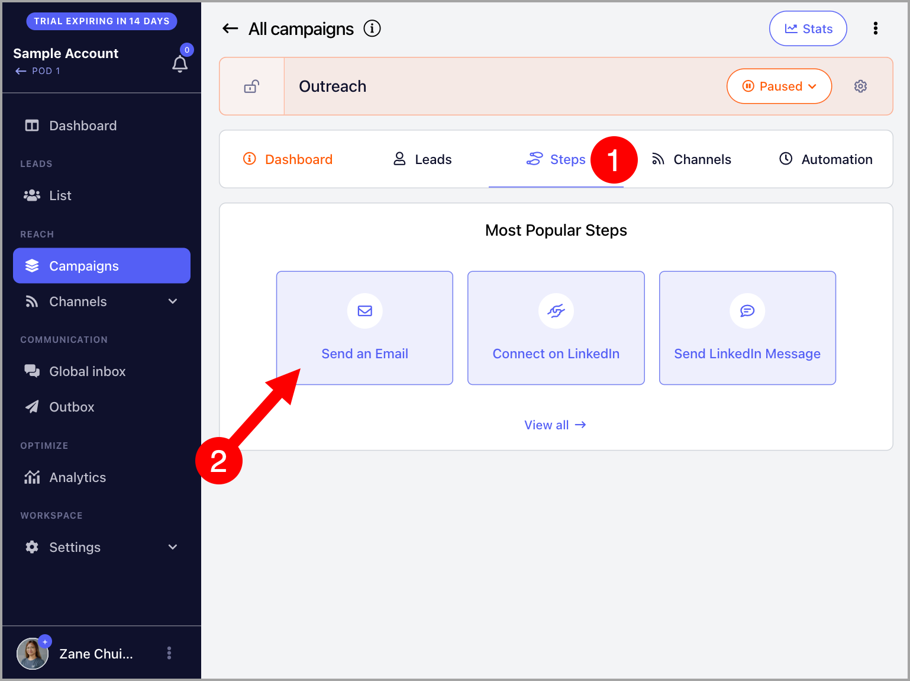
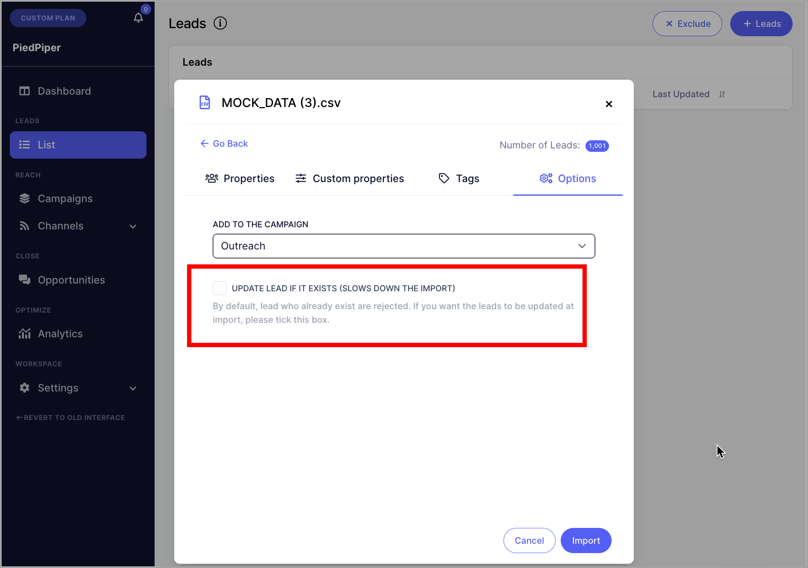
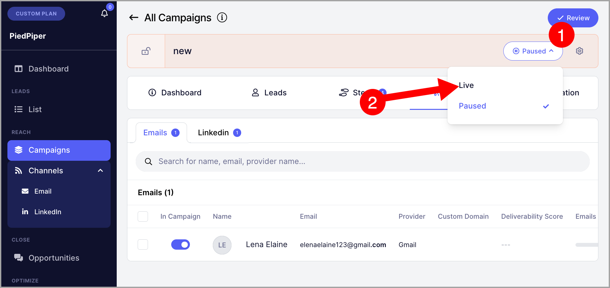
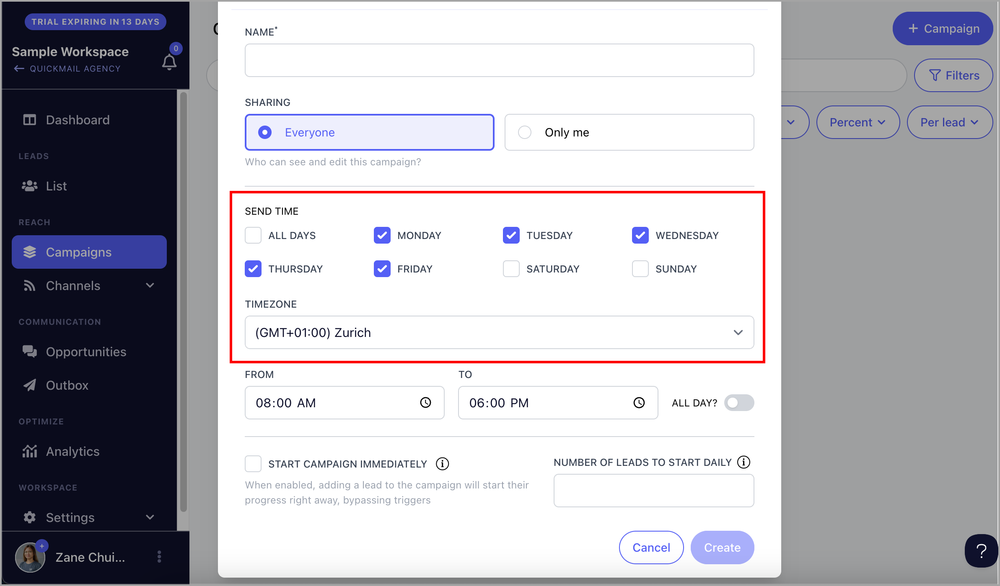
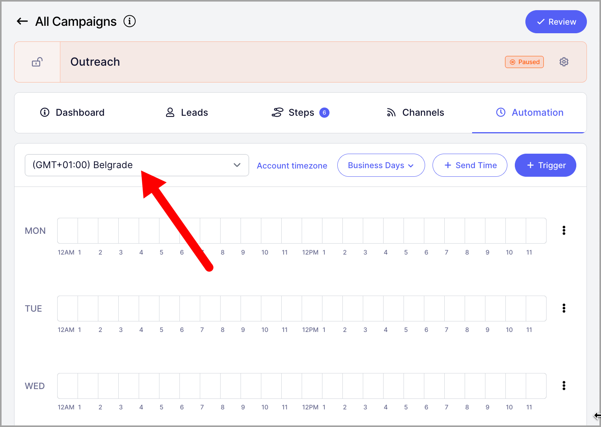
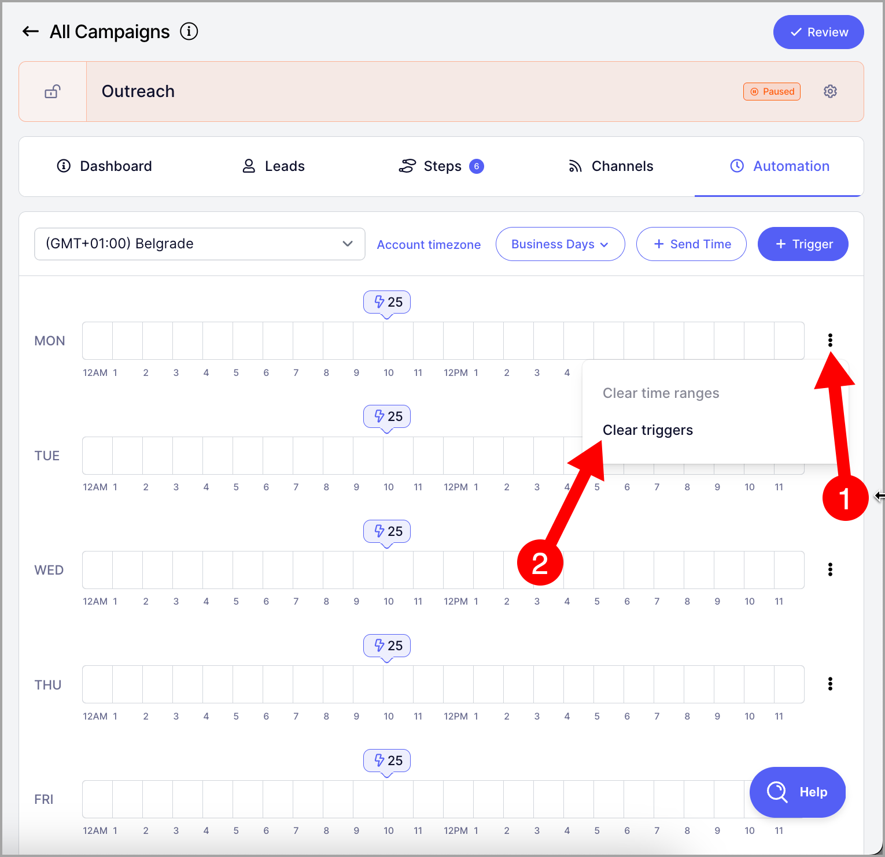
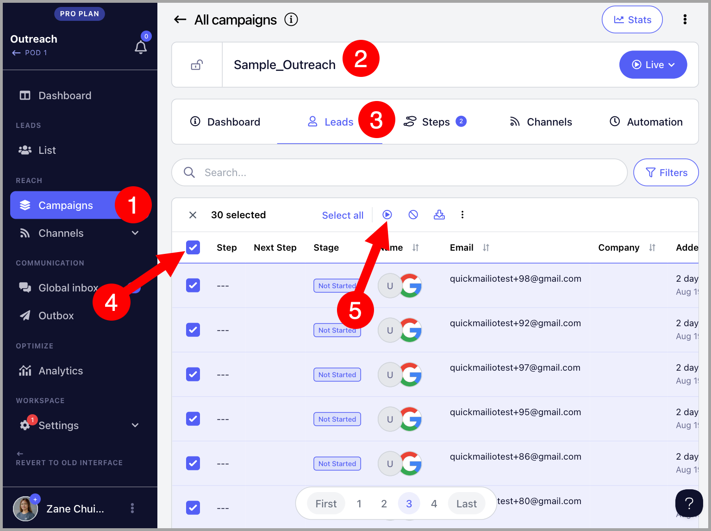
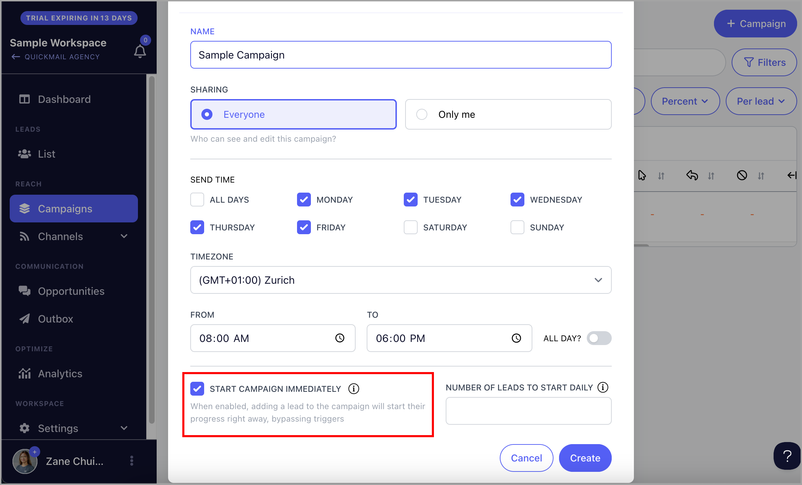

# Campaign Building: Step by step

### **In this article:**

- What are campaigns?
- **Step 1:** Create a campaign
- **Step 2:** Create Steps
- **Step 3:** Assign Accounts for Sending
- **Step 4:** Add leads to the campaign
- **Step 6:** Activate the campaign
- Editing Send Times
- Starting Leads

If you prefer watching video tutorials, check this out: Campaign Building Guide 🎥

# What are campaigns?

Campaigns are a series of emails and tasks that you can use to reach out to your leads and get replies. In QuickMail, you can run omni-channel campaigns that include email, calls, SMS, and LinkedIn actions, among others.

## Step #1: Create a campaign

To get started, go to Campaigns → click + Campaign

After clicking + Campaign:

1. Give the Campaign a name
2. Choose whether it's for everyone (Shared) or only you (Private)
3. Choose the days you'd like to send
4. Specify Timezone for sending
5. Specific Send times
6. Add the number of leads you'd like to start daily

**Warning:** "Start campaign immediately" will begin sending emails as soon as leads are added.

If your campaign includes a large number of leads and multiple email steps, starting it immediately is not recommended. This may result in:

- A high volume of outgoing emails, which could lead to your email account being flagged.
- A backlog of emails waiting in the send queue, causing delays.

Consider using automation by adding the 'number of leads to start daily'

**Note:** Private campaigns are only visible to the email address that created the campaign. So it's not visible to other team members or even admins.

## Step #2: Create steps

Next, under the steps tab, choose the step that you want to add. Meanwhile, let's take Email as an example.

Next, add your email subject → email body → Click "Add".

**Note:** By default, a 3-day Wait Step will be automatically created when creating any Step. It's possible to change the wait range.

You can keep adding follow-ups by clicking "Add new step"

Aside from email and LinkedIn steps, QuickMail has a lot of other steps that you can use.

To see the whole list, click "View All" when adding steps.

## Step #3: Assign emails for sending

We don't have our own server for sending emails, so users must add their own email account for sending. Without an email account, the campaign can't send emails.

To add an email account for sending, please follow this guide: Adding Email Accounts for Sending

Once an email account is added, go to the campaign → Channels tab → Under Emails, toggle your preferred email address on

**Pro tip:** You can assign multiple Email Accounts to the campaign to scale your campaigns safely. This will distribute the volume of emails from your campaign which will avoid getting flagged by email service providers.

## Step #4: Add leads to campaigns

Without leads, your campaign automation won't work. So you need to ensure your campaigns have leads first. Leads can be added during the import process or manually from the Leads list.

### Step 4 - Option 1: Importing leads to campaign

To import leads to the campaign, go to the campaign → Menu → Import leads

**Tip:** You can learn more about importing leads here

**Pro tip**: if your leads are already added to the Workspace you can simply re-import the same sheet. When re-importing, make sure to check the checkbox "Update lead if it Exists"

Otherwise, leads won't be added to the campaign because they will be rejected for duplicates.

### Step 4 - Option 2: Manually adding leads to campaign

To add Leads manually just select them from the List → Click on Actions → Add to Campaign → Select the campaign

# Step #5: Activate the campaign

The last step in setting up campaigns is to activate it.

When leads are added to the campaign, they will be on a 'Not Started' status.

Once the campaign is live, emails will be sent based on when leads start the campaign according to Triggers, and the allowed campaign Send Times.

To set the campaign live, go to the campaign → click the paused dropdown → choose Live

**Tip:** If your campaign is not sending emails, please check out this guide for troubleshooting

## Editing Send Times

**Send Times** determine the specific hours and days when the campaign is allowed to send emails.

For a newly created campaign, the initial send times are based on the send time settings and time zone selected during campaign setup.

However, you can edit the Send Times by going to the campaign → Automation tab → Make sure to select your preferred time zone → Shade your preferred send times and days

**Tip:** For more info about Send Time, check out this guide: Optimizing Send Times

**Note:** By default, there's a 60-second plus a 15-second random delay between sending emails. Ensure the campaign has enough time to accommodate your preferred email volume.

## Starting Leads

In QuickMail, when leads are added to a campaign, they are initially in a 'Not Started' status. The campaign will only begin sending emails to leads once they are started in the campaign.

Leads can be started either through scheduled triggers or manually:

- **Triggers** dictate how many leads begin the campaign on specific days and times.
- **Manual start** allows you to start leads at any time
- **Instant start** allows you to automatically start leads as soon as they are added to the campaign

### **Triggers**

Triggers dictate how many leads will start your campaign on specific days and times. The initial triggers are based on the 'Number of leads to start daily' during campaign setup.

If you'd like to edit Triggers, go to the campaign → Automation tab → Ensure first that you're using the correct timezone.

Then, click Triggers → select the days you want Leads to start on the campaign → select the time of the day when you want to start them → set number of leads to start → Apply.

In case you make any mistake with choosing the day, times, and/or leads to start, you can also clear triggers.

**Notes:**

⚠️ Triggers don't control how many emails are sent, especially if there are follow-ups in the campaign. If you'd like to set a daily email limit, it must be done on the email account settings.

⚠️ The number of leads in the Triggers are divided and assigned equally among the inboxes assigned to the campaign.

⚠️ Triggers can't be applied retroactively, so you'll need to wait for the next scheduled time when they will start new leads.

<!-- images-start -->
## Screenshots

<!-- images-end -->
