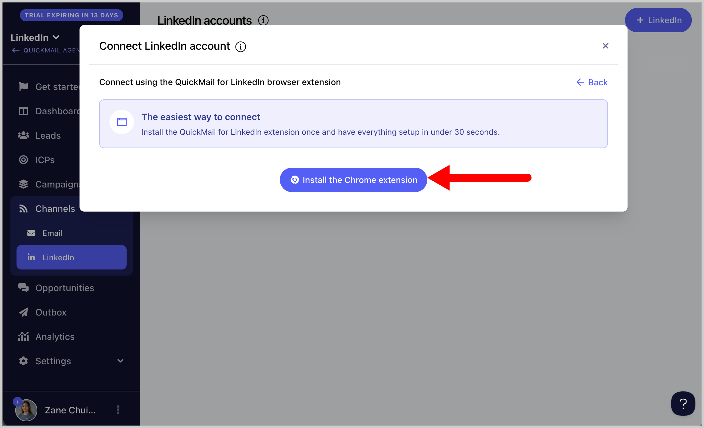
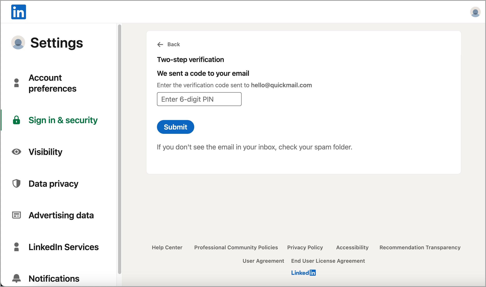
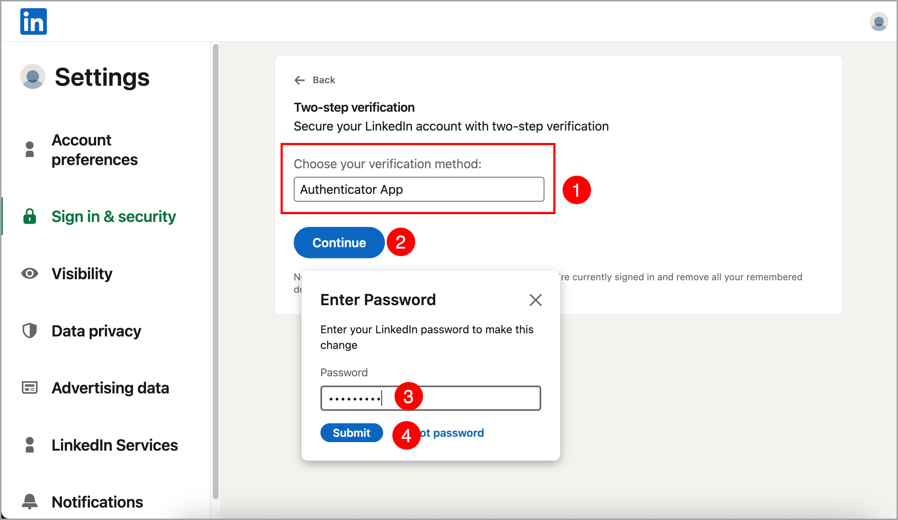
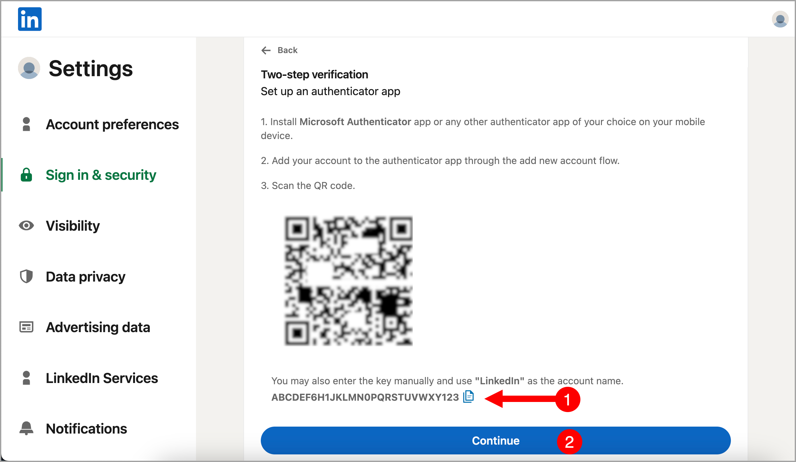
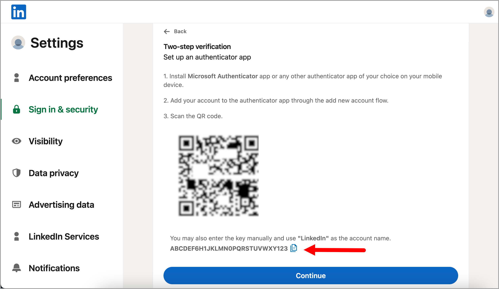
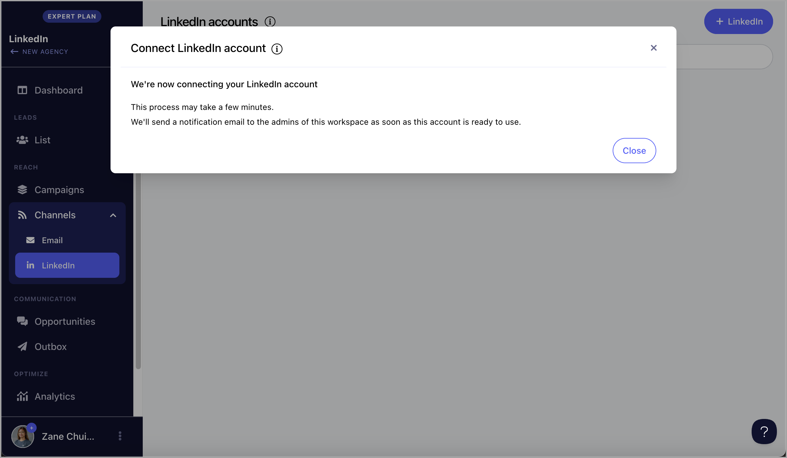

# LinkedIn: Adding LinkedIn Accounts 🔑

**In this article:**

- How to add a LinkedIn account?
- How to use the LinkedIn automation?

## How to add a LinkedIn account?

### OPTION 1 - Via Credentials + 2FA

**Step 1.** To get started, log in to your LinkedIn account in a separate browser tab → Click **'Me'** → **'Settings & Privacy'**.

**Step 2.** Go to Sign in & security → Click **'Two-step verification'**

- If two-step verification is enabled, temporarily disable it. After that, proceed to the next step.
- If two-step verification is not enabled, proceed to the next step to enable it.

**Step 3.** Enable two-step verification and enter the code sent to your email address, then click 'Submit'

**Step 4.** Choose 'Authenticator App' and click 'Continue' → Enter your LinkedIn password to proceed

**Step 5.** Download an authenticator app, such as [Google Authenticator](https://support.google.com/accounts/answer/1066447?hl=en&co=GENIE.Platform%3DAndroid) or [Microsoft Authenticator](https://www.microsoft.com/en-us/security/mobile-authenticator-app) in your mobile phone.

**Step 6.** In your authenticator app, look for the QR scanner and scan the QR code displayed on your screen. This will add your LinkedIn account to your authenticator app.

**Step 7.** Once authenticator is set up, copy the code below the QR code and **paste it into a Notepad** (or somewhere safe) → Click 'Continue'.

**Step 8.** Enter the code you see in your authenticator app → Click Verify. Your LinkedIn two factor authentication is now setup!

**Step 9**. Log out from the LinkedIn account and then log back in.

**Step 10.** Copy the code from LinkedIn that you pasted into your Notepad.

**Step 11.** After copying the code, go to your QuickMail account → Channels → LinkedIn → + LinkedIn → LinkedIn credentials + 2FA

**Step 12.** Choose country → Add the email address & password associated with your LinkedIn account → Paste the 2FA code → Add

Note that it may take a few minutes (but not more than an hour) for the LinkedIn account to be added

**Note:** If you have issues adding your LinkedIn account, contact us at support@quickmail.io

### **OPTION 2 - Via cookies**

**Step 1.** Visit this [link](https://chrome.google.com/webstore/detail/copy-cookies/jcbpglbplpblnagieibnemmkiamekcdg) and install the cookies extension on your browser.

**Step 2.** Once the extension has been added, go back to your LinkedIn profile and click the cookie Icon. Doing so will copy the cookies of the page.

If you don't see the cookie icon on your browser, click the puzzle icon and it should show all extensions you have on the browser.

**Step 3.** After copying the cookies, go to your QuickMail account → Channels → LinkedIn → + LinkedIn → LinkedIn cookies

**Step 4.** Add the country and paste the cookies → Add → LinkedIn account will be added immediately

**Important:** Logging out of your LinkedIn account will disconnect it from QuickMail by invalidating the cookies, preventing us from sending LinkedIn connection requests. To avoid this, simply log in through an incognito window and close the window after without logging out.

<!-- images-start -->
## Screenshots

<!-- images-end -->
