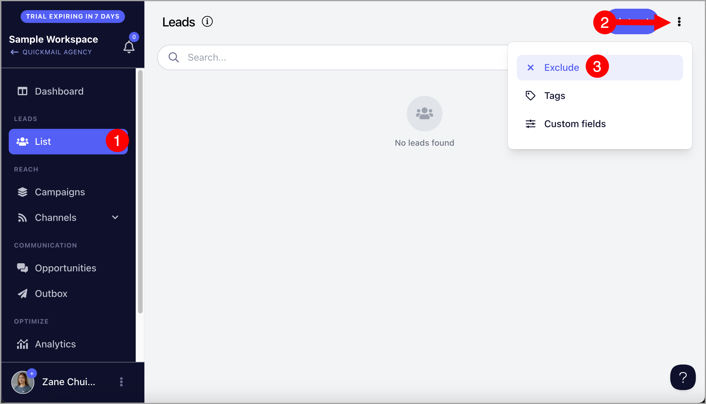
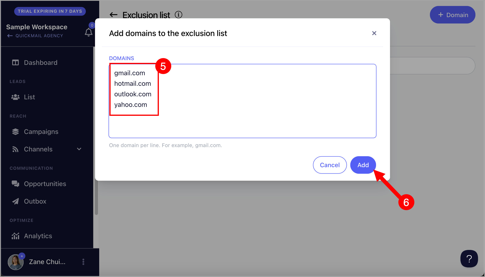
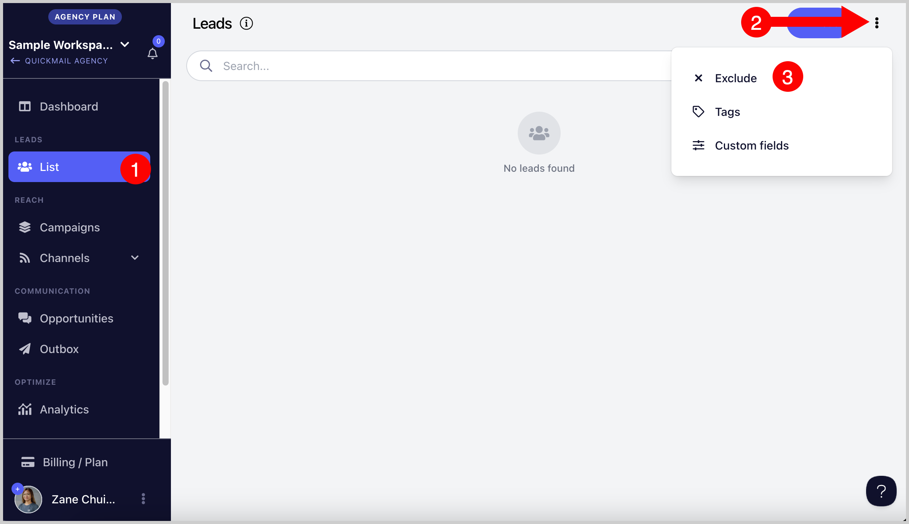
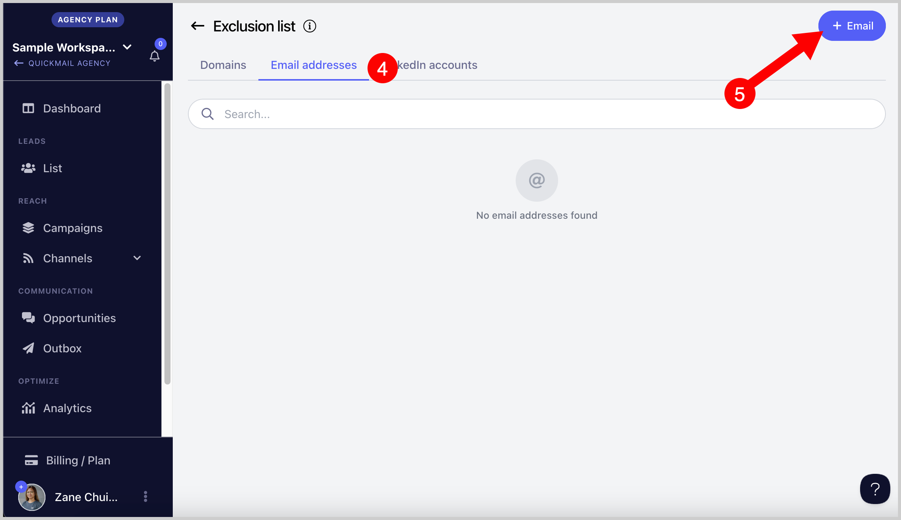
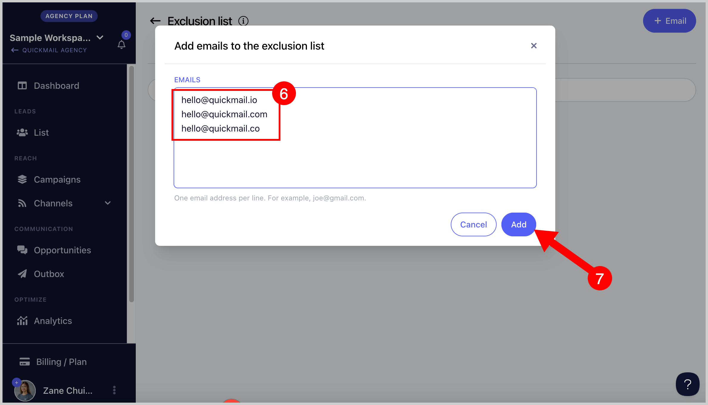
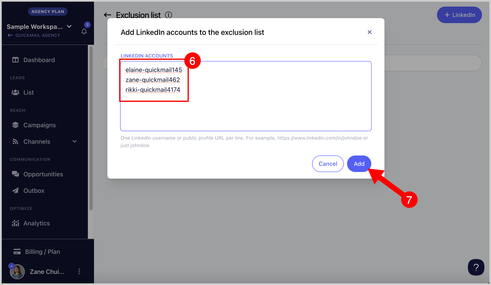

# Managing Exclusion List (For Workspaces)

**In this article:**

- Why keep an exclusion list?

- Excluding domains

- Excluding email addresses

- Excluding LinkedIn profiles

- Automatically adding leads to the exclusion list if they unsubscribe

- Automatically adding domains to the exclusion list if a lead unsubscribes

# Why keep an exclusion list?

An exclusion list makes it possible for users to prevent emailing specific email addresses or email addresses from specific domains.

This could come in handy if companies have opted out of your campaign or if there are specific leads from a company that is not the right fit for your campaign.

This is also helpful if you want to prevent contacting free email addresses.

**Note:** If a lead is using a domain listed under the domain exclude list, the lead will not be able to start any campaign in the account and any running journey will also get canceled.

# How to exclude domains?

**Step 1.** Go to List → Menu (Three vertical dots at the upper right hand corner) → click Exclude

**Step 2.** From the domain tab, click +Domain.

**Note:** Don't put https://, http://, or www when adding domains to the exclusion list

**Step 3.** Multiple domains can be added at a time by entering 1 domain per line → Click Add.

# How to exclude email addresses?

**Step 1.** Go to your List → click Exclude at the top right side of the page.

**Step 2.** Next, go to "Email addresses" tab → click + Emails.

**Step 3.** Multiple emails can be added at a time by entering 1 email address per line → Finally, click "Add"

# How to exclude LinkedIn profiles?

**Step 1.** Go to your List → click Exclude at the top right side of the page.

**Step 2.** Next, go to "LinkedIn" tab → click + LinkedIn

**Step 3.** Add the LinkedIn profile IDs. You can enter multiple LinkedIn IDs, 1 profile ID per line → Finally, click "Add"

You can add them in these format:

- https://www.linkedin.com/in/elaine-quickmail145/

- elaine-quickmail145

# How do I automatically add leads to the exclusion list if they unsubscribe from my campaign?

No, need to add them manually. Leads automatically get added to the exclusion list if they unsubscribe from your campaign.

# How do I automatically add leads' domains to the exclusion list if they unsubscribe from my campaign?

It's not yet possible to automate this. So, you need to manually add the domain to the domain exclude list.
