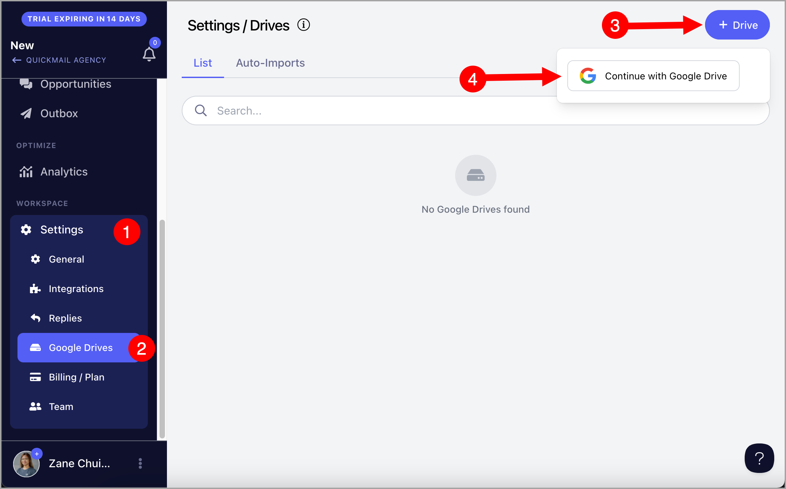
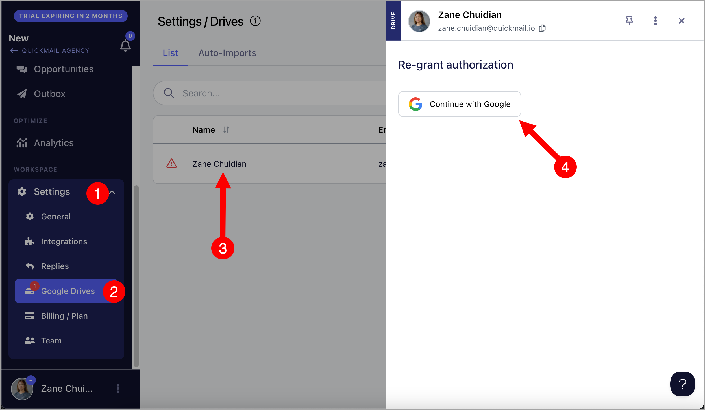
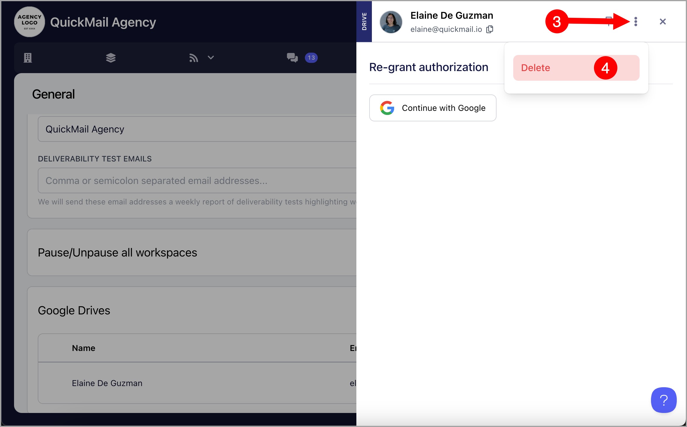

# Managing Google Drives

**

**In this article:**

**For Workspaces**

- [Connecting a Google Drive to a Workspace](#How-to-connect-a-Google-Drive-to-an-Account-Aypb3)

- [Disconnecting a Google Drive account from a Workspace](#Disconnecting-a-Google-Drive-account-from-a-workspace-cMtu4)

- [Reauthenticating a Google Drive account in a Workspace](#Reauthenticating-a-Google-Drive-Account-from-a-workspace-Rhbrc)

**For Agencies**

- [Connecting a Google Drive to an Agency](#How-to-connect-a-Google-Drive-to-an-Agency-jKet_)

- [Disconnecting a Google Drive account from an Agency](#Disconnecting-a-Google-Drive-account-2Wa1m)

- [Reauthenticating a Google Drive account in an Agency](#Reauthenticating-a-Google-Drive-Account-from-an-Agency-g6f0J)

QuickMail allows users to link one or more Google Drive accounts to be able to add leads or setup Auto-Import using Google Sheets

**

## Connecting a Google Drive account to a workspace

Click Settings → Google Drives → + Drive → Continue with Google Drive

Once the drive is added, it will be visible on that page.

After that, head to the Leads List, and Google Sheets will be an option to Import Leads from.

## Disconnecting a Google Drive account from a workspace

To disconnect a Google Drive account from a workspace, go to a specific workspace → Settings → Google Drives → Click on a Google Drive → Menu (Three vertical dots) → Delete

Careful: **Deleting a Google Drive account will delete all auto-imports associated with it

## Reauthenticating a Google Drive Account from a workspace

When our permission to your Google Drive is revoked, the connected Drive gets disconnected from your account. When this happens, there will be a red warning icon in the Settings and beside the Google Drive account affected.

To reconnect your Google Drive account, go to Settings → Google Drives → Click on the Google Drive → Continue with Google

## Connecting a Google Drive account to an Agency

If you have multiple workspaces in an Agency in QuickMail, it's possible to link a Google Drive account at the Organization level. This saves you time in adding the Google Drive individually in each workspace.

Head to the Agency Dashboard → Settings → Add Google Drive → Continue with Google Drive

Once the Google Drive is added, all workspaces in the Organization will be able to import Sheets from that drive!

## Disconnecting a Google Drive account from an Agency

To disconnect a Google Drive account from an agency, go to the Agency Dashboard → Settings → Click on a Google Drive

After that, click Menu (Three vertical dots) → Delete

## Reauthenticating a Google Drive Account in an Agency

When our permission to your Google Drive is revoked, the connected Drive gets disconnected from your account. When this happens, there will be a red warning icon in the Agency Dashboard Settings and beside the Google Drive account affected.

To re-authenticate a Google Drive account in an agency, go to the Agency Dashboard → Settings → Click on a Google Drive

After that, click 'Continue with Google' and follow the prompts from Google.

