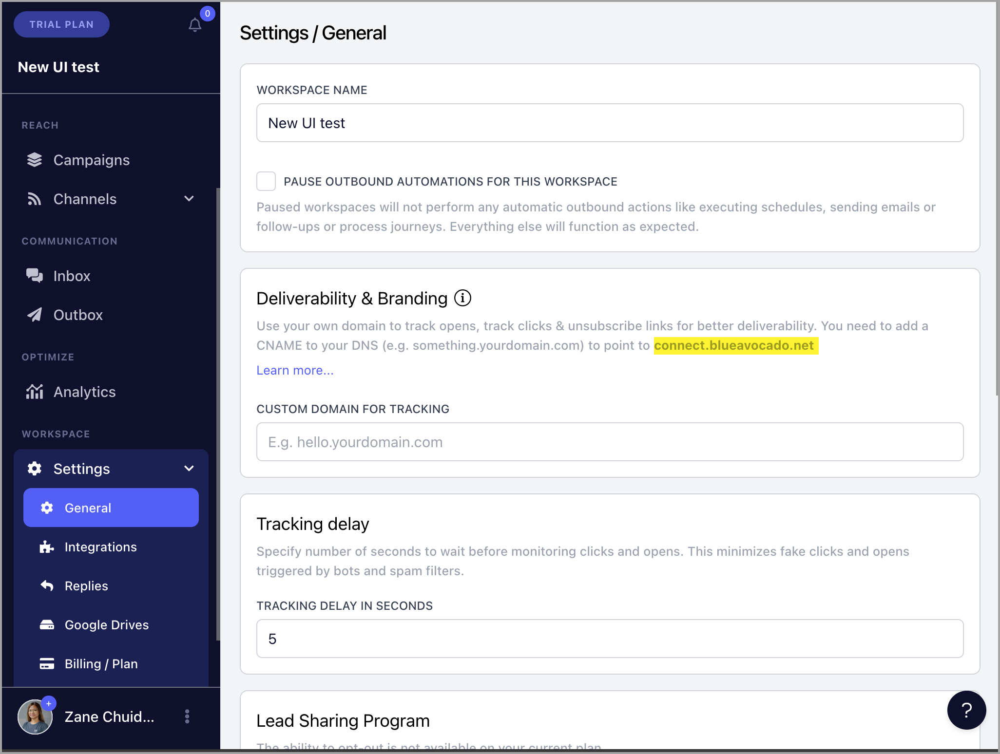
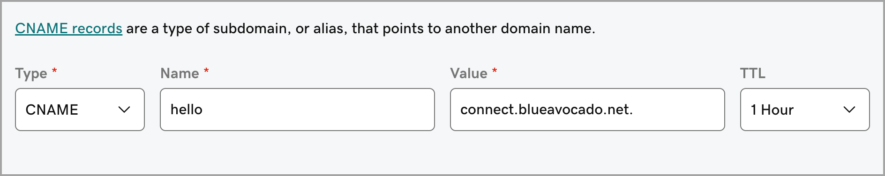
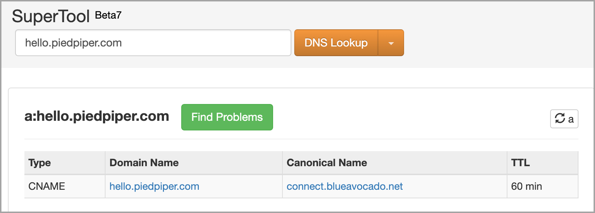
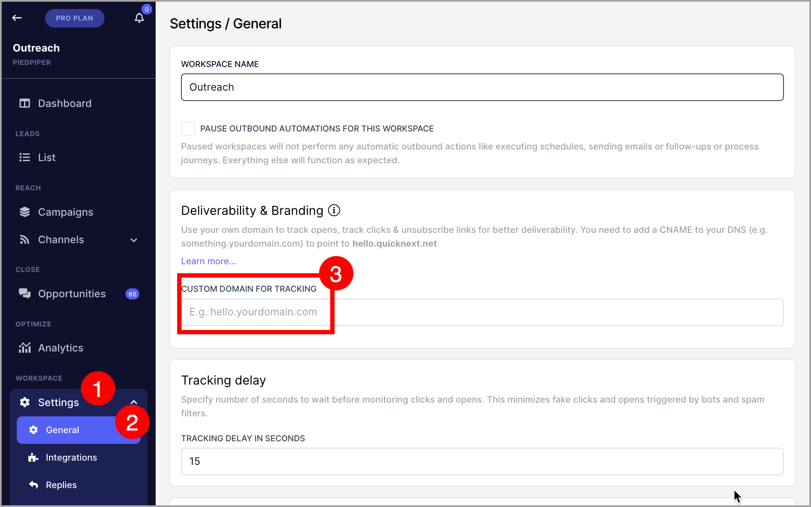
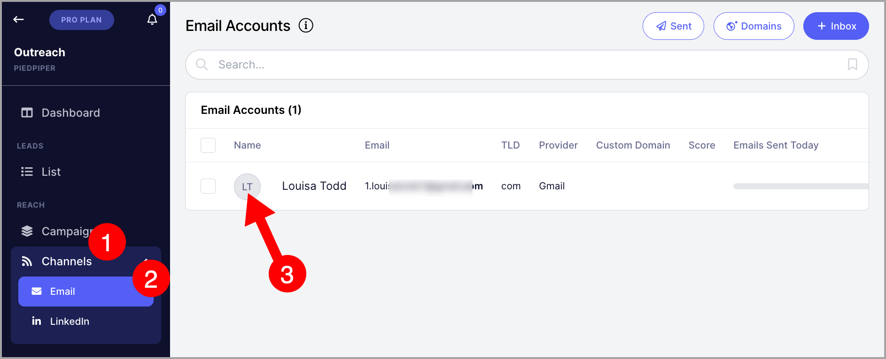
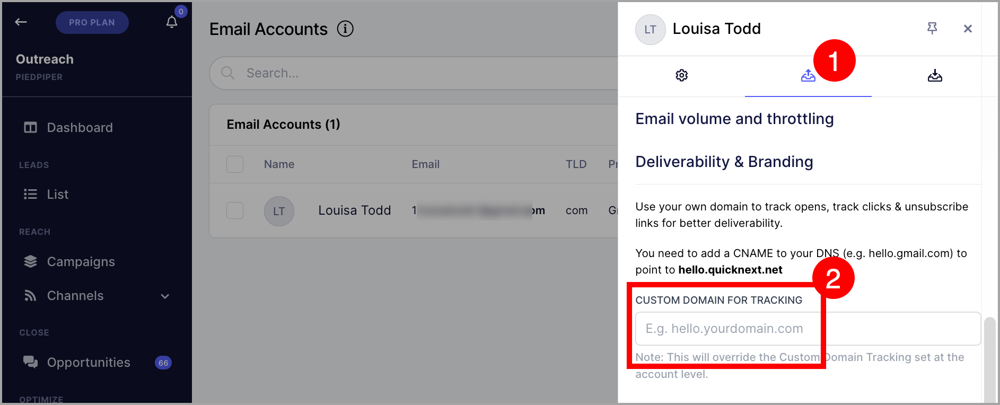
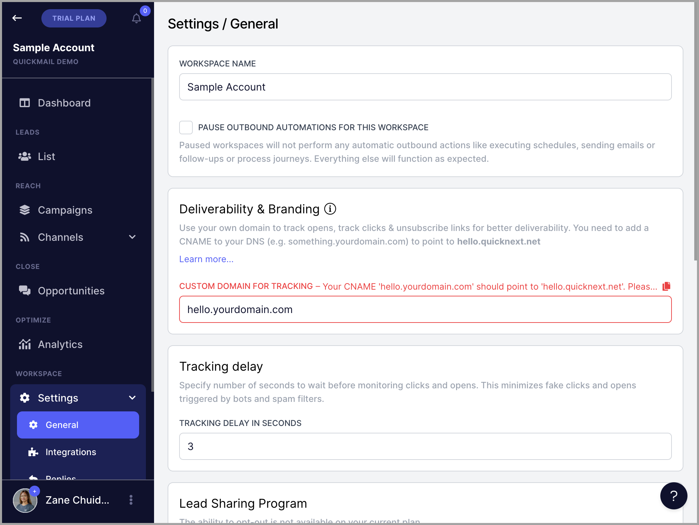

# Custom Domain Tracking to Improve Deliverability

**

**In this article:**

- [Importance of setting up custom domain tracking](#Importance-of-setting-up-custom-domain-tracking-sVjfm)

- [Setting up custom domain tracking](#Setting-up-custom-domain-tracking-bQsJ5)

- [Account level](#Custom-domain-tracking-on-the-account-level-Applies-to-all-email-acco-vhZ-P)

- [Email account level](#Custom-domain-tracking-on-the-email-account-level-Unique-for-each-ema-zJHTf)

- [How does custom domain tracking works?](#How-does-custom-domain-tracking-work-sbvMW)

- [How do I know if custom domain tracking is correctly setup?](#How-do-I-know-if-my-custom-domain-tracking-is-properly-set-up-UwIDp)

# Importance of setting up custom domain tracking

Custom domain tracking allows you to use your own brand to track what prospects do. When leads see links with your domain's branding, the email will appear more trustworthy, and they are likely to click the links.

Default tracking URLs are shared by other users, affecting reputation. With custom domain tracking, you control your domain's reputation, boosting email deliverability.

# Setting up custom domain tracking

## Step #1: Check where to point the CNAME

Go to your Workspace → Settings → General → Copy where to point the CNAME (It differs per account)

- **connect.blueavocado.net** (SSL)

- **hello.quicknext.net** (Non SSL)

**

In this screenshot below, the CNAME for my workspace should be pointing to connect.blueavocado.net**

**Pro Tip: **If you would like to change your custom domain tracking to SSL (secure links), please reach out to [support@quickmail.io](mailto:support@quickmail.io).

## Step #2: Add a CNAME record

To set up a custom domain tracking in QuickMail, you'll need to access your domain's DNS records to add a CNAME.

Here are some helpful articles from some domain hosts about how to add a CNAME record:

- [GoDaddy](https://nz.godaddy.com/help/add-a-cname-record-19236)

- [NameCheap](https://www.namecheap.com/support/knowledgebase/article.aspx/9646/2237/how-to-create-a-cname-record-for-your-domain/?__cf_chl_captcha_tk__=pmd_6ddcec20559dc3afd7fb925b1b36a955f75e7cea-1627324349-0-gqNtZGzNA2KjcnBszQq6)

- [Bluehost](https://my.bluehost.com/hosting/help/resource/714)

- [SiteGround](https://www.siteground.com/kb/site-tools-vs-cpanel-comparison-create-cname-records/)

Once you have accessed your DNS, add a CNAME with the desired hostname (Any name will do) and point it according to the one displayed in your workspace.

Based on the example in Step #1, it should point to **connect.blueavocado.net**. The TTL should be the default which is 1 hour.

**Pro tip:** Don't use email-related words for the CNAME host to avoid raising spam suspicion (e.g. mail, email, tracking, custom).

Once you've set up the CNAME, you may need to wait a bit (since TTL is 1 hour, this is the time it may take for the change in the DNS to propagate)

**Pro tip: **You can use DNS lookup tools like [MXToolbox](https://mxtoolbox.com/SuperTool.aspx) to check where the CNAME is pointing to

## Step #3: Add a custom domain tracking in QuickMail

There are 2 ways to add custom domain tracking:

- ### Account Level Custom Domain Tracking (Applies to all email accounts)

Once the CNAME record is properly propagated, go to your QuickMail account Settings → General → Custom Domain Tracking.

The format of custom domain tracking should be CNAME host + domain

For example, if the CNAME hostname is *hello* and the domain is *domain.com*, the custom domain tracking should be ***hello.domain.com****.*

- ### Email Account Level Custom Domain Tracking (Unique for each email account)

If you have multiple emails with different domains, it's best to set the custom domain tracking on the inbox level.

To do that, go to Channels  → Emails  → Click the thumbnail of the inbox.

Next, go to the sending tab of the email  → scroll down to custom domain tracking  → add the custom domain.

# How does custom domain tracking work?

When custom domain tracking is configured, we utilize your domain for tracking purposes.

If this setting is enabled at the account level, it applies to all inboxes within the account.

However, if an email account has its custom domain tracking, QuickMail prioritizes the email account's settings over those of the account.

# How do I know if my custom domain tracking is properly set up?

If the custom domain tracking isn't pointing to the correct values, you will get an error upon adding it to QuickMail.

We check the custom domain tracking settings on both the account and inbox levels daily to ensure they are properly configured. If we find that the custom domain tracking is not functioning correctly, we pause the affected inboxes.

For instance, if the custom domain tracking is only set up at the account level and is not working, we pause all inboxes in that account. However, if custom domain tracking is also set up at the inbox level, we only pause the inboxes with incorrect custom domain tracking.

**Note:** Inboxes with incorrect custom domain tracking - whether they're using that of the inbox or that of the account - can't be unpaused.
