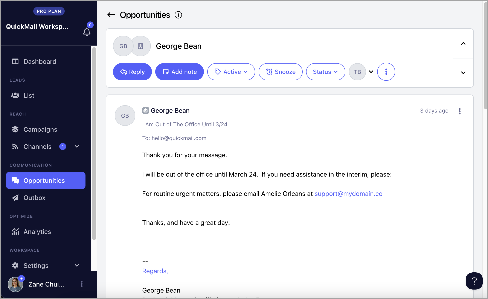
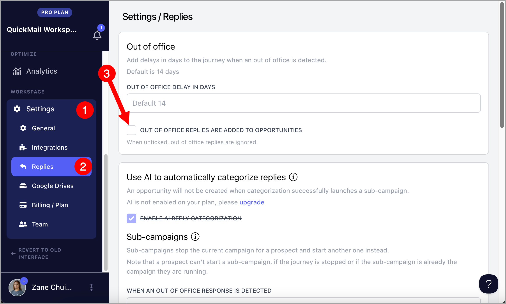
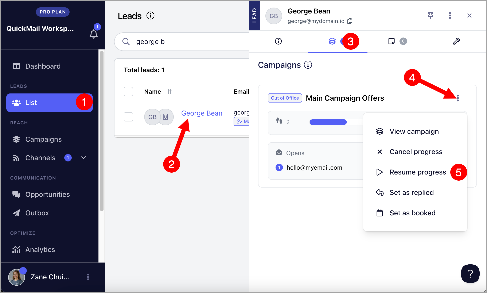

# Handling Out-of-office Replies

## What are Out-of-office Replies?

Out-of-office replies are automated email responses that notify the sender that the recipient is temporarily unavailable due to reasons such as vacation, leave, or departure from the company. These replies typically include details such as the expected return date and alternative contact information if necessary.

## How does QuickMail detect out-of-office replies?

QuickMail automatically checks email accounts every 10 minutes for new responses. Our system is designed to identify automated out-of-office replies and distinguish them from regular responses.

## What happens if a lead is marked as out-of-office?

When a lead is marked as out-of-office, QuickMail automatically delays the next email by an additional 14 days by default on top of the existing Wait Step.

For example, if the lead's next scheduled email was originally set to be sent in 3 days, QuickMail will instead wait 17 days (3 days + 14-day out-of-office delay) before sending the next email.

This ensures that emails are sent when the recipient is more likely to be available, improving the chances of engagement.

## How do I change the default delay of 14 days?

Go to the reply settings of the account and edit out of office delay in days. Here's an example of it set to 3.

## Where do I see out of office replies?

You can view out-of-office replies on the **Opportunities page** in QuickMail. This helps you identify whether a lead is temporarily unavailable or has left the company. Their out-of-office message may also provide useful details, such as their expected return date or an alternate contact person, allowing you to adjust your follow-up strategy accordingly.

If you don't want to see out-of-office replies in Opportunities, go to Settings → Replies → uncheck the box 'Out of office replies are added to Opportunities'

## How do I send emails immediately to leads marked as out-of-office?

Leads marked as out-of-office can be resumed immediately or on a specific date and time.

To resume out-of-office leads, click the lead's name or thumbnail in the List page to open quick view → Campaigns tab → click the triple-dot icon for the campaign → Resume progress → Select date → Confirm

**Note:** On rare occasions, an out-of-office reply is detected as a regular reply causing the leads to completely stop receiving emails from the campaign.

In such instances, you can also resume the lead immediately or on a specific date and time.
