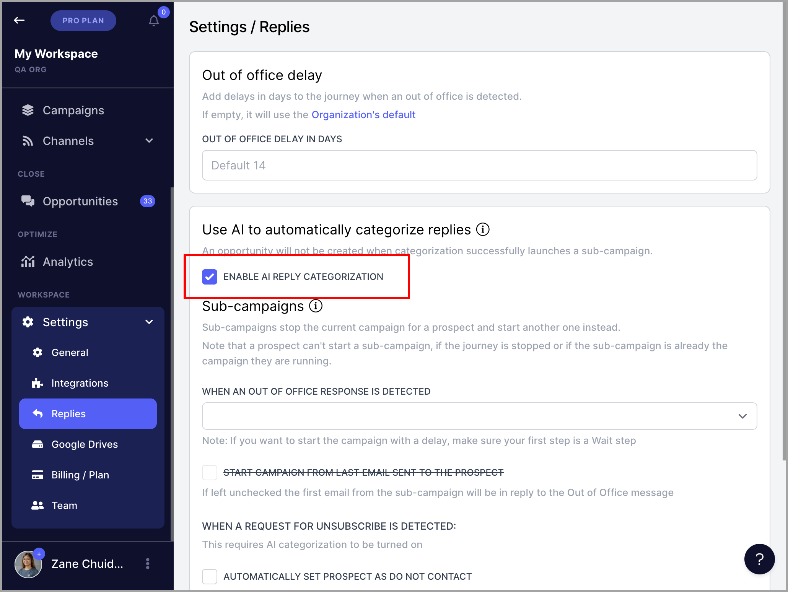
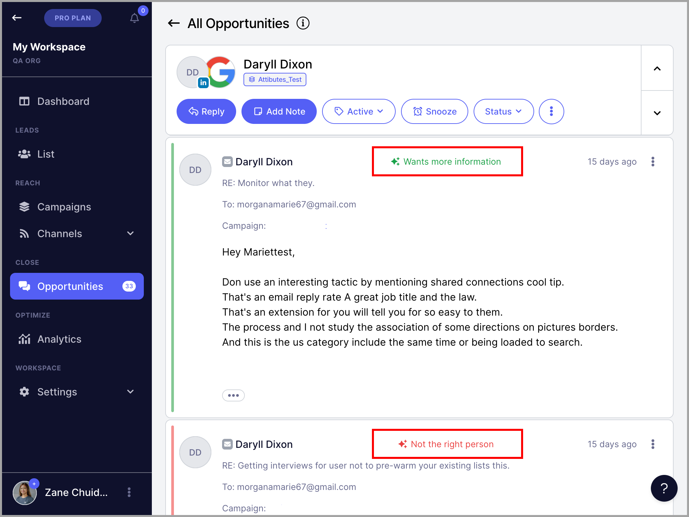

# Categorizing Replies with AI

**

### In this article:

- [What's the AI Reply Categorization feature?](#Whats-the-AI-Reply-Categorization-feature-t-Azb)

- [How does AI Reply Categorization work?](#How-does-AI-Reply-Categorization-work-X2aTP)

- [How are replies categorized?](#How-are-replies-categorized-uiCo9)

# What's the AI Reply Categorization feature?

**Note: **The AI Reply Categorization feature is only available for Legacy and Expert Plans

AI Reply Categorization is a useful feature that will help you gain insight into the underlying meaning of each reply that you receive.

The Analysis makes it easy to determine the sentiment of your campaigns **automatically**, without having to perform the work of tagging each reply individually.

Enable it in Settings → Replies → Enable AI Reply Categorization

# How does AI Reply Categorization work?

With the AI sentiments feature integrated into the Opportunities page, any received reply will undergo automatic AI reply analysis.

Each reply is then categorized with the corresponding label, and the AI automatically sets the sentiment of the journey with the first reply.

Once a reply is categorized with AI, it will also be possible to use the feature to start Leads on a new Sub-Campaign.

**Note: **The AI feature will currently only work with English-language text.

# How are replies categorized?

The analysis will categorize all replies into the following three categories:

### Positive Sentiments:

- **Interested** - Analysis determined that the Lead is interested.

- **More information** - The Lead would like to find out more.

- **Booking Request - **The Lead would like to book a meeting.

**

### Neutral Sentiments:

- Not Now** - The Lead might be interested, but this is not the right time.

- **Confused - **The Lead is not sure why they received this message.
**

### Negative Sentiments:

- Unsubscribe** - The Lead would like to be removed from any future campaigns (Lead is automatically marked as Do Not Contact and opportunity is automatically archived)

- **Not the right person - **The Lead is not the right person for this email.

- **Not interested  - **The Lead is not interested.

- **No need - **The Lead has no need for this right now.
