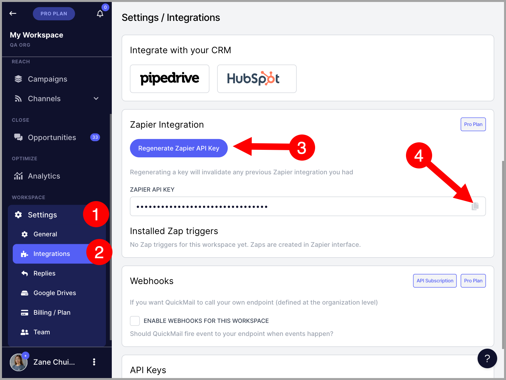
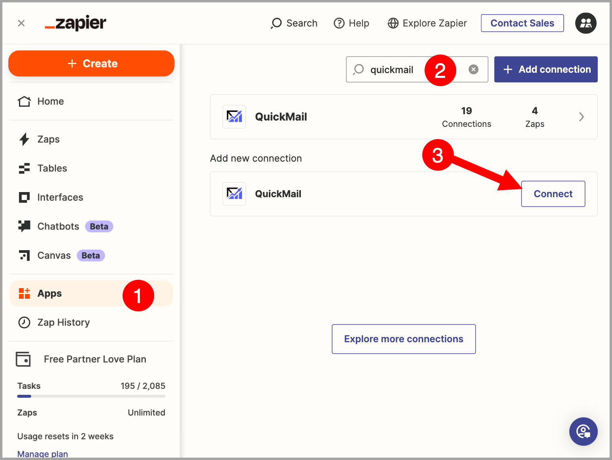
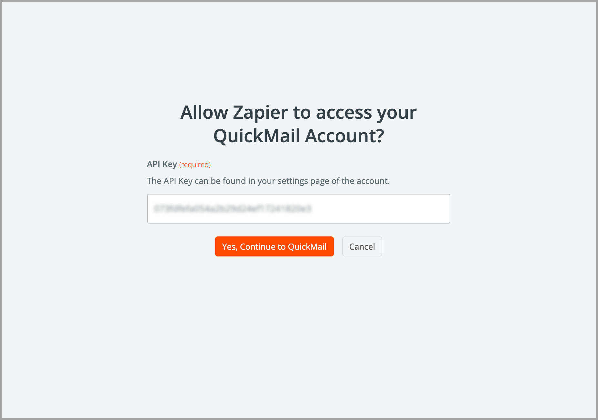
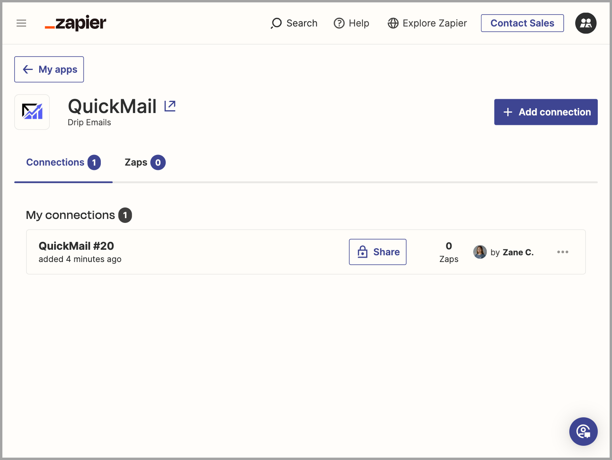

# Zapier Integration

**

## What is Zapier integration for?

Zapier allows integrations of multiple apps by connecting actions and triggers. This makes it possible to automate workflows from within QuickMail and create integration with other apps that are supported by Zapier.

Here are the available QuickMail **Triggers:**

-  Update Tag

-  New Reply

-  New Checkpoint reached

-  New Journey Completed

-  New Unsubscribe

-  New Bounce

-  New Task

-  New Open

-  New Click

-  New Journey Sentiments or Labels

- New Inbox Reply Status

Here are the available **Actions:**

-  Create or Update a Lead  (This Action can also Add a Lead on a Campaign)

-  Cancel Journey

-  Unsubscribe Lead

Here are the available data that can be extracted:

- Account ID

- Prospect ID

- Prospect Email

- Prospect First Name

- Prospect Last Name

- Prospect Titlte

- Prospect Role

- Prospect Phone

- Prospect Score

- Prospect Language

- Prospect Unsubscribed

- Prospect Verified Source

- Company ID

- Company Name

- Company Domain

- Journey ID

- Campaign ID

- Campaign Name

- Campaign Description

- Inbox Email

- Journey Opens

- Journey Clicks

- Journey Replies

- Journey Step Count

- Click Link

## How to set up Zapier integration

On your QuickMail workspace, go to Settings → Integrations → Scroll down to the Zapier Integration section → click Regenerate Zapier API Key → Copy Zapier API Key

Next, go to Zapier → Go to Apps → Search QuickMail from the apps → click Connect.

After clicking Connect, a new window will pop up. To allow Zapier to access your QuickMail account, paste the Zapier API key that was generated in QuickMail → Yes, Continue to QuickMail

This is how it should look like once QuickMail has successfully been connected to your Zapier account.

## How to create Zaps with QuickMail Triggers and Actions

Go to Zapier Home Page and click + Create → Select Zaps

When creating a zap, search QuickMail for the Trigger or Action (depending on the automation you want to set up)

Follow the prompts on the page to create a Zap that does what's needed.

After the Zap is all set, use the switch in the top-right corner to turn it on, and it'll be good to go.

Zapier will take care of the rest!
