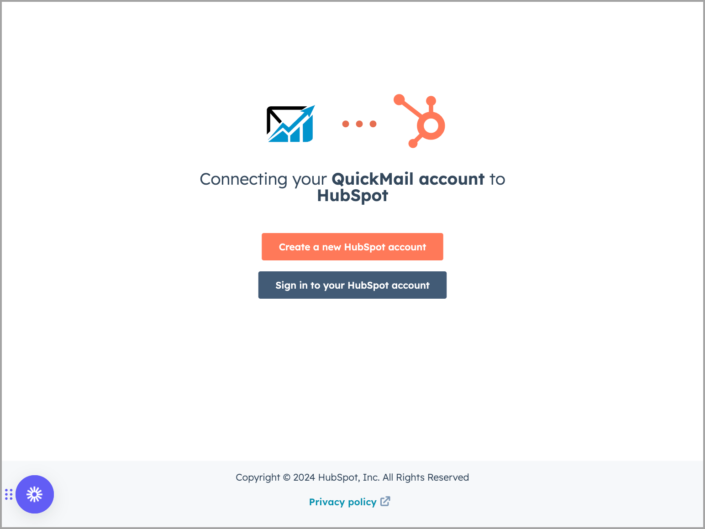
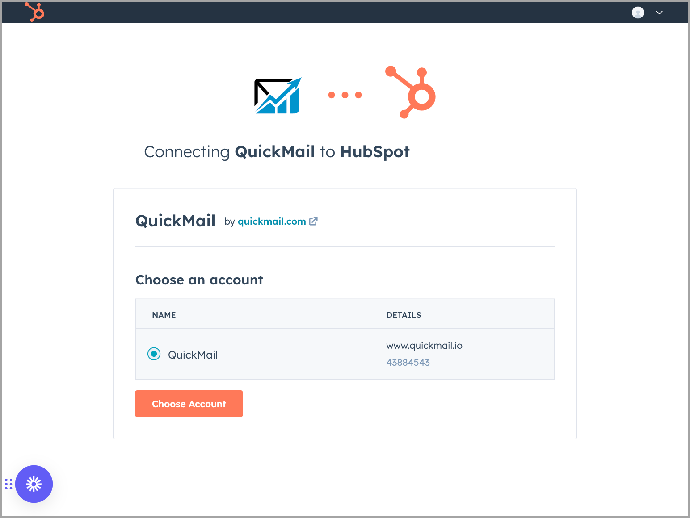
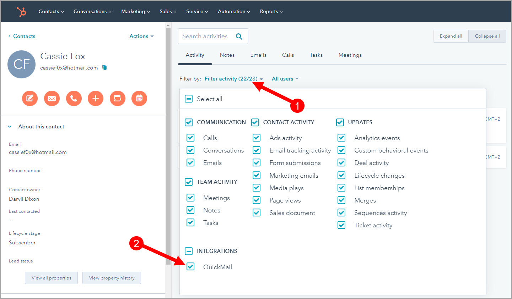

# HubSpot Integration

HubSpot CRM can now be connected to QuickMail to improve your workflow.

It allows users to export, import, automatically sync, and see the lead's activities in HubSpot.

#### In this article:

- What is Supported in the Two-Way Sync?

- How to Setup HubSpot Integration?

- How to Manually Trigger an Import from HubSpot?

- How to See Leads' Activities in Hubspot?

- How to Pause HubSpot Integration?

- How to Remove HubSpot Integration?

- How to See Synced Leads?

## What Is Supported in the Two-Way Sync?

Updating and adding leads are automatically synced in real time. Note that importing a large list may take some time for all data to be synced.

Currently, here's how two-way sync is triggered for Leads:

- Adding or Importing Leads

- Editing First Name or Last Name

- Editing Job Title

- Editing Phone Number

- Events include Opens, Clicks, Replies, Unsubscribes, and Bounces.

- Assigning or Unassigning Tags and Custom Attributes

Here's how two-way sync is triggered for Tags & Custom Attributes

- Editing a tag in QuickMail updates the QuickMail properties in HubSpot

- Deleting a tag in QuickMail puts a tag (deleted) on the QuickMail properties in HubSpot

- Editing a tag in HubSpot doesn't reflect in QuickMail

Currently, our HubSpot integration doesn't support recording sent emails.

If the goal is to record all the sent emails in HubSpot, it's necessary to use the BCC setting.

Please refer to this article for more details: Logging Sent Emails in HubSpot

**Note:** Editing lead information won't create a new contact in Hubspot.

## How to Setup HubSpot Integration?

To Setup Hubspot Integration in QuickMail, go to Settings →  Integrations → Look for HubSpot

You'll be prompted to sign in, or create a new HubSpot account

After signing in, select the HubSpot account you would like to connect to QuickMail

This is what it looks like in QuickMail once a HubSpot account has been connected

## How to Manually Trigger an Import from HubSpot?

Existing leads in HubSpot and QuickMail won't automatically sync after setting up the integration. Only the new leads created after the integration is set up will be synced automatically. So the leads must be manually imported via the integration.

**Note:** It's not possible to filter the list of leads that will be imported from HubSpot to QuickMail.

To manually import all Leads from HubSpot, go to Settings → HubSpot → Import all existing Leads in HubSpot

Importing all leads to QuickMail may take some time. Once the import has finished, you will receive an email notification about the import.

## How to See a Leads' Activity in Hubspot?

To see a Leads' activity in Hubspot, go to a specific contact → Filter Activity → Enable filter for QuickMail Integration.

After enabling the filter for QuickMail Integration, Leads' activities are displayed under the Activity tab.

## How to Pause HubSpot Integration?

Creating new Leads will no longer sync when integration is paused. However, these actions will still sync:

- Updating tag names

- Creating and Deleting Custom Attributes from QuickMail to HubSpot

- Creating and Deleting Tags from QuickMail to HubSpot

To pause integration, Go to Settings → Integrations → Under HubSpot Integration, check the box "Pause Integration"

## How to Remove HubSpot Integration?

Two-way sync will permanently stop once HubSpot Integration is removed in QuickMail.

Go to Settings → Integrations → Under HubSpot Integration, click "Remove HubSpot Integration"

