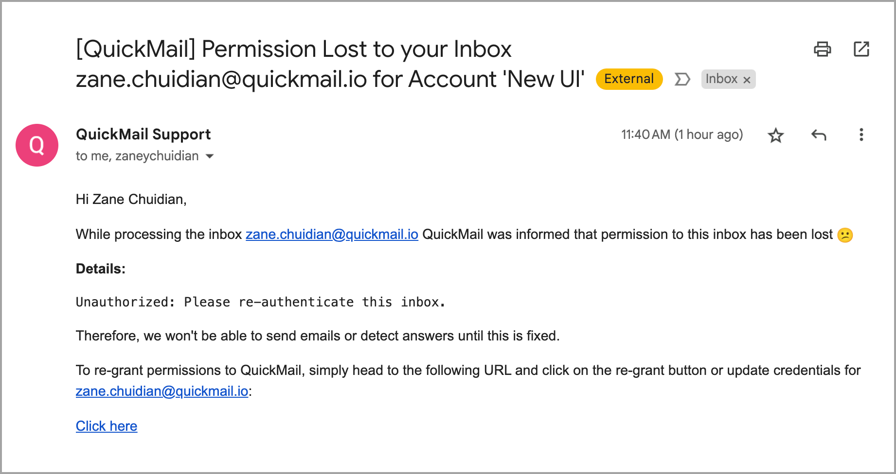
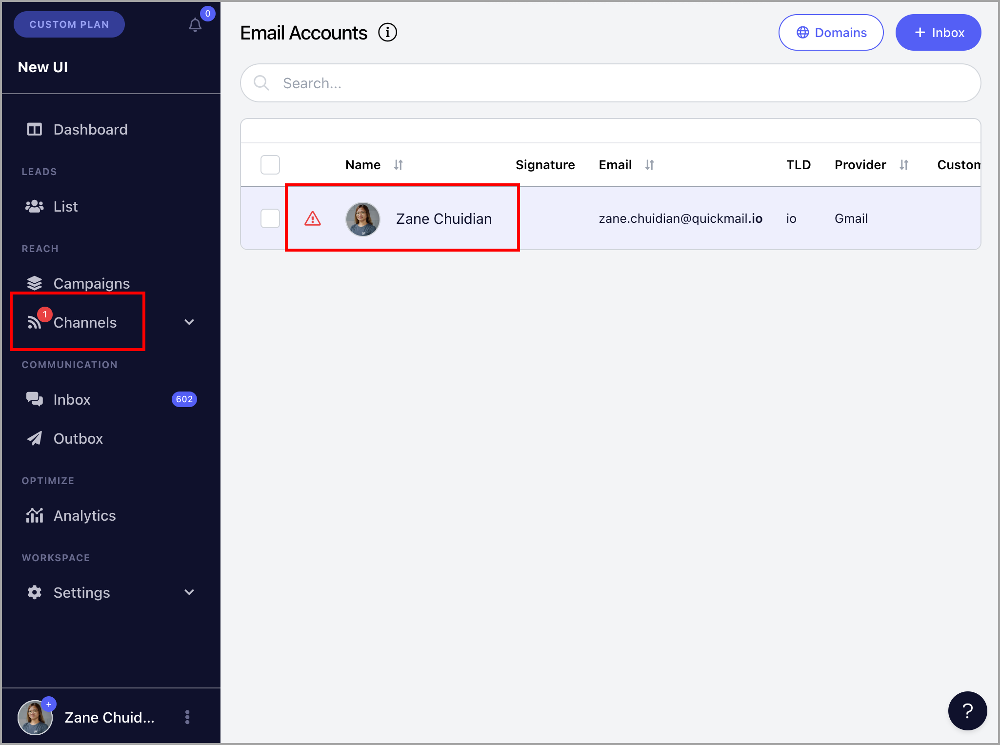
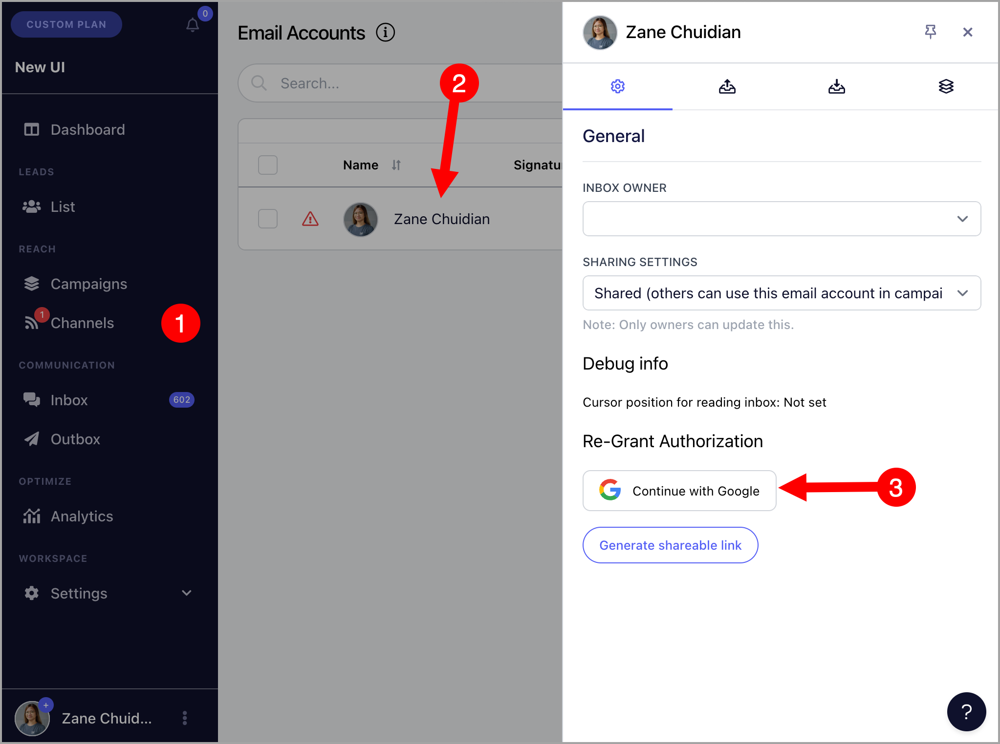
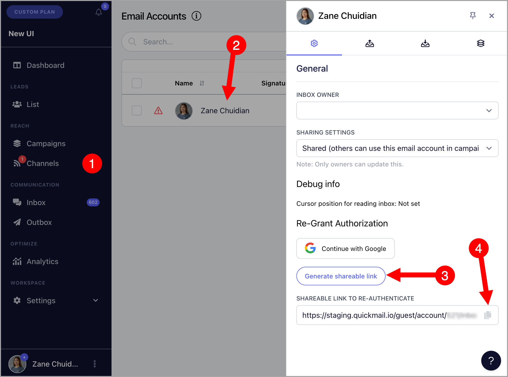
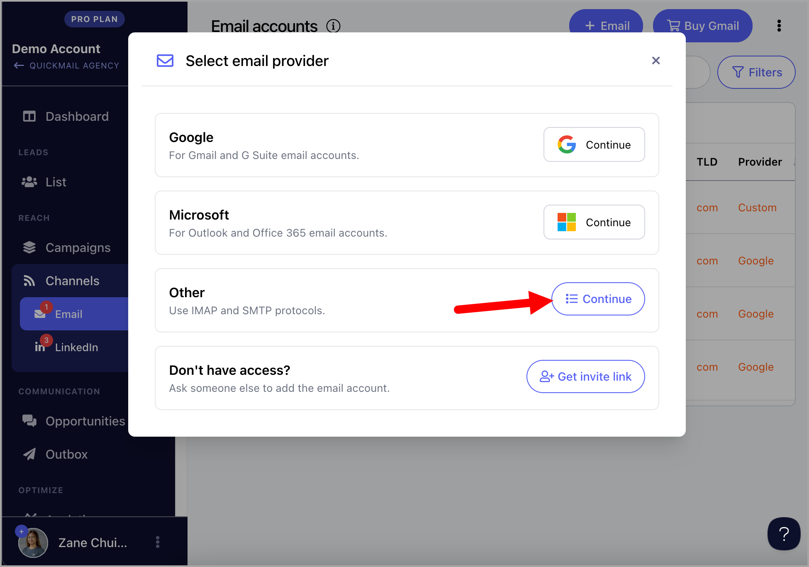
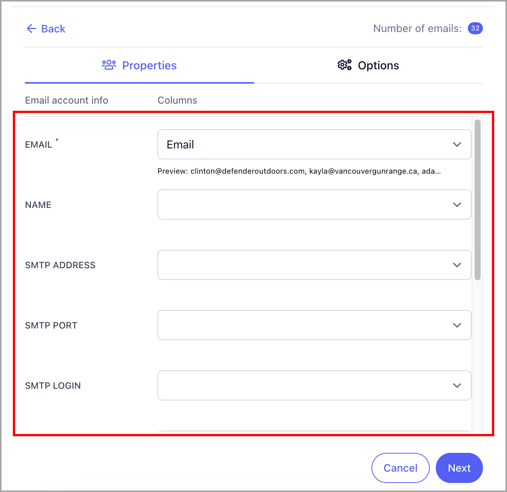
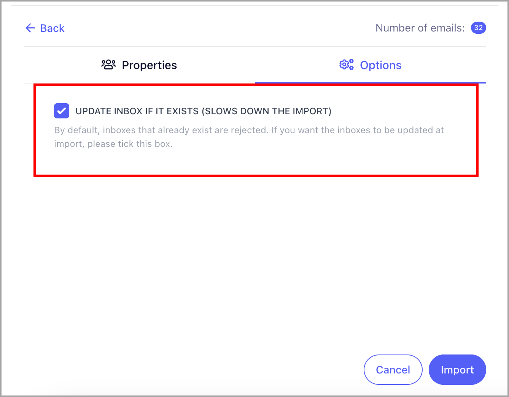

# Re-authenticating Email Accounts

QuickMail may lose permission to your email account due to changes in the security settings of the email account, cancellation of the account, or a security check by the email provider (which may happen to newly set up email accounts).

When this happens, no emails will be sent out from the email accounts. This also means that replies and bounces will not be detected until the email account has been re-authenticated.

**In this article:**

- How to know if an email account lost authentication?

- How to reauthenticate email accounts?

- Gmail and Outlook

- Custom Email Accounts

# How to know if an email account lost authentication?

If QuickMail loses permission to your email account, you will receive an email notification stating which email account is affected.

**Note:** The email notification will be sent to both the admin, the owner of the email account in QuickMail, and the email account itself.

Here's an example of an email notification, stating that permission to an email account is lost.

Moreover, there will be a red indicator in the left-side navigation under Channels or a danger icon beside the email account name.

# How to re-authenticate email accounts?

Note: Once the disconnected email account has been re-authenticated, all pending emails will be sent immediately

## Gmail or Outlook Email Account

There's currently no option to reauthenticate Gmail or Outlook inboxes in bulk. Each account needs to be reauthenticated individually.

To reauthenticate a Gmail or Outlook account, go to Channels → Emails → Select an email account.

### Option 1: If you have access to the email account

Click on Continue with Google or Microsoft under Re-grant Authorization.

### Option 2: If you don't have an access to the email account

Generate and copy the shareable link to reauthenticate the email account. Provide it to the person who has access to the email account.

## Custom Email Accounts

Option 1:** To reauthenticate custom email accounts individually, go to Channels → Emails → Select an email account → Sending Settings → Update the SMTP details if needed → Test Sending**.**

After that, go to Receiving Settings → Update the IMAP details if needed → Test Receiving

**Option 2: **To reauthenticate custom email accounts in bulk, first, you'd need to have a list of email addresses, passwords, SMTP, and IMAP settings of the email accounts.

You can copy and use this template: [Format for Bulk Reauthentication of Custom Inboxes](https://docs.google.com/spreadsheets/d/1uMcEfIRJ-I5Dbu1ioUguJ3t1OvWOPxMCcQzI9bLA2tQ/edit?gid=0#gid=0)

Once you have a CSV of the email account info, go to Channels → Email → + Email → 'Other: Continue'

After that, click '+ Add in bulk'

Make sure to map the correct columns

Then, check the box 'Update inbox if it exists'

An import report will then be sent via email to show the status. The red warning icon will no longer show up once the email accounts have been reauthenticated
