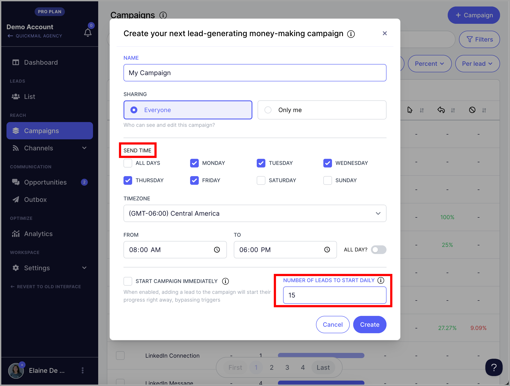

# Campaign Building Video Guide 🎥

**

**Videos in this guide:**

- [Step 1 - Creation + Steps](#Step1---Creation--Steps-843Wc)

- [Step 2 - Channels](#Step-2---Channels-Inbox-Rotation-tZttu)

- [Step 3 - Automation](#Step-3---Automation-Send-Times-and-Triggers-TcGYv)

- [Step 4 - Add Campaign List](#Step-4---Add-Leads-zMJCd)

- [Step 5 - Review, Test, Go Live](#Step-4---Review-Test-and-Go-Live-n3IX9)

Welcome to QuickMail! 🎉 This video guide will take you through the steps to set up your first campaign.

**

If you prefer written resources, check out this setup guide.

Let's dive in...

# Step1 - Creation + Steps

QuickMail campaigns can be set as shared** (visible by the whole team) or **private** (just for you).

**

This video takes you through the steps to create a campaign and build the steps for outreach.

Jump ahead:**

0 sec - Intro and how to create a campaign

[35 sec](https://quickmail-1.wistia.com/medias/42qxjazidq?wtime=35s) - Creating campaign steps

[1 min 30 sec](https://quickmail-1.wistia.com/medias/42qxjazidq?wtime=1m30s) - Lead properties for customization

[2 min 30 sec](https://quickmail-1.wistia.com/medias/42qxjazidq?wtime=2m30s) - Step variations for a/b testing

[3 min](https://quickmail-1.wistia.com/medias/42qxjazidq?wtime=3m0s) - Step settings (open and click tracking, etc.)

**

Note: There's no limit to how many steps you can add to a campaign and you can create as many campaigns as you need.

# Step 2 - Channels

This is the stage of the campaign builder where the email and LinkedIn accounts are selected as senders.

This video gives you a quick demo of inbox rotation** and how to scale your sends up or down in a few clicks.

Adding additional senders alone won't increase the number of outbound sends from your campaign. The campaign **triggers** should also be increased to change the number of new leads being added to the campaign.

# Step 3 - Automation

There are two automations to create when setting up your campaign: **triggers** and **send times.**

**

Send times** are the timeframe where emails can be sent from the campaign

**Triggers** add leads to the campaign at set days and times

**Jump head:**

[24 sec](https://quickmail-1.wistia.com/medias/4a6xha5gmg?wtime=24s) - Explanation of send times vs. triggers

[45 sec](https://quickmail-1.wistia.com/medias/4a6xha5gmg?wtime=45s) - How to set send times and triggers

[1 min 25 sec](https://quickmail-1.wistia.com/medias/4a6xha5gmg?wtime=1m25s) - How to scale up your sends

**

Update: **When you create a campaign, you should see this set up page.

So you can set up your send times and triggers immediately when creating campaigns.

**

The time of the trigger will be the start of your send time

# Step 4 - Add Campaign List

Once your campaign automation is set up, it's time to add leads** to your campaign!

**

You have 3 options for adding leads:

- Create a lead individually

- Import in bulk via CSV

- Import in bulk via Google Drive

In the video below we cover importing custom lead properties, lead tags**, and **adding leads** to your campaign.

# Step 5 - Review, Test, and Go Live 🎉

Before you flip the switch on a campaign - it's a good idea to **preview** the steps and even send **test emails** to see exactly how each email looks in the inbox.

**Jump ahead**

[20 sec](https://quickmail-1.wistia.com/medias/df6cr9zwz2?wtime=20s) - Preview campaign steps

[1 min 5 sec](https://quickmail-1.wistia.com/medias/df6cr9zwz2?wtime=1m5s) - Send test emails to yourself or another email address

[1 min 24 sec](https://quickmail-1.wistia.com/medias/df6cr9zwz2?wtime=1m24s) - Warnings + go live 🎉

**

QuickMail will prompt you with campaign warnings if it detects settings that could cause errors.

These errors are most commonly related to senders** (not having an email address or LinkedIn account selected in channels) and **leads** (not having leads uploaded to the campaign).

**

A campaign can be set to live before leads are uploaded. **Once the leads have been added to the campaign, QuickMail will start them in the steps at the next trigger.

Questions? We'd love to hear from you! Send us an email directly at [support@quickmail.io](mailto:support@quickmail.io)
