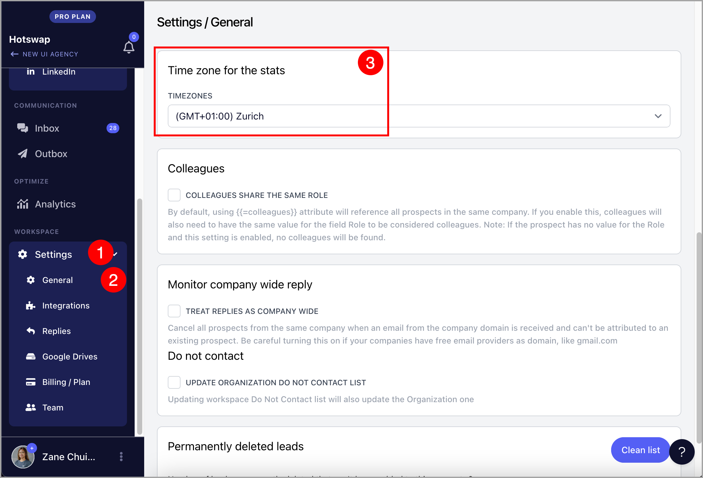

# Account Timezones

**

The timestamps in the campaign and account analytics will reflect the timezone of the account. The default timezone assigned to the account will match the timezone in which the account was created.

Note: Timestamp on the Outbox (Sent Emails) are based on the timezone of your device

# How to change or check the account timezone?

To change or check for the account timezone, go to Settings → General → Scroll down and look for "Timezone for the stats" → Select your preferred timezone

