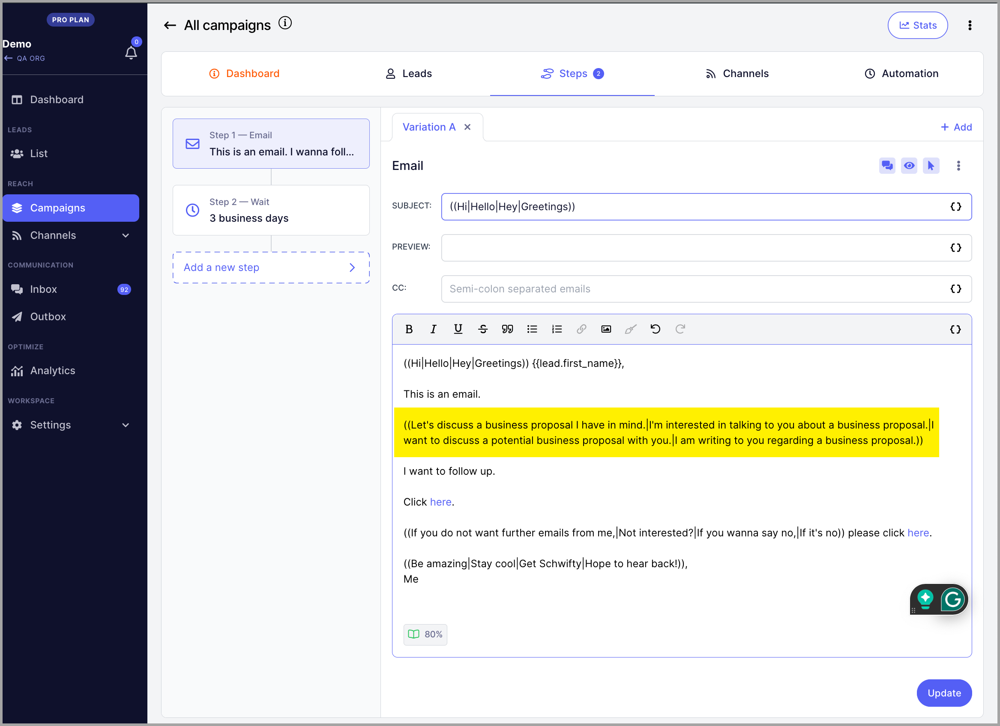

# Text Variations (Spintax)

**

## Why use text variations?

Text Variations can be added to emails to vary the emails going out.

This is a good way to avoid campaign fatigue where spam filters flag the email account for sending too many emails with the same content.

## How to add text variations?

Start with 2 open parentheses "((" add the first text variation and separate each text variation with a vertical bar "|".

Close the text variation set with 2 close parentheses "))".

**Example: **

**

(( Hi | Hello | Hey | Greetings ))

Phrases and sentences work too:

It's also possible to add multiple text variation sets in the email to vary the emails even more!

Any text variations added can be picked randomly when prospects get to the email step.

So the example above may send an email like:

Pro tip:** Aside from text variations, you can also have email variations if you want to do A/Z testing and track which copy is working best. Check this out.
