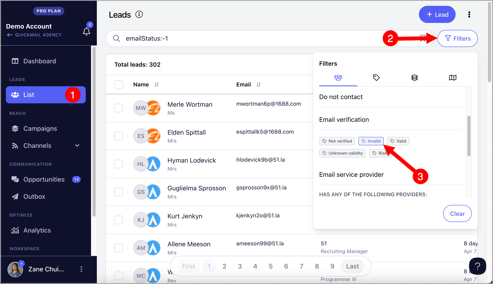
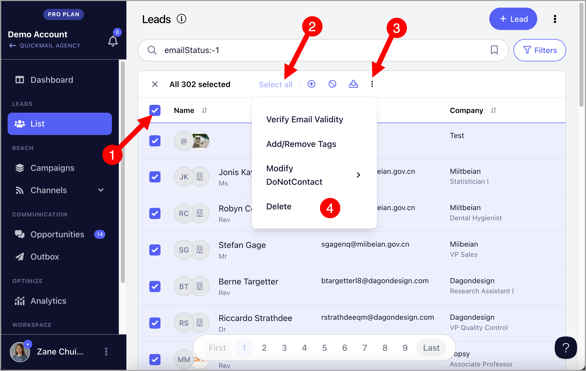
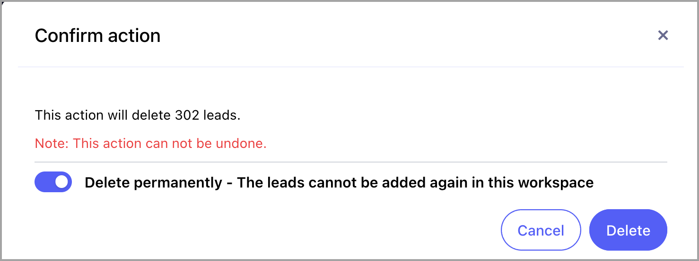
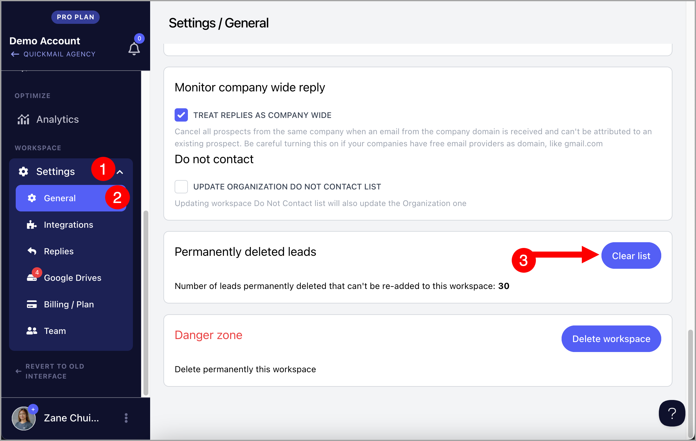
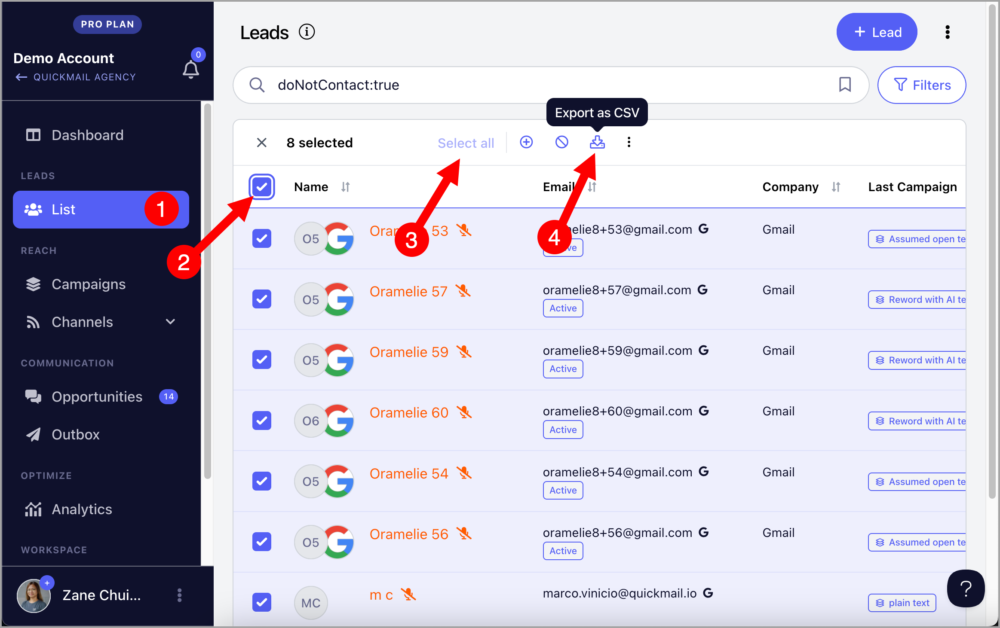

# Permanently Deleting Leads

**

**In this article:**

- [Why delete leads permanently?](#Why-delete-leads-permanently-WoYec)

- [What specific leads can I permanently delete?](#What-specific-leads-can-I-permanently-delete-xrChL)

- [How to delete leads permanently?](#How-to-delete-leads-permanently-Ryf2_)

- [I mistakenly deleted leads permanently, how do I undo it?](#I-mistakenly-deleted-leads-permanently-how-do-I-undo-it-_BYQA)

- [Can I get a list of permanently deleted leads?](#Can-I-get-a-list-of-permanently-deleted-leads-Zp5Nt)

# Why delete leads permanently?

All accounts have a lead limit based on the plan — 10k for Basic, 50k for Pro, and 100k for Expert.

When you reach your lead limit, you can permanently delete leads from your account to make room for new ones.

Permanently deleting leads also helps prevent accidentally re-adding leads you no longer wish to engage with or message.

# What specific leads can I permanently delete?

It's always up to the user to decide, but some of the most commonly deleted leads are those who have unsubscribed, are marked as "do not contact," or have bounced/invalid email addresses.

To narrow down your list to only show unsubscribed/do not contact leads, go to List →  Filters →  Has "Do Not Contact"

Meanwhile, to get the list of invalid emails, go to List →  Filters → under Email Verification, select 'Invalid'

# How to delete leads permanently?

To delete leads permanently, first, select all filtered leads.

Then, before confirming delete, make sure to toggel 'Delete Permanently' on

# I mistakenly deleted leads permanently, how do I undo it?

From your workspace, go to the general settings → scroll down → clean list.

# Can I get a list of permanently deleted leads?

It's not possible to retrieve a list of permanently deleted leads.

Once leads are permanently deleted, their data is stored in the database but encrypted, making it unreadable.

To avoid losing records of permanently deleted leads, it's a good practice to always export the list beforehand.

To export the leads you'd like to delete permanently, select the leads you'd like to delete permanently → Export (CSV will be sent to the email address you're using to login)

