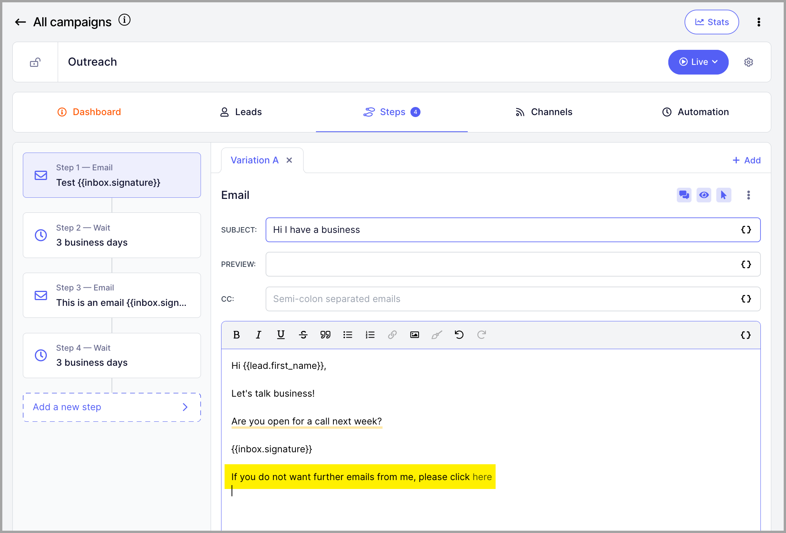
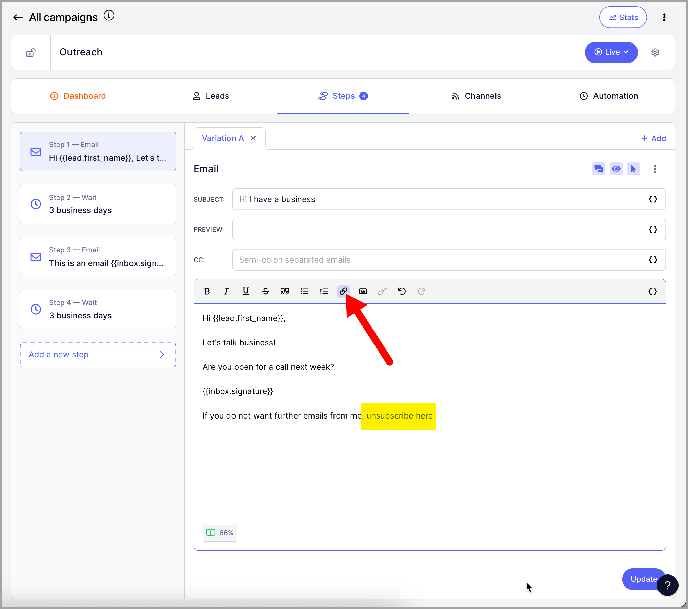
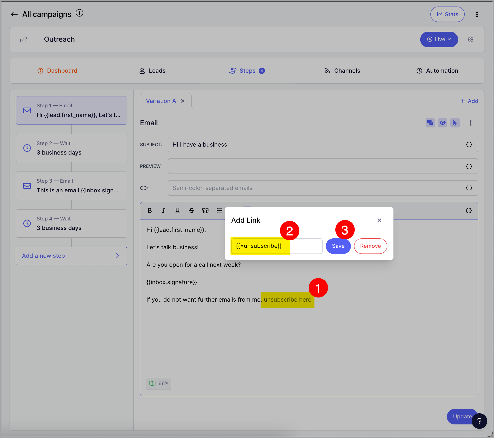
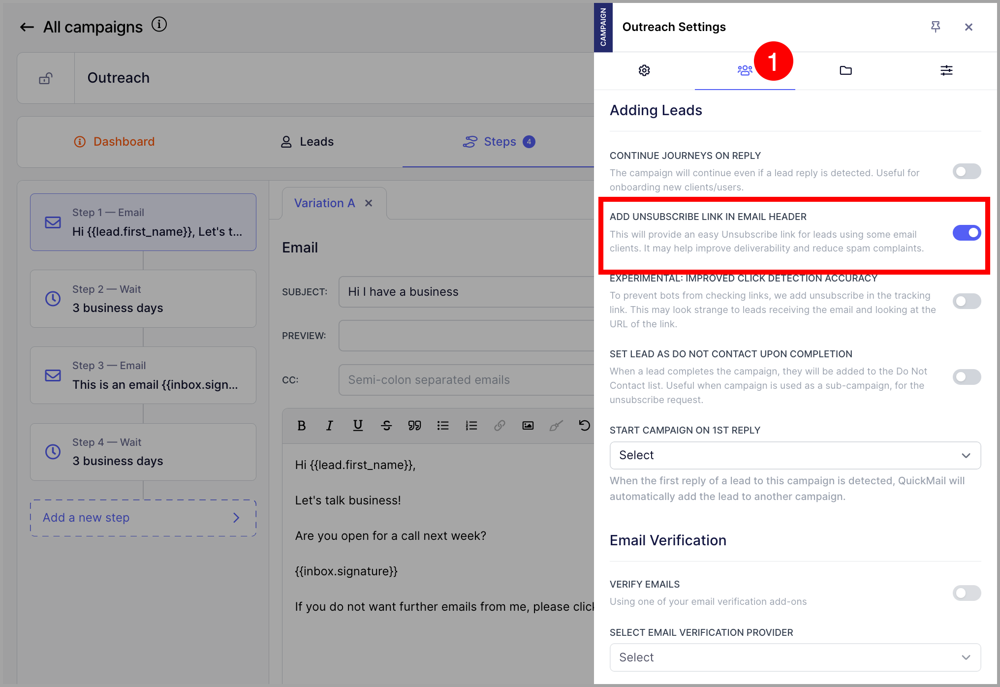
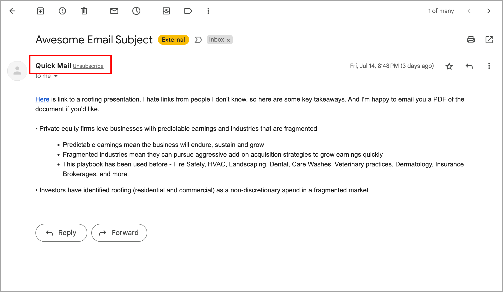
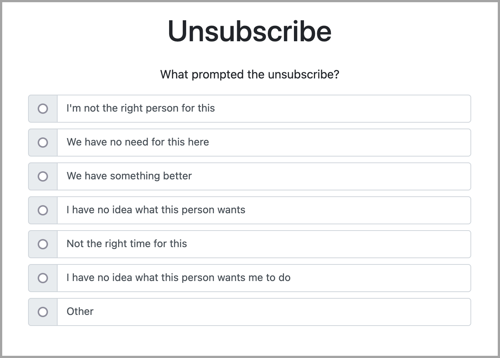

# Adding Unsubscribe Links

**

**In this article:**

- [Why add an unsubscribe link to emails?](#Why-add-an-unsubscribe-link-to-emails-5bSCd)

- [How to add an unsubscribe link to my emails?](#How-to-add-an-unsubscribe-link-to-my-emails-qnRwA)

- [How to personalize the unsubscribe message?](#How-to-personalize-the-unsubscribe-message-ySr2b)

- [How to include an unsubscribe link in a signature?](#How-to-include-an-unsubscribe-link-in-a-signature-kKqF0)

- [How to include an unsubscribe link in the email header?](#How-to-include-an-unsubscribe-link-in-the-email-header-Dqon0)

- [What do leads see if they click unsubscribe?](#What-do-leads-see-when-they-click-unsubscribe-MIjyy)

# Why add an unsubscribe link to emails?

Including an Unsubscribe link for prospects is a good way of giving them a quick way to say they're not interested, and can potentially reduce the risk of them marking messages as Spam.

However, the more links in a message, the greater the likelihood of reducing the deliverability of messages, so be mindful of that!

# How to add an unsubscribe link to my emails?

To add an Unsubscribe link to your emails, go to the campaign → Steps → Open an Email Step → on the email editor, click the icon { } for properties.

**

From the properties menu, click pre-computed and click Unsubscribe.

It'll insert the Unsubscribe Attribute wherever your cursor is in the message body.

It will read "If you don't want to hear from me again, click here," with "click here" being the Unsubscribe link.

# How to personalize the unsubscribe message?

The unsubscribe attribute can also be used as a hyperlink. To do that, enter the text into the email body → highlight the part you'd like to be the unsubscribe link → click the link button on the toolbar.

Then, enter {{=unsubscribe}} as the link → click save.

# How to include an unsubscribe link in a signature?

If a signature is being included in emails, the unsubscribe link can live there, too!

From the signature page, you can link the {{=unsubscribe}} properties into any word and it will work the way it does in email steps.

# How to include an unsubscribe link in the email header?

You can also include an Unsubscribe Link in an email header to make it easier for your prospects to unsubscribe from a campaign.

To include an Unsubscribe Link to an email header, on the campaign -> click the gear icon -> under the 2nd tab, toggle "Add unsubscribe link in email header" on.

Here's how the unsubscribe header will appear on your emails

Pro tip: **The unsubscribe header won't appear if the inbox doesn't have a good sender reputation and/or if the unsubscribe link is not SSL.

To have a higher chance of unsubscribe links appearing on your email headers, make sure that your unsubscribe links will use SSL by setting up custom domain tracking.

# What do leads see when they click unsubscribe?

Whenever a lead unsubscribes from your emails, they will be redirected to this form where they can choose the reason for unsubscribing.

**Note: **As soon as leads click the unsubscribe link, they will automatically be unsubscribed even though they don't choose from the list.

**Note: **There's no option to edit the list or have them in a different language
