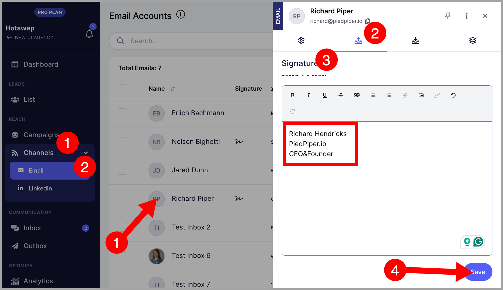
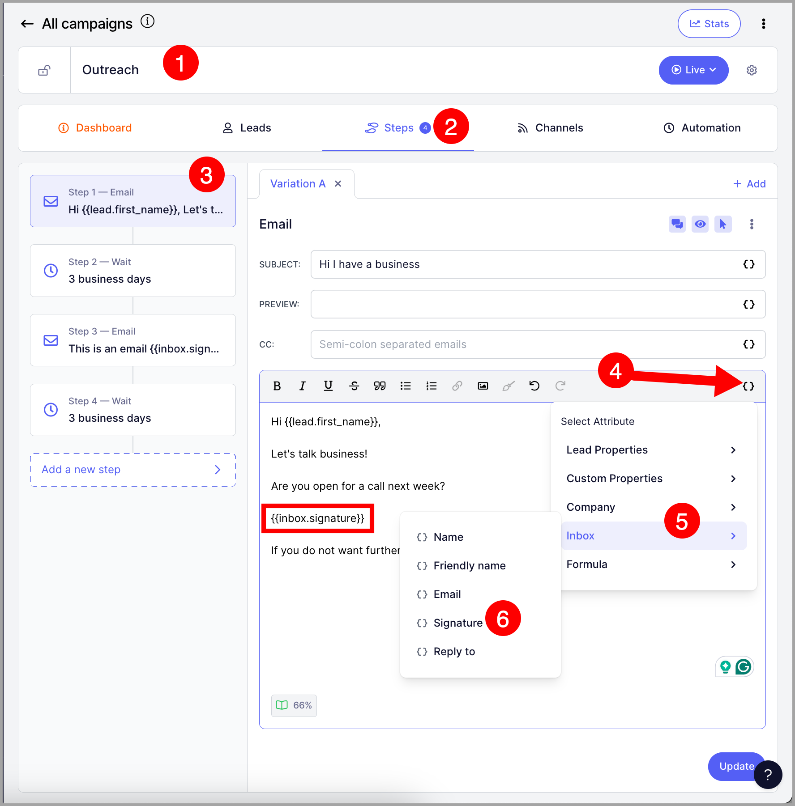
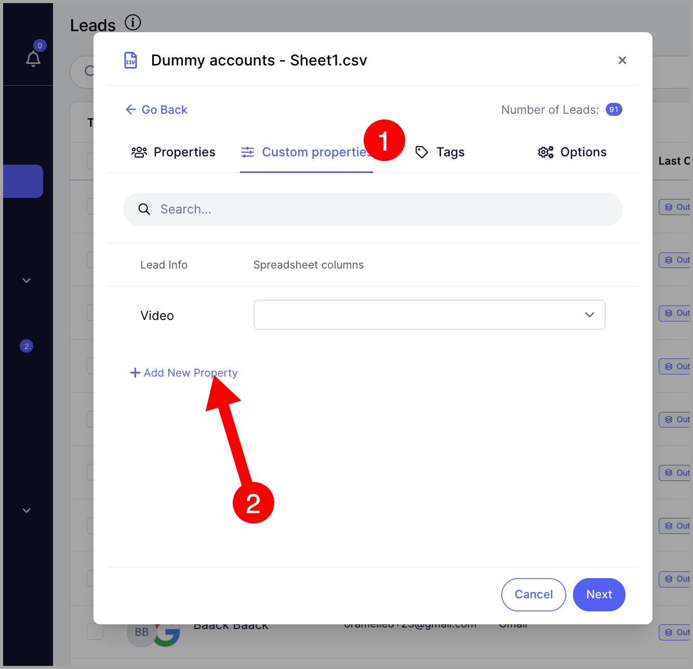
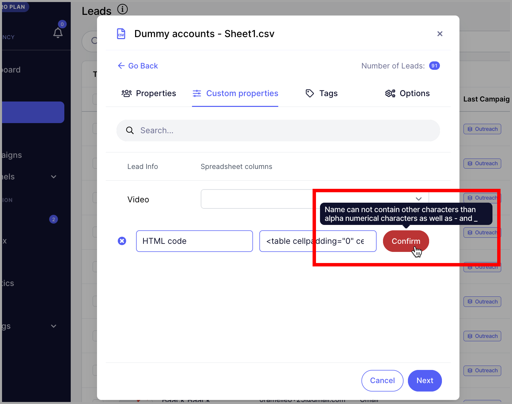
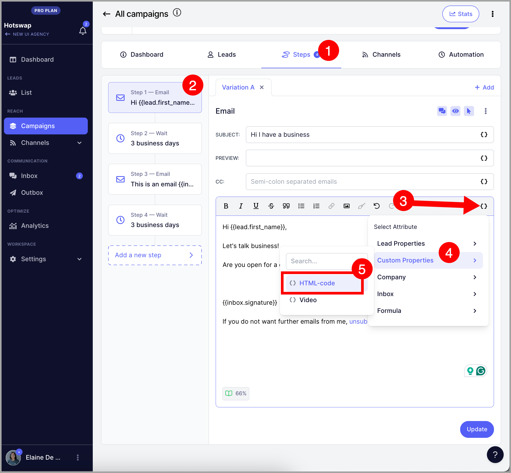
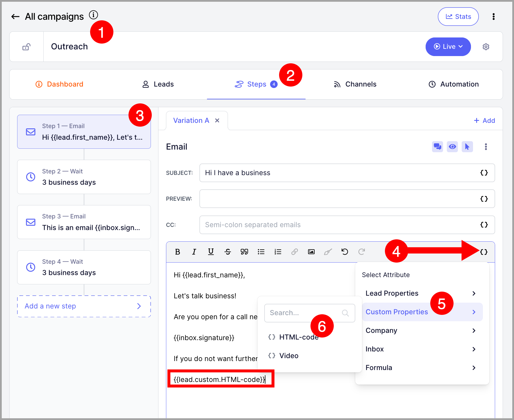
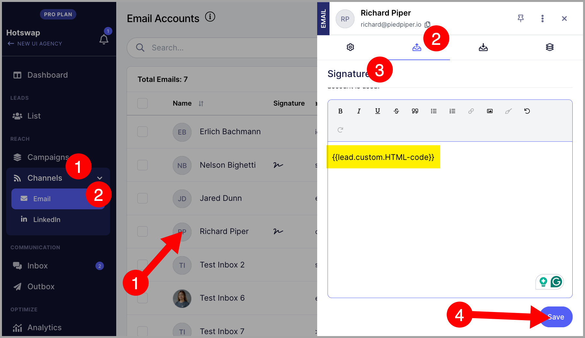

# Adding Email Signature

### In this article:

- Why create an email signature in QuickMail?

- How to create a signature?

- What is the signature attribute?

- How to create an HTML signature?

# Why create an email signature in QuickMail?

Signatures in Quickmail are created on a per-email basis, so no matter which email is used, QuickMail will use the appropriate signature when sending the message.

That means you don’t need to update the email steps in all your campaigns when changing/updating your contact information, for example.

Aside from being able to add an email signature to an email campaign, the signature attribute is convenient when you’re using multiple emails to send campaigns.

If you don't use the signature attribute and just add the signature to the body, then the email signatures will be static.

Using the signature attribute allows you to match the signature with the email account being used to send the emails.

# How to create a signature?

Head to any email channels page and click the email thumbnail. It will open the Quickview. Go to the sending settings → scroll down → set signature → save.

# What is the signature attribute?

To add the signature attribute, you can type {{inbox.signature}} on the email body or click { } on the email body.

Clicking the { } button will open the attributes window. From the attributes window, click inbox and inbox.

Pro tip: The properties under the Inbox heading can also insert other email-specific attributes, like the name of the email owner, their email address, or a specific reply-to address.

# How to create an HTML signature?

At the moment, we don't support HTML pasted on the email signature. However, the current workaround is to create a custom attribute and paste the HTML as the default value.

The email editor doesn't support HTML yet; however, there is a workaround and it is to use custom properties.

To create a new property, go to the leads page and import a CSV or Drive.

Note: You don't need to complete the import to create a custom property so you can load any CSV.
Just go to the custom properties tab -> add a custom property.

Then, name your custom attribute -> paste the HTML code as the default value -> confirm.

**Warning:** The custom property name should only contain alphanumeric characters, as well as - and _. Creating a custom property name that has a space will lead to an error.

**Note:** Make sure that the HTML code is finalized before pasting it as a default value of the custom property because there's no option to edit an HTML code.

After creating the custom properties, just insert it into the email step.

Then, the HTML body will be translated once the prospect receives the email.

Here's how to do that:

Copy the property syntax.

And paste it into your signature.

As long as the signature is attribute is inserted into emails, all emails that will be sent will have the translated HTML code.
