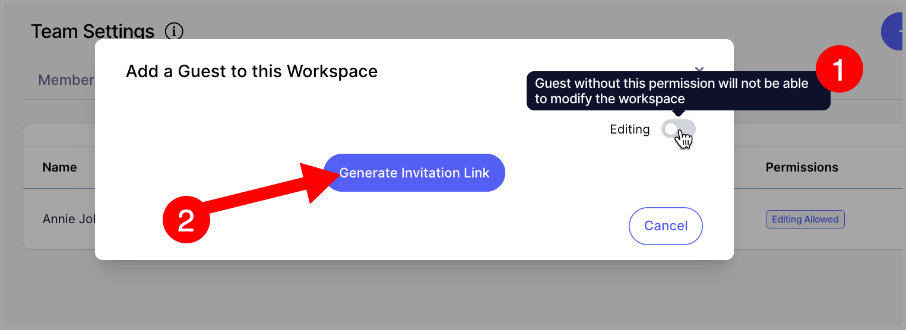
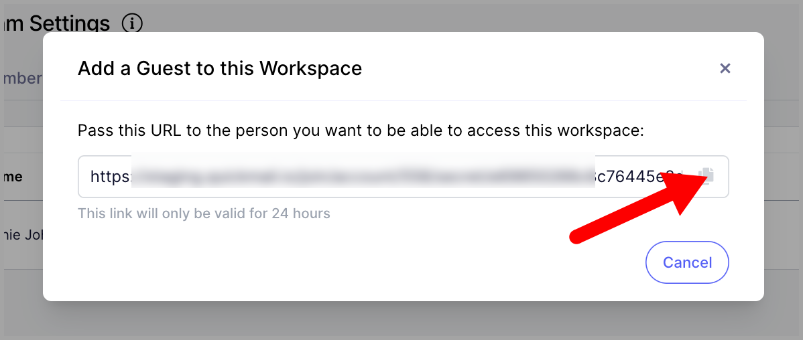

# Giving Clients Access to their Workspace

**

**In this article:**

- [Why invite clients to their workspace?](#How-does-it-work-e84CI)

- [What's the difference between guests and team members?](#Guests-vs-Team-members-KlnAu)

- [How to invite clients as guests?](#How-to-invite-clients-as-guests-s-sTl)

- [How do I change edit permissions after clients are added to their workspace?](#How-do-I-change-edit-permissions-after-clients-are-added-to-their-work-j1eWx)

- [How do I delete a client from a workspace?](#How-do-I-delete-a-client-from-a-workspace-khgBl)

# Why invite clients to their workspace?

Having the ability to invite clients as guests allows agency users to offer their clients a view of their QuickMail campaigns and stats without granting them access to other workspaces under the agency. This helps agency users maintain client confidentiality.

Also, clients invited to workspaces can't access the workspace settings so they can't view and update billing information and plan.

# What's the difference between guests and team members?

Unlike team members, guests won't be able to access other workspaces under the agency. Moreover, guests won't be able to access the workspace settings.

# How to invite clients as guests?

Click Settings → Team → under Guests tab, press the "+ Guest" button.

Set the edit permission settings.

If edit access is allowed, the client can add and make changes to their campaigns, handle replies using opportunities, and view their stats.

If edit access is not allowed, the client can only view their campaign, replies, and reporting.

Copy the invite link and provide it to your client.

**Note: **Invitation links are only valid for 24 hours and guests can only log in using Google, Microsoft, and LinkedIn accounts

# How do I change edit permissions after clients are added to their workspace?

Please click the client on the guests page.

From the quickview, change the edit permissions.

# How do I delete a client from a workspace?

Click the guest from the guests page.

From the quickview, click the triple-dot icon and click Delete.

