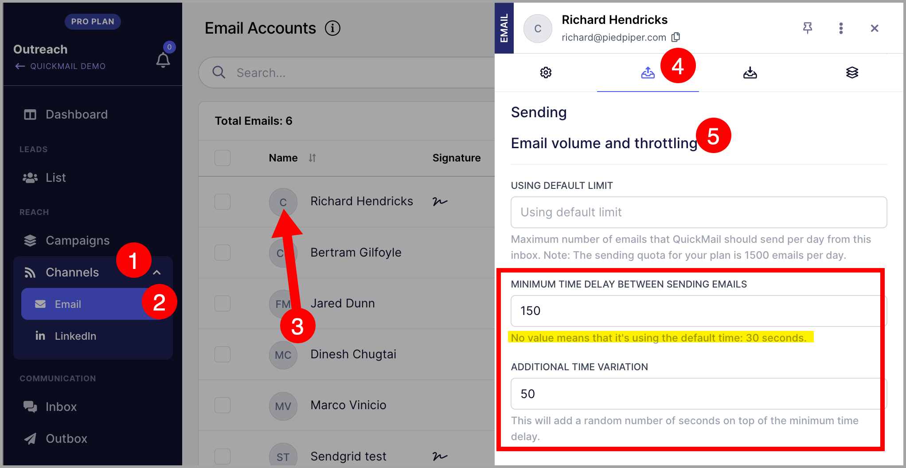
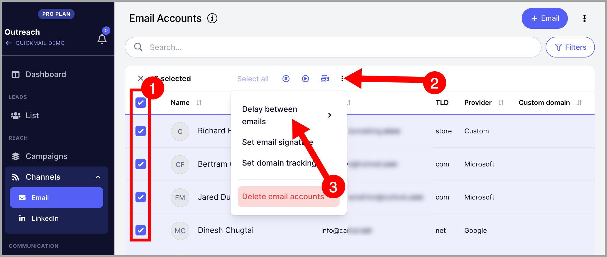
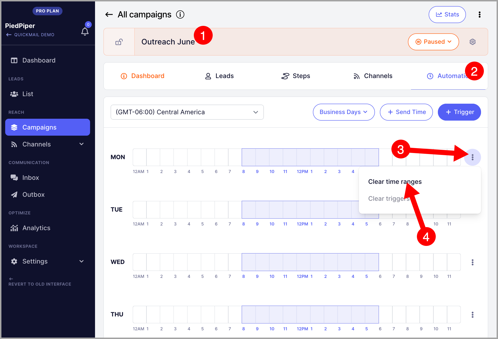
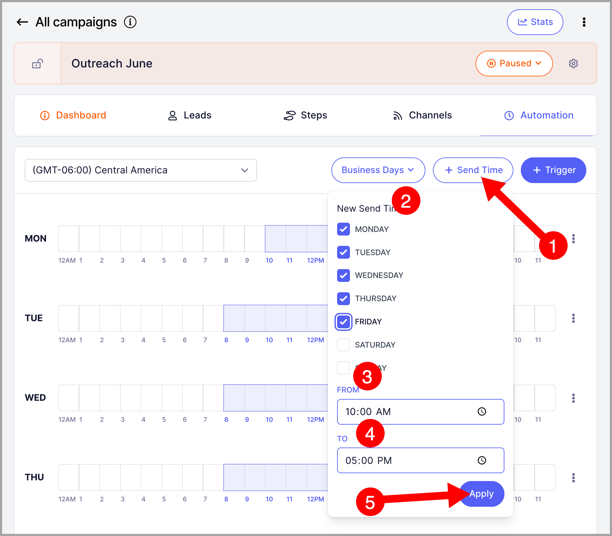
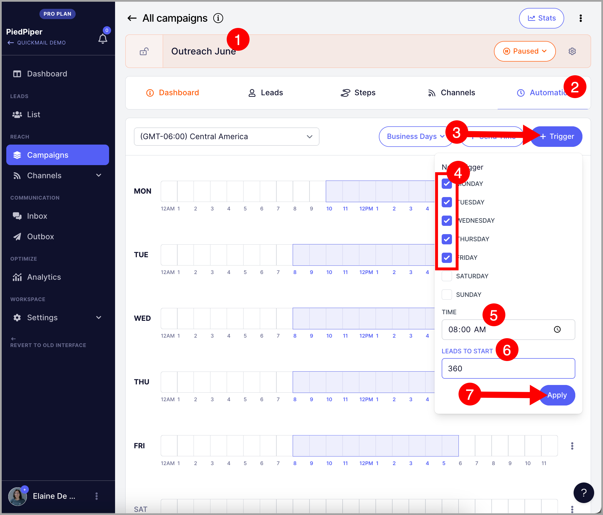
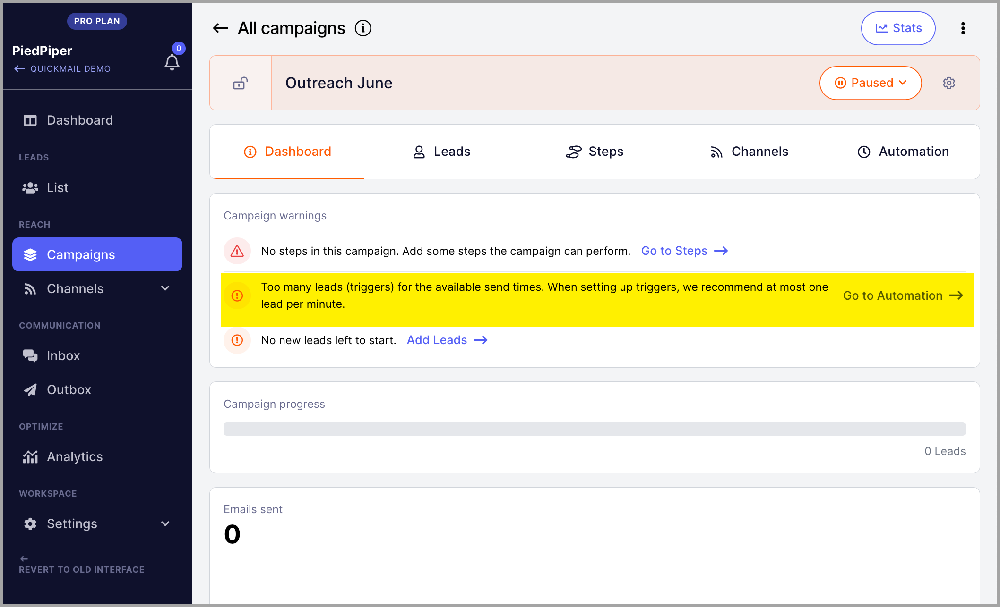

# Throttling Emails to Avoid Getting Flagged

### In this article:

- Why do emails need to be throttled?

- How to throttle emails?

- Increase delay between emails

- Limit the number of hours a campaign can send emails using send times

- Limit the number of leads that will start a campaign using triggers

# Why do emails need to be throttled?

To moderate the volume of emails sent by your email address, emails can be throttled.

Emails need to be throttled in the following instances:

- **To ensure good email deliverability. **
Email service providers put a limit on the number of emails you can send. This is to prevent spam or abuse.
Free Gmail accounts have a 500 daily email limit, Outlook accounts have a 300 daily email limit, and G-suite accounts have a 2,000 daily email limit.
Once you reach your daily email limit, you can’t send any more emails for a certain period.
Usually, when you reach your daily email limit, you will receive email notifications from nobody@gmail.com.
These notifications don't have the email address of the prospects who didn't receive your emails.
So there's no way to know which prospects you need to reach out again.
Additionally, it's not recommended to max out the limit right off the bat. Email service providers don't like a sudden spike in email volume so doing so will raise spam suspicions.
When your email address raises spam suspicions, the email address might be disabled from sending and receiving emails temporarily or worse, shut down permanently.
If your emails are shut down, all communication with your existing leads and campaigns will be put to a halt, and recovering them will be difficult, if not impossible.

- To moderate the sending of accumulated emails to send from an email account.
Email to leads accumulate in an email account when a scheduled campaign and/or the inbox assigned to a scheduled campaign is paused.
Follow-up schedules will still continue to count even if the emails or the campaigns are paused.
That's why pausing campaigns or pausing inboxes may result in an accumulation of pending follow-ups.
The longer the inboxes/campaigns are paused, the more follow-ups may accumulate (especially if you're running multiple campaigns with multiple email steps).
If you're not throttling emails, accumulated emails in an email account could lead to a sudden spike in the email volume.

# How to throttle emails?

## Option 1: Increase the delay between emails.

To slow down the rate of emails going out, you can increase the delay between emails.

To increase the delay between emails, go to channels → emails → click the email you want the delay adjusted → go to sending tab→ scroll down and under throttling enter your preferred minimum time delay.

To make the emails look like they're sent by humans, add a longer delay time variation.

This will vary the number of seconds each email will wait to be sent.

You can also set this in bulk if you have multiple emails.

Just select all the emails that you want to set and click this triple dot icon to see more menus.

## Option 2: Limit the number of hours a campaign can send emails using send times

Send times allow you to control which days and times a campaign can send emails.

By default, all campaigns created have a send time of 8:00 AM and 6:00 PM account timezone. However, you can shorten it by editing the send times.

Note: The longer the send time, the more emails can send

To edit the send times, first, clear the added time ranges on your campaign.

Then, add a new one.

## Option 3: Limit the number of leads that will start a campaign using triggers

Triggers control how many leads to start on your campaign on specific days and hours.

We usually recommend starting leads per minute.

So if you have 6 hours in your send times, the number of leads you should start a day should not exceed 6*60 = 360 leads.

Here's how to add triggers.

**Pro tip:** You can look at campaign warnings to get a hint of what you need to change in the campaign for it to run properly

Learn more about send times and triggers here.
