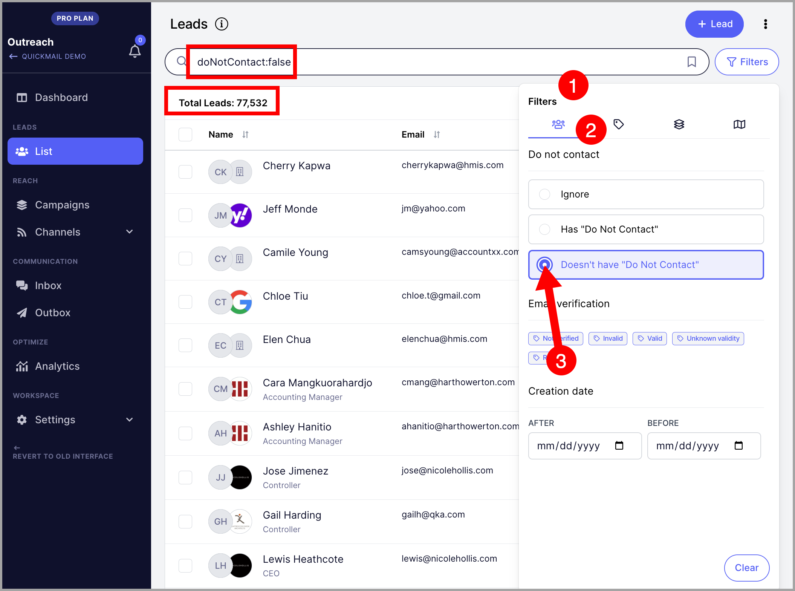
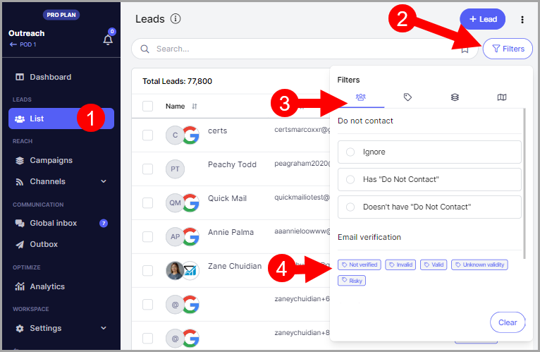
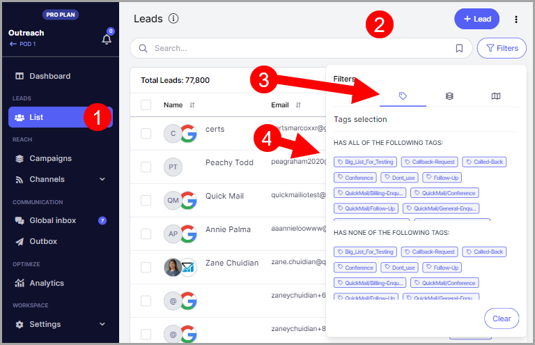
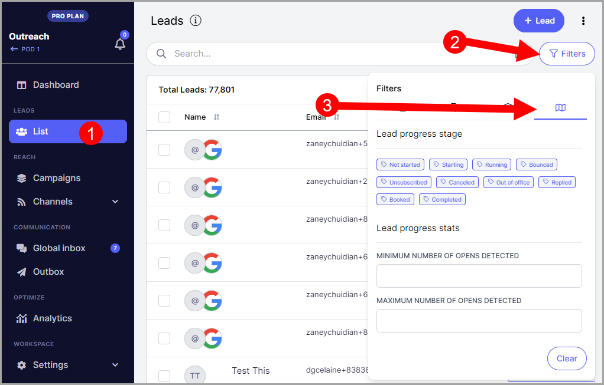

# Narrowing Down Your List Using Filters

**
**

### In this article:

- [Why filter leads?](#Why-filter-leads-zVcAx)

- [How to filter leads?](#How-to-filter-leads-FyQMX)

- [Unsubscribed/do not contact leads](#Unsubscribeddo-not-contact-leads-zEzSL)

- [Leads with specific email validity](#Leads-with-specific-email-validity-QKxPW)

- [Leads created on a specific timeframe](#Leads-were-created-on-a-specific-timeframe-6Top1)

- [Leads with and/or without specific tags](#Leads-with-and-without-specific-tags-RhCax)

- [Leads in X numbers of campaign](#Leads-in-X-numbers-of-campaign-8pjDS)

- [Leads on specific campaigns](#Leads-on-specific-campaigns-IjEhK)

- [Leads status in a campaign](#Leads-status-in-a-campaign-qbmHj)

- [Leads with opens](#Leads-with-opens-oZSZm)

- [Leads with clicks](#Leads-with-clicks-_aJRq)

- [How to share filter leads?](#How-to-share-filtered-leads-2u4eB)

- [How to save filters?](#How-to-save-filters-hbV4x)

# Why filter leads?

Digging through a huge number of leads can be taxing.

That's why you can use filters to narrow down your list and easily find the leads you're looking for, based on specific categories.

Aside from being a time-saver, using filters can also help you find your leads more accurately than doing it manually.

# How to filter leads?

To get started, go to the Leads page and click filters.

It will open this window where you can see all the available filters.

## Here are some filters you can use to find specific leads.

### Unsubscribed/do not contact leads

Leads are marked as Do Not Contact if they unsubscribed from a campaign. You can also manually mark them as Do Not Contact.

To filter leads with Do Not Contact mark, simply click this radio button under the first tab:

On this filter, you can also look for leads with no do not contact mark.

### Leads with specific email validity

Pro tip:** To verify emails in QuickMail, you should set up an email verification tool. Here's a detailed guide on email verification.

Select any status under email verification to filter emails based on their validity.

### Leads created on a specific timeframe

It's possible to add a Start and End date to filter Leads by their creation date in QuickMail.

Use the "After" date as a Starting point and "Before" as the end date for the filter.

### Leads with and without specific tags

Filter leads based on specific tags they have or don't have.

### Leads in X numbers of campaign

Filter leads that are part of a certain number of campaigns.

### Leads on specific campaigns

Filter leads participating in specific campaigns.

### Leads status in a campaign

Filter by the status of leads within a campaign, such as replied or in a specific step.

You can also filter by status change date

### Leads with opens or clicks

Filter leads based on whether they have opened or clicked emails.

# How to share filtered leads?

Share filtered leads with team members, or save the results for record keeping.

You can select all the resulting lists of filtered leads and Export it to a CSV file for sharing with the team or record keeping.

Do this by selecting the leads -> "Select All" -> Export to a CSV

# How to save filters?

Save your custom filters for future use.

First filter the leads, then click in the bookmark icon in the search bar.

Save the current filter, it will request a filter name.

The saved filters will be available for use in the future, no need to create the same filter repeatedly.
