# LinkedIn Automation 🤖

**

💡 The number of LinkedIn accounts that you can add depends on your [plan.](https://quickmail.com/pricing)

**In this article:**

**What can I do with QuickMail's LinkedIn Automation? **

- [Generate Profile View](#Generating-profile-views---Helps-create-familiarity-and-boost-connecti-GRtyP)

- [Send LinkedIn Connection Request](#Sending-connection-requests--qT57A)

- [Send LinkedIn Message](#Sending-LinkedIn-messages-24TKC)

- [Send Instant Follow-Up LinkedIn Messages](#Send-instant-follow-up-LinkedIn-message-HSujP)

- [Send LinkedIn Voice Message](#Sending-LinkedIn-voice-message-LA9Ip)

- [Send LinkedIn InMail](#Sending-LinkedIn-voice-message-Jf3pK)

- Import Leads With Sales Navigator

- [Import Leads Who Viewed Your Profile](#Import-Leads-Who-Viewed-Your-Profile-myX90)

- [Import Leads From LinkedIn Post](#Import-Leads-Who-Viewed-Your-Profile-to-a-Campaign-rcDF5)

**How to set up LinkedIn Automation? **

- [Add a LinkedIn account](#How-to-add-a-LinkedIn-account-AH8Vt)

- Via Browser extension

- [Via cookies](#OPTION-1-Via-cookies-kY4YL)

- [Via LinkedIn credentials & 2FA](#OPTION-2-via-LinkedIn-credentials--2FA-cJTOR)

- [Add the lead's LinkedIn profile URL](#Step-2-Add-the-prospects-LinkedIn-ID--TsAjg)

- [Assign a LinkedIn account to a campaign](#How-to-assign-a-LinkedIn-account-to-a-campaign-sntOM)

- [Add a LinkedIn Step to a campaign](#How-to-create-a-LinkedIn-Step-Ni9SY)

**LinkedIn Settings**

- [How can I change the daily limit for my LinkedIn Actions?](#How-can-I-change-the-daily-limits-of-my-LinkedIn-actions-UwNre)

- [How can I see the acceptance rate of my LinkedIn campaign?](#How-do-I-know-if-a-LinkedIn-Connection-Request-has-already-been-sent-t-xaRO2)

- [How can I check the account for new connections?](#How-can-I-check-the-account-for-new-connections--8D0dC)

- [How to reauthenticate a LinkedIn account?](#What-to-do-when-your-LinkedIn-account-loses-permission-in-QuickMail--xCXM)

- [Via cookies](#For-LinkedIn-accounts-added-via-Cookies-wio7R)

- [Via LinkedIn credentials & 2FA](#For-LinkedIn-accounts-added-via-2FA-Kk215)

- [How do I know if a LinkedIn Connection Request has already been sent to a lead?](#How-do-I-know-if-a-LinkedIn-Connection-Request-has-already-been-sent-t-28BUZ)

- [How to delete a LInkedIn account?](#What-to-do-when-your-LinkedIn-account-loses-permission-in-QuickMail--xCXM)

- [How can I prevent accepted connection requests from creating Opportunities?](#How-can-I-prevent-accepted-connection-requests-from-creating-Opportuni-sqQQE)

- [FAQs](#FAQs-mVu1v)

**

## What can I do with QuickMail's LinkedIn Automation?

We have 9 features available in our Linkedin Automation:

### Generating profile views

Helps create familiarity and boost connection and reply rates by making your approach feel more natural.

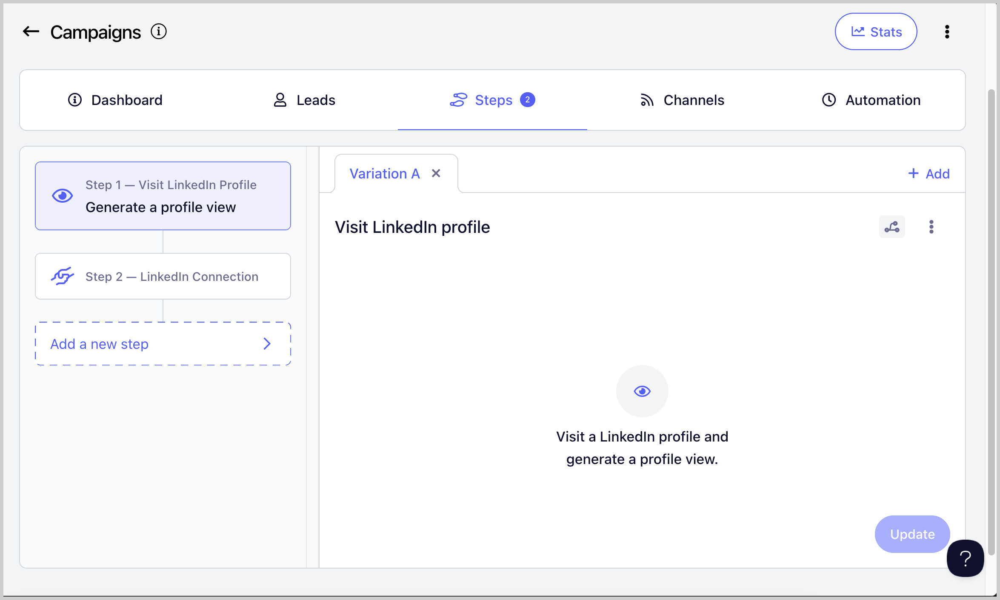

### Sending connection requests

Allows you to connect to the leads, without having to do it manually

IMPORTANT NOTES:**

- LinkedIn Connection Requests are automatically withdrawn after 90 days and when that happens, the lead status will change from 'Running' to 'Canceled'.

- You can resend the Connection Requests again after 3 weeks.

- LinkedIn doesn't allow sending messages to leads you're yet connected with

- Therefore, the setting 'Wait Until Connection Request' on a LinkedIn Connection Request Step is enabled by default. This means that the lead won't proceed to the next step, until the connection request is accepted. You can disable this setting here:

**

### Sending LinkedIn messages

Allows you to send LinkedIn Messages (the lead must be connected in order to send a LinkedIn message)

### Sending instant follow up LinkedIn message

You can also send multiple messages or attachments in quick succession, which helps your outreach feel more natural, like a real conversation.

### Sending attachments

You can now add attachment to your LinkedIn messages which helps make your outreach more engaging, shows proof of your work, and gives prospects something tangible to review, like a case study, one-pager, or portfolio.

### Sending LinkedIn InMails

Allows you to send LinkedIn InMail messages without needing to be connected to the lead.

### Sending LinkedIn voice message

Helps you stand out and get more replies because because it feels more personal, grabs attention faster, and builds trust more easily than a text message.

### Import Leads Who Viewed Your Profile to a Campaign

Note: LinkedIn imports do not include email. So if you want to run email campaigns on them, you need to manually look for the emails of your leads and update them in QuickMail. Otherwise, leads will run into an error and will get stuck in the campaign.**

You can automatically import leads who viewed your profile to QuickMail.

To enabled this option, go to Channels → LinkedIn → Click on the LinkedIn account → Receiving tab → Check the box 'Create leads from profile viewers' → Choose campaign where you'd like to add the leads (Optional)

**

### Import Leads From LinkedIn Post

Tip: **You can also import leads from a different person's LinkedIn post

Users can now import leads from LinkedIn posts. This makes it easier to capture engaged prospects directly and streamline your outreach efforts.

**

To use this feature, go to List  → Import from LinkedIn post  → Copy the LinkedIn post link and paste it into QuickMail →  Continue with the onscreen prompts.

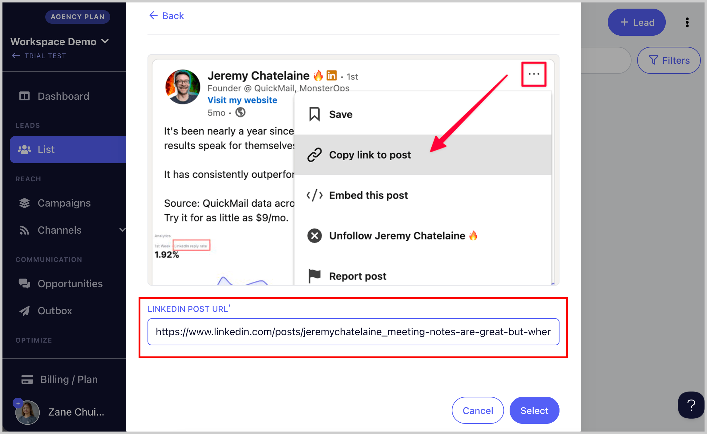

## How to Add a LinkedIn Account for Outreach?

There are two ways to add a LinkedIn account:

- Via browser extension **– easiest way to add a LinkedIn account

- **Via cookies** – prone to account disconnection

- **Via LinkedIn credentials + 2FA** – more stable, but if you haven’t set up two-step verification yet, the setup process may be trickier.

**Important: **If you don't have access to the LinkedIn account, you can also generate an invite link instead.

### OPTION 1: Via browser extension

**Step 1.** To get started, first login to the LinkedIn account you'd like to add.

**Step 2**. On a different tab, go to your QuickMail account → Channels → Click 'Browser Extension

**Step 3 - **Click 'Install the Chrome extension'

**Step 4 **- A new tab will open once the browser extension is installed. The LinkedIn account currently signed in will be detected automatically. Select the account and the workspace where you'd like to add the LinkedIn account.

**Step 5 -** You'll get a confirmation whether the LinkedIn account was added successfully or not. From the same page, you can also view the LinkedIn account activity.

**

### OPTION 2: Via cookies

Step 1.** Visit this [link](https://chrome.google.com/webstore/detail/copy-cookies/jcbpglbplpblnagieibnemmkiamekcdg) and install the cookies extension on your browser.

**Step 2. **Once the extension has been added, go back to your LinkedIn profile and click the cookie Icon. Doing so will copy the cookies of the page.

If you don't see the cookie icon on your browser, click the puzzle icon and it should show all extensions you have on the browser.

**Step 3. **After copying the cookies, go to your QuickMail account → Channels → LinkedIn → + LinkedIn → LinkedIn cookies

**Step 4.** Add the country and paste the cookies → Add → LinkedIn account will be added immediately

**Important: **Logging out of your LinkedIn account will disconnect it from QuickMail by invalidating the cookies, preventing us from sending LinkedIn connection requests. To avoid this, simply log in through an incognito window and close the window after without logging out.

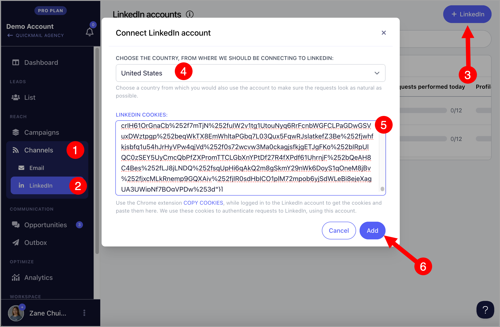

**

### OPTION 3: via LinkedIn credentials + 2FA

Step 1.** To get started, log in to your LinkedIn account in a separate browser tab → Click **'Me' **→** 'Settings & Privacy'**.

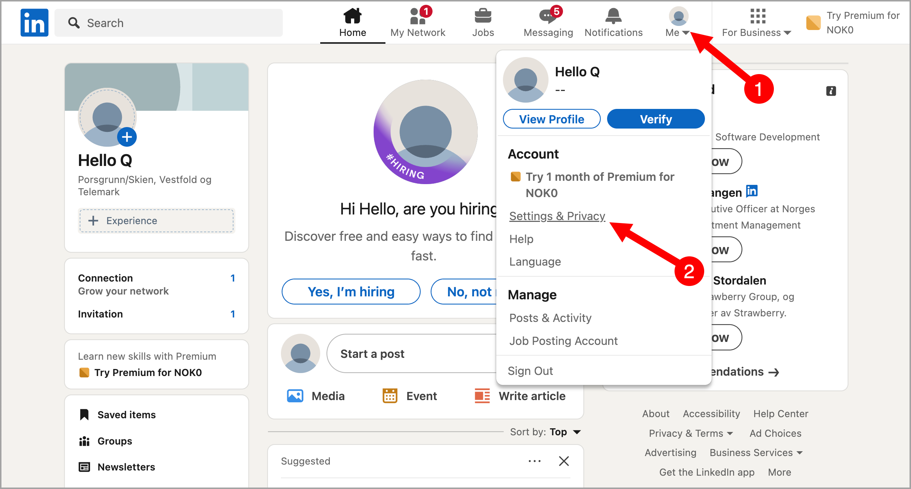

**Step 2.** Go to Sign in & security → Click** 'Two-step verification' **

- If two-step verification is enabled, temporarily disable it. After that, proceed to the next step.

- If two-step verification is not enabled, proceed to the next step to enable it.

**Step 3. **Enable two-step verification and enter the code sent to your email address, then click 'Submit'

**Step 4. **Choose 'Authenticator App' and click 'Continue' → Enter your LinkedIn password to proceed

**Step 5.** Download an authenticator app, such as [Google Authenticator](https://support.google.com/accounts/answer/1066447?hl=en&co=GENIE.Platform%3DAndroid) or [Microsoft Authenticator](https://www.microsoft.com/en-us/security/mobile-authenticator-app).

**Step 6. **In your authenticator app, look for the QR scanner and scan the QR code displayed on your screen. This will add your LinkedIn account to your authenticator app.

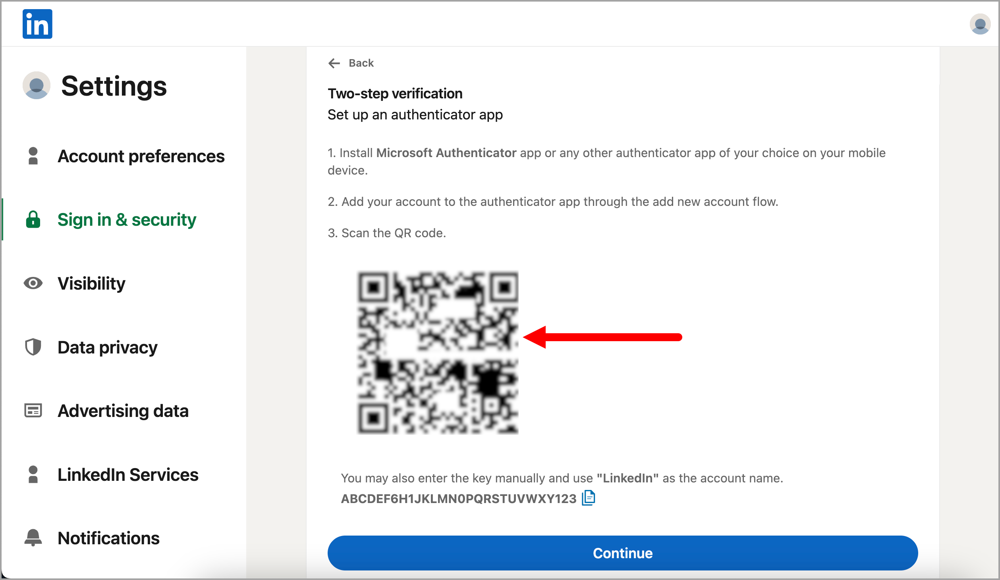

**Step 7.** Once authenticator is set up, copy the code below the QR code and **paste it into a Notepad **(or somewhere safe) → Click 'Continue'.

**Step 8. **Enter the code you see in your authenticator app → Click Verify. Your LinkedIn two factor authentication is now setup!

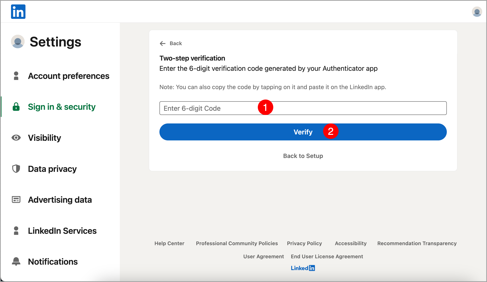

**Step 9. **Copy the code from LinkedIn that you pasted into your Notepad.

**Step 10.** After copying the code, go to your QuickMail account → Channels → LinkedIn → + LinkedIn → LinkedIn credentials + 2FA

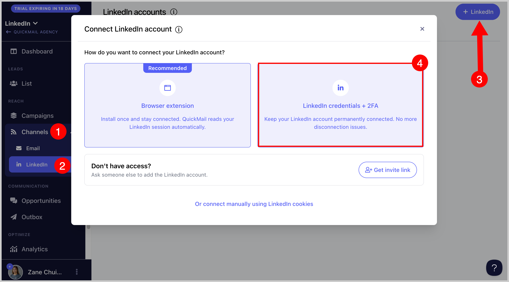

**Step 11. **Choose country → Add the email address & password associated with your LinkedIn account → Paste the 2FA code → Add

Note that it may take a few minutes (but not more than an hour) for the LinkedIn account to be added

**Note: **If you have issues adding your LinkedIn account, contact us at support@quickmail.io

**

## How to add lead's LinkedIn information?

The LinkedIn account can be added manually or in bulk by importing the leads.

Note: **We don't support leads scraped from a tool with unique URL IDs assigned to LinkedIn profiles. They differ from the actual LinkedIn Profile URL IDs, and scraping violates LinkedIn's policy.

Here's the correct format and where to get the lead's LinkedIn Profile URL ID:

- ### Manually adding lead's LinkedIn ID

To manually add LinkedIn info to a lead, just head List → click on a lead → from quickview, click on + show properties and add the LinkedIn account.

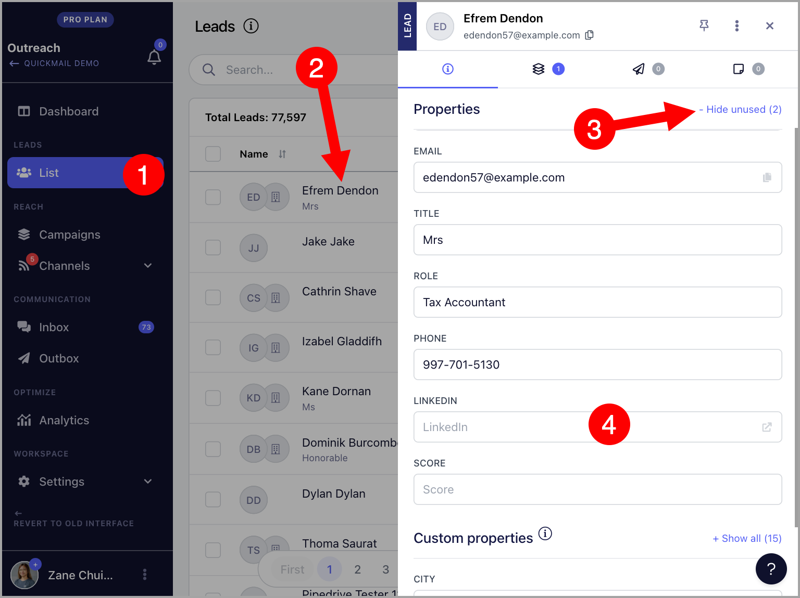

- ### Bulk-adding leads' LinkedIn IDs

To bulk-add leads' LinkedIn IDs, simply go to your CSV/Google sheet and add a LinkedIn column.

Then, upon importing leads, you can map your LinkedIn column with the LinkedIn property in QuickMail.

💡 **Pro tip: **If your leads are already in the account, make sure to check the box "Update lead if it exists" when re-importing leads. If this checkbox is not checked, your leads and updates will be rejected to prevent duplicates.

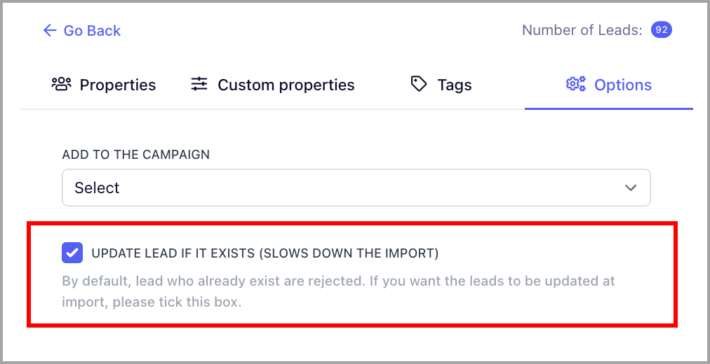

**

## How to assign a LinkedIn account to a campaign?

To assign a LinkedIn account to a campaign, just go to the Campaign → Channels → LinkedIn Tab → Toggle a LinkedIn account on

💡 Pro tip: **You can assign as many LinkedIn accounts as you need to the campaign. You can check a LinkedIn account's quickview in the Channels page or in the Channels page of the campaign to easily see the campaigns where it is assigned.

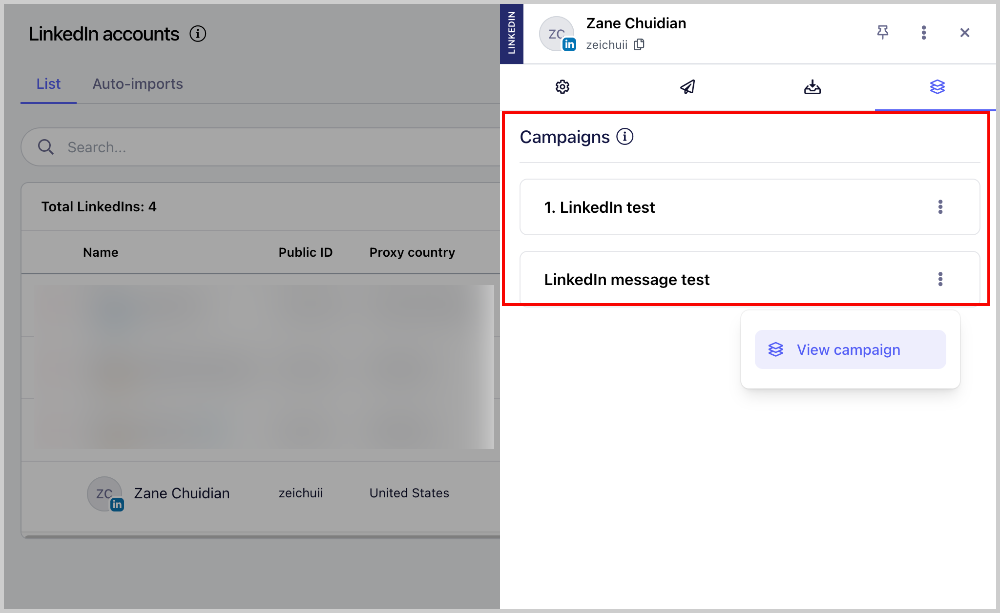

**

## How to create a LinkedIn Step?

From your campaign, go to Steps and click the Add Step button, it's show a list of steps you can add. Choose LinkedIn Connection Step or LinkedIn Message Step

💡Pro Tip: **If you would like to know more about managing your LinkedIn Outreach with QuickMail, check out these guides:

- Automate Sending LinkedIn Connection Requests

- Automate Sending LinkedIn Messages

**

## How can I change the daily limits of my LinkedIn actions?

Go to Channels → LinkedIn → Select a LinkedIn account → Sending tab → LinkedIn actions limit and throttling

You can update the action limits in settings. While we recommend not exceeding 12 actions per day to avoid LinkedIn restrictions, our system does not have a maximum cap. Each LinkedIn account may have different limits. For more details, click [here](https://www.linkedin.com/help/linkedin/answer/a551012/types-of-restrictions-for-sending-invitations).

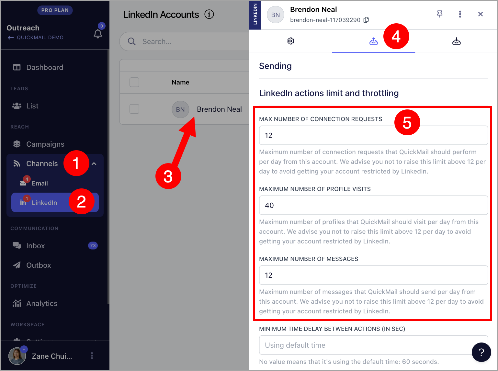

## How can I see the acceptance rate of my LinkedIn campaign?

To see the acceptance rate of LinkedIn connection requests, simply check the campaign stats:

## How do I know if a LinkedIn Connection Request has already been sent to a lead?

Leads who have already been sent a connection request will have an orange Linkedin icon in their thumbnail. Those that are in blue haven't been sent yet

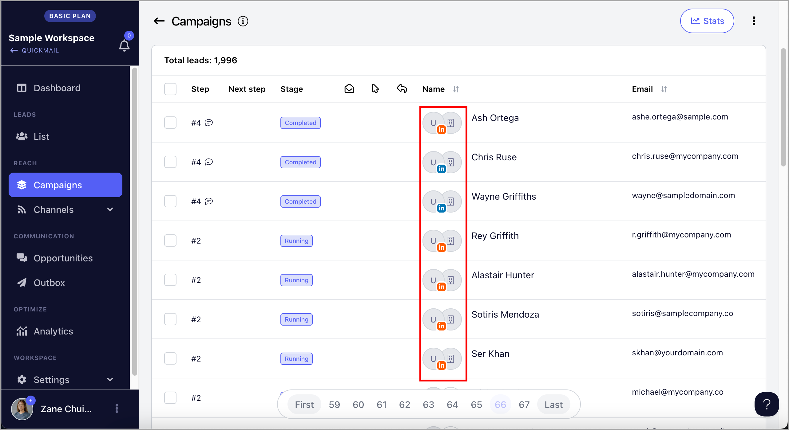

## How can I check the account for new connections?

Note: **QuickMail automatically scans for new connections once a LinkedIn account is linked. This is done roughly every hour.

However, If you'd prefer not to wait for the automatic check, it's also possible to manually check the account for new connections but can only be done 12 hours after the last check.

To do this, go to Channels → LinkedIn → Select a LinkedIn account → Receiving tab → Scroll down the page and press "Sync Now".

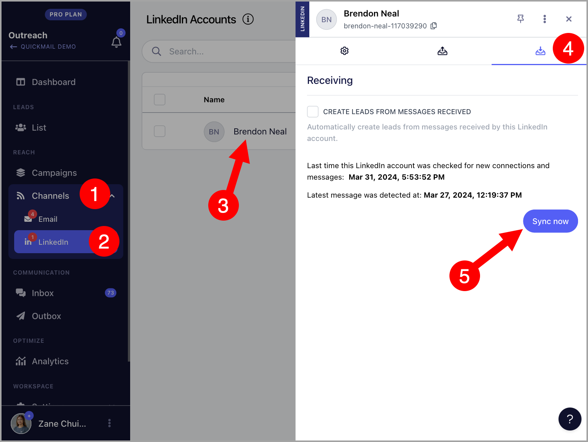

You can also check whether the lead is already connected with you on LinkedIn.

To do this, use the Lead filter and select the LinkedIn network distance filter to view:

- 1st-degree connections

- 2nd-degree connections

- 3rd-degree++ connections

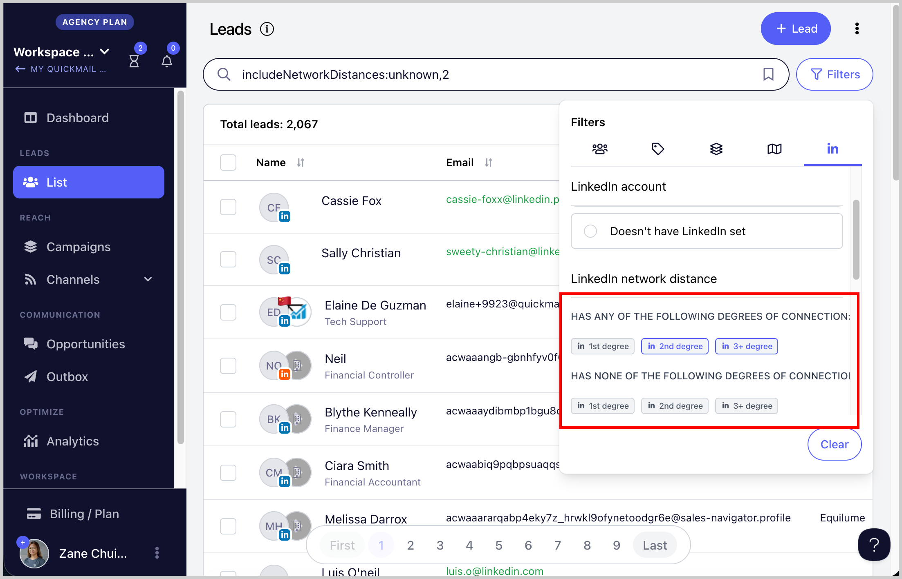

## How to reauthenticate a LinkedIn account?

- ### For LinkedIn accounts added via 2FA

Please reach out to [support@quickmail.io](mailto:support@quickmail.io)

- ### For LinkedIn accounts added via Cookies

Logging out of the LinkedIn account invalidates LinkedIn cookies, preventing the sending of connection requests in QuickMail.

If the account loses permission, a warning appears in Settings on the LinkedIn page, and an email notification is sent to the account owner.

To re-authorize the LinkedIn account, log in to the LinkedIn account, open the LinkedIn account settings, and update the Cookies. (See [how to add LinkedIn account](#How-to-add-a-LinkedIn-account-AH8Vt) for steps)

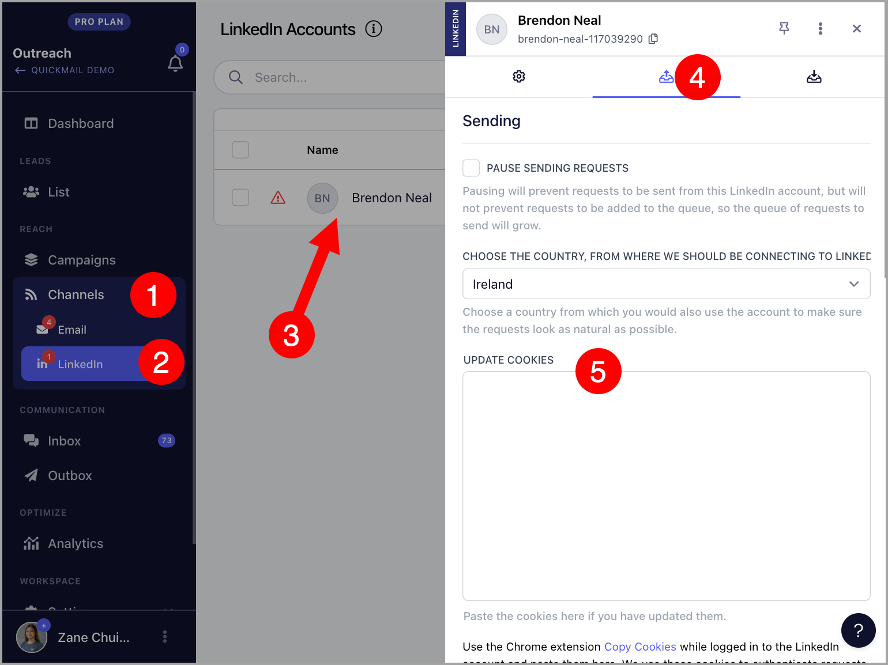

## How to delete a LinkedIn account?

To delete a LinkedIn account, go to Channels → Select a LinkedIn account → Click on the three vertical dots → Delete

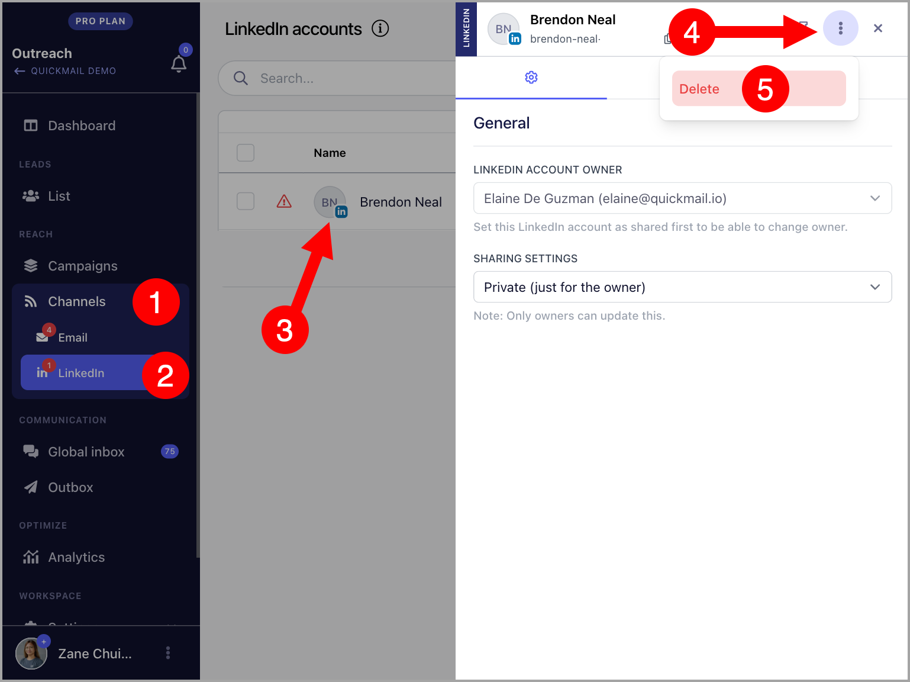

## How can I prevent accepted connection requests from creating Opportunities?

By default, opportunities are created when leads accept connection request. If you'd like to prevent this from happening, simply disable 'New connections create new opportunities' from the Replies Settings.

## FAQs

### Can I send a LinkedIn message to people I’m not connected with?

No, LinkedIn doesn't allow sending messages to people you're not connected with unless your LinkedIn account has InMail credits, which require a premium LinkedIn subscription.

### What will happen if I try sending a LinkedIn message to people I'm not connected with?

The lead's status in a campaign will encounter an error, and the sequence will stop.

### Can I send emails and LinkedIn messages in the same campaign?

Yes, you can send both from the same campaign. However, if the lead hasn't accepted your LinkedIn connection request, it may cause delays since campaigns operate linearly. In that case, it's best to create separate campaigns for LinkedIn and email outreach.

### My LinkedIn account keeps on disconnecting, why is that?

We use cookies to connect to your LinkedIn account. When you log out of your LinkedIn account in your browser, the session cookie will expire, causing us to lose permission to access your LinkedIn account.

### My LinkedIn account got disconnected, how can I reconnect?

Please follow this [guide](#What-to-do-when-your-LinkedIn-account-loses-permission-in-QuickMail--xCXM)

### I keep getting an error importing my leads because of their LinkedIn profile, how to fix?

If the leads are scraped from a tool, most of the time they assign unique URL IDs to leads for LinkedIn, so they are different from the actual lead's LinkedIn Profile URL ID which we don't support at the moment. Here's the correct format and where to get the lead's LinkedIn Profile URL ID:

