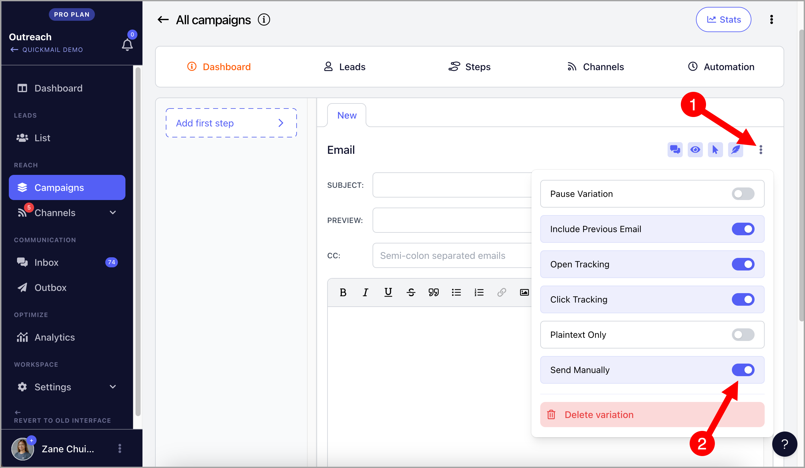
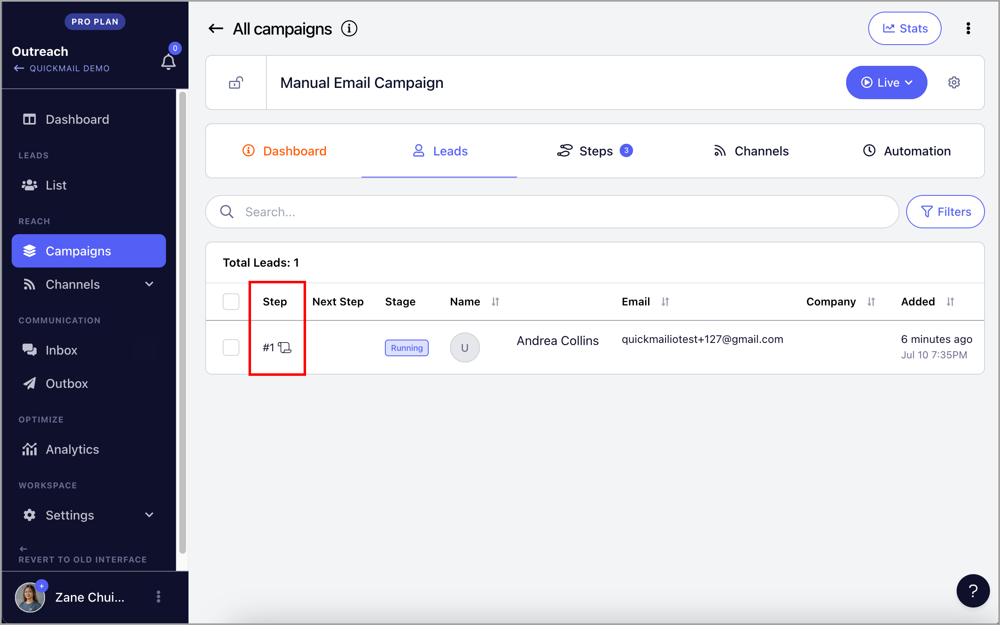
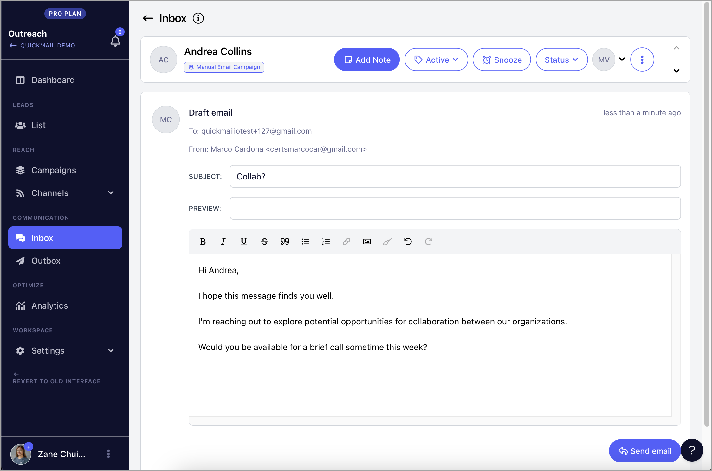

# Sending Emails Manually

**

Emails in QuickMail can be set to be sent manually when they need reworking or major editing before sending. When a lead reaches an email step set to be sent manually, a draft is generated in the Inbox section.

The Inbox section is where you can review or edit draft emails before sending them manually.

Sending emails manually is beneficial when an email requires extensive personalization for each prospect.

For example, if you want the first email step of your campaign to be a unique email for each prospect, but the follow-ups are all the same, you can set the first email step of your campaign to be sent manually.

**Note:** For minimal personalization, you can use Custom Properties andLiquid Syntax instead of sending emails manually.

## How to create manual emails?

To set an email step to be sent manually, toggle on "Send Manually" when creating the email step. A feather icon will appear, indicating that the email is set to be sent manually.

## Where to send emails manually?

Once a lead goes into an email step that is set to be sent manually, a paper draft icon will appear in the lead status in the campaign.

Moreover, a draft will get generated in the Inbox section. From there, you can edit the email and send it to the lead.

