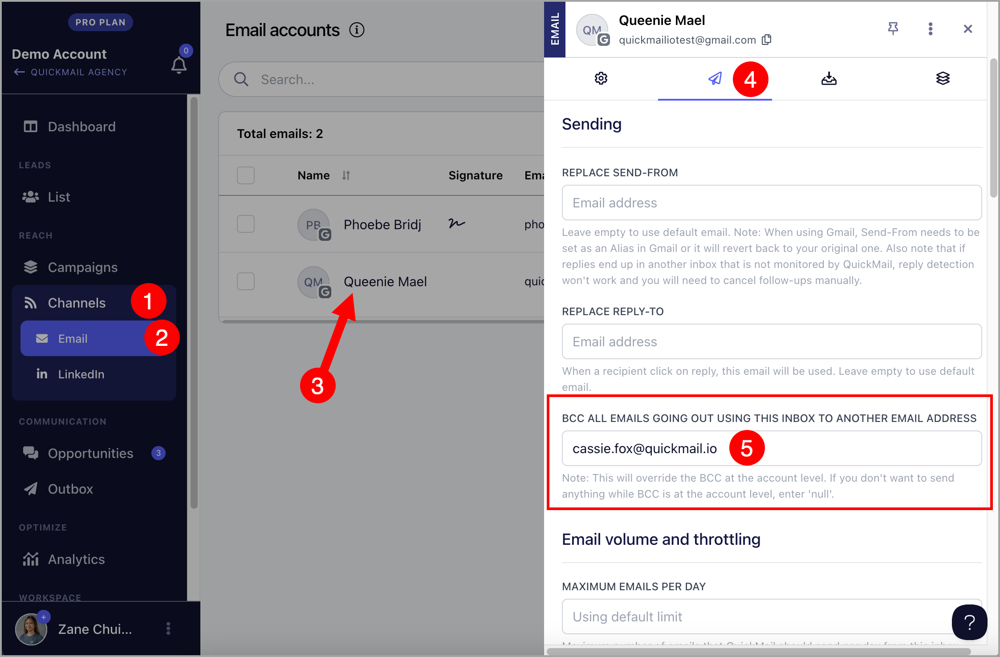

# Adding BCC to Emails

**

# What is it for?

**BCC emails (blind carbon copy)** allow users to send copies of all outgoing emails in QuickMail another address.

Some users use the BCC field to send copies of their emails to a CRM address (like SalesForce or Hubspot) so that they can automatically log all the emails they are sending out.

**Careful: **Setting an address that is added as an inbox in QuickMail as BCC will cause sent emails to be detected as campaign replies. This can cause all journeys to be marked as replied.

# How to set up BCC Email?

### Workspace Level

Setting a BCC email at the workspace level ensures it's included in every campaign, eliminating the need to apply it to each inbox individually.

To set up a BCC email at the workspace level, go to Settings → General → under BCC email, fill out the "BCC Email" field

### Inbox Level

Setting a BCC email at the inbox level will add the BCC email to all emails sent from that specific inbox. If the workspace has multiple inboxes, only the inbox with the BCC setting will include the BCC email.

Go to Settings → Channels → Emails → click the email account → under sending settings, fill out the "BCC Email" field.

