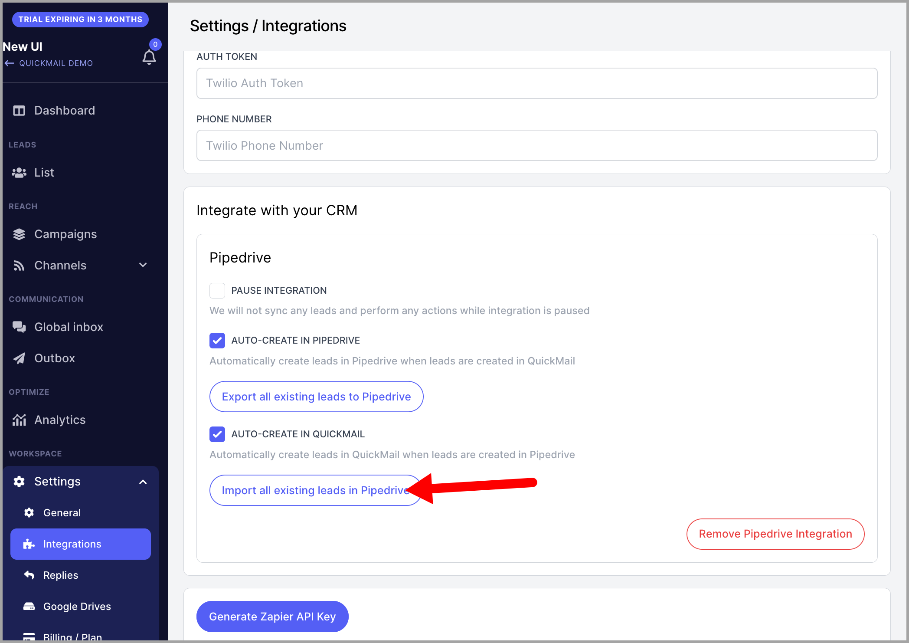
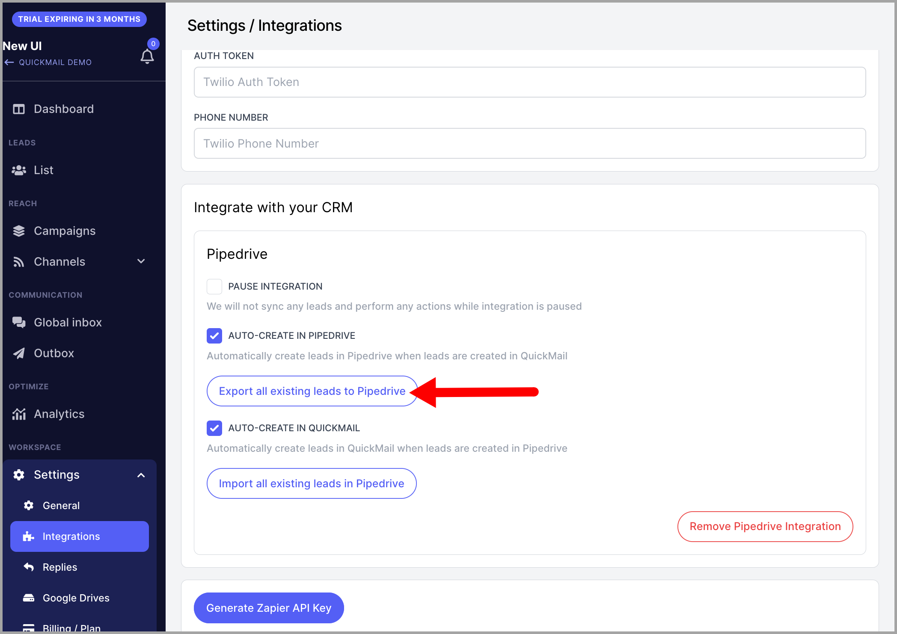
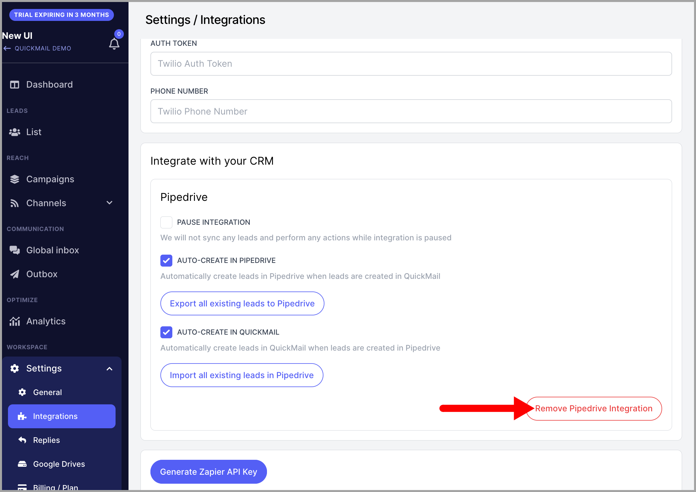

# Integrating QuickMail with PipeDrive

### In this article:

- How does the integration work?

- How to set it up?

- How to import prospects from PipeDrive to QuickMail?

- How to export prospects from QuickMail to PipeDrive?

- How does the integration work while it's paused?

# How does the integration work?

- Adding contacts in QuickMail creates contacts in PipeDrive and vice versa.

- Editing contact information such as names, companies, phone numbers, tags, and attributes works 2-way.

- Editing tag names and creating tags in QuickMail will edit and create custom fields in PipeDrive.

- If a tag is deleted in QuickMail, the tag will have (deleted) in its name in PipeDrive.

- Creating and deleting attributes in QuickMail will create and delete them in PipeDrive. Deleted attributes will have (deleted) in their names.

- Importing existing contacts from PipeDrive to QuickMail and exporting them from QuickMail to PipeDrive.

- Editing a synced QuickMail tag and attribute names in PipeDrive will not reflect in QuickMail, but the sync will continue to work.

# How to set it up?

Go to settings  → Integrations  → scroll down  → Pipedrive  → Login to your Pipedrive account

**Note:** The 1st PipeDrive installation in the account must be done by a user that is an admin in PipeDrive. Otherwise, you will run into an error.

# How to import prospects from PipeDrive to QuickMail?

Under PipeDrive integration on the add-ons page, click Import all existing prospects from PipeDrive.

This will add all prospects that you have in PipeDrive to QuickMail, including their name, email address, company, and telephone number.

# How to export prospects from QuickMail to PipeDrive?

Under the same page, click Export all existing prospects to PipeDrive.

This will add all your prospects in QuickMail to PipeDrive, including their email address, name, company, phone number, tags, and attributes.

Note: An import and export can't be done at the same time. So it's normal to get this error if you try to import/export while import/export is ongoing.

# How does the integration work while it’s paused?

While it’s paused, the following does not happen:

- Creating a contact in QuickMail doesn’t create a contact in PipeDrive, and vice versa;

- The 2-way sync of contact information such as names, phone numbers, tags, and attributes won’t work;

On the other hand, while the integration is paused, the following still works:

- Creating tags in QuickMail will create a custom field in PipeDrive;

- Deleting tags in QuickMail will add (deleted) to the custom field in PipeDrive;

- Changing tag names in QuickMail will change the custom field name in PipeDrive;

- Creating attributes in QuickMail will create a custom field in PipeDrive;

- Deleting attributes in QuickMail will add (deleted) to the custom field in PipeDrive.

## How to delete the integration

To do that, just go to Settings  → Add-ons  → go to PipeDrive  → Remove PipeDrive Integration.

