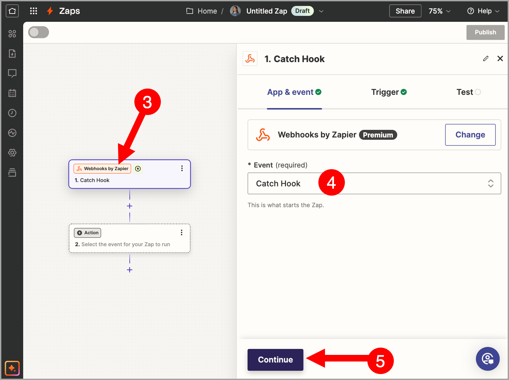
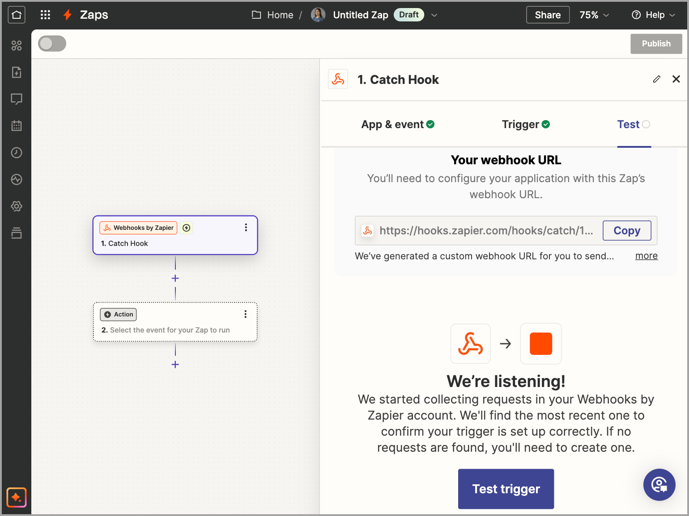
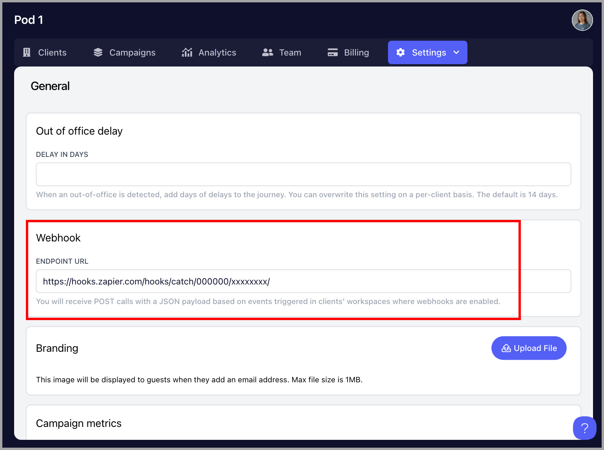
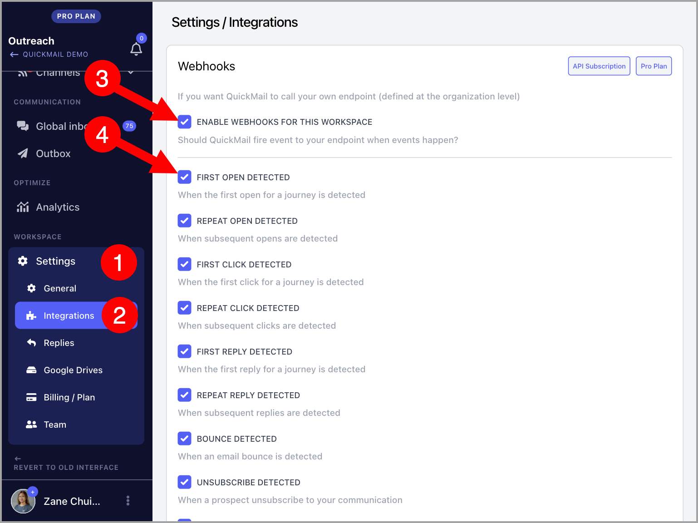

# Webhooks

Using QuickMail webhooks makes it easy to fetch all the data you need from the workspaces under your organization and consolidate it.

Here are the available webhooks at the moment:

- First open

- Repeat open

- First click

- Repeat click

- First reply

- Repeat reply

- Bounce

- Unsubscribe

- Lead tagging

- Task completed

- Journey completed

- Journey checkpoint

- Opportunity status

# How does it work?

Whenever an event occurs in a QuickMail workspace where a webhook is activated (opens, clicks, replies, unsubscribes, completed journeys, etc.), QuickMail will send all the information about this event to your webhook provider (like Zapier, Make.com. Integromat).

You can then use this information to automate workflows and perform actions such as recording it in a Google Sheet or sending it to a different app.

# How to set it up?

## Step 1. Get the webhook endpoint URL

- ## For Zapier

To get started, go to your Zapier account and create a Zap

Select Webhook by Zapier as a Trigger → Under *Event, select "Catch Hook" → Continue

Click Continue again → Copy webhook endpoint URL

## Step 2. Add the webhook endpoint URL to QuickMail

To add the webhook endpoint URL, go to the Organization Dashboard by clicking the Organization Name at the upper left hand corner of the workspace.

**Note:** Webhooks are only compatible with Agency accounts. If you don't see an option to access the Organization Dashboard, your account is likely a Team account. For switching to an Agency account, please contact us at support@quickmail.io.

On the Organization Dashboard, go to Settings tab → Webhooks → Paste webhook endpoint URL

## Step 3. Enable Webhooks

To enable Webhooks, go to a specific workspace → Settings → Integrations → Enable Webhooks → Choose your preferred Triggers

## Step 4. Complete your workflow

After setting it up on QuickMail, go back to your webhook provider to complete the workflow and make sure to set the workflow or zap live.
