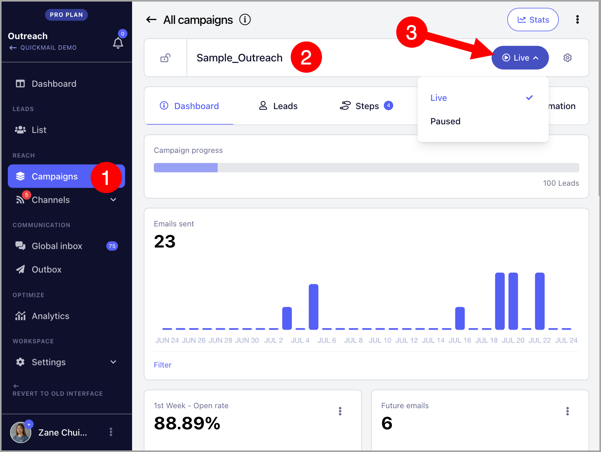

# Pausing and Unpausing Campaigns

**

There are two ways to pause and unpause campaigns: **Manually **and **in Bulk.**

**Manual**

To manually pause or set a campaign live, go to the Campaign → Click Live or Pause button

**In Bulk**

To pause or set multiple campaigns live at the same time, go to Campaigns → Select your preferred campaigns → Click Pause or Resume button

