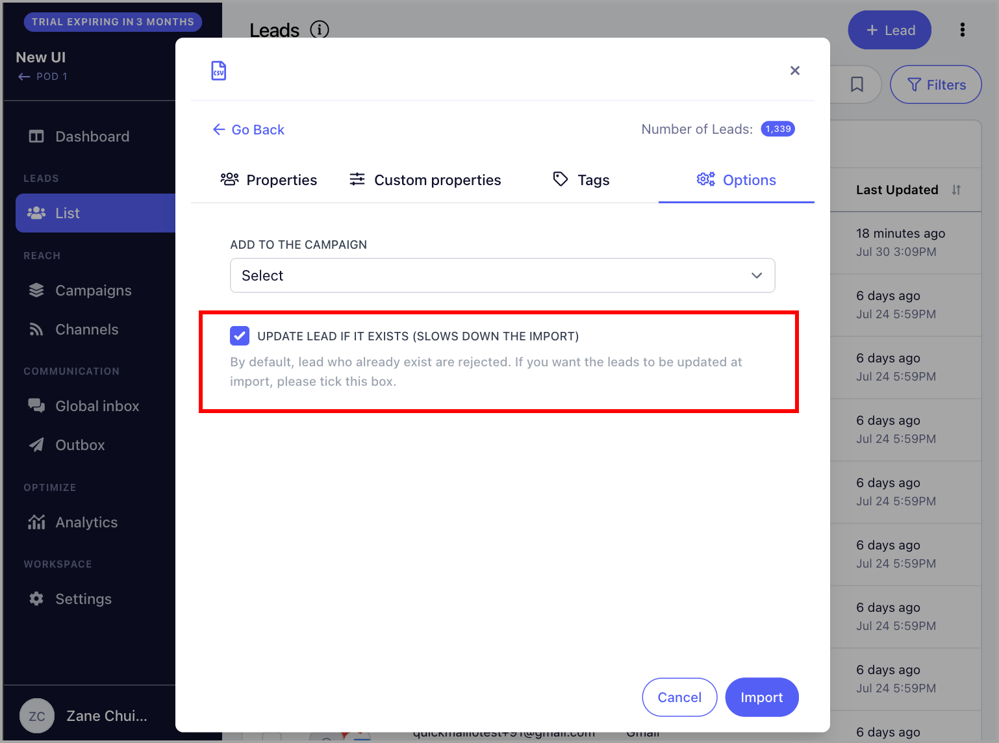

# Understanding the Import Report

**

**In this article:**

- [What is an Import Report?](#What-is-an-Import-Report-0zugd)

- [Why are the leads getting rejected upon import?](#Why-are-the-leads-getting-rejected-upon-import-dttXW)

- [Email already belongs to a prospect within the account](#Email-already-belongs-to-a-prospect-within-the-account-TVFPu)

- [Max number of prospects reached (100)](#Max-number-of-prospects-reached-100-XQVDv)

- [Email was permanently deleted](#Email-was-permanently-deleted-dDjk0)

# What is an Import Report?

An import report will be sent to the email address you're using to login after every import. It contains details about what happened to the import.

**

The report includes:

Prospect overview: The number of leads that were successfully imported to the list.

- Added X new prospects **- refers to the number of new leads added to the account

- **Modified X prospects **- refers to the number of existing leads that have been reimported (It doesn't necessarily mean that they have been updated)

- **Rejected X prospects **- refers to the number of leads that have been rejected

**Details: **Provides information on which leads were rejected and the reasons why they were rejected

# Why are the leads getting rejected upon import?

Prospects may get rejected during import for a number of reasons.

Here are the most common errors when importing leads and how to fix them:

## "Email already belongs to a prospect within the account"

**Reason:** Leads that already exists are automatically rejected to prevent duplicates. This error can also happen if there are duplicate leads from within the CSV.

**Fix:** If you would like to reimport the same leads to update their information, simply check the box "Update lead if it exists" upon import.

## "Max number of prospects reached (100)"

**Reason: **Your account is currently on trial and when on the account is on trial, the maximum number of leads that can be added to the account is only 100.

**Fix: **You can either delete existing leads to free up space or upgrade your current plan.

To upgrade your plan, go to Settings → Billing/Plan → Choose Plan (Note that you must login using the admin email address to have permission in updating the plan)

## "Email was permanently deleted"

**Reason: **An email address will be permanently deleted if this is toggled upon deletion.

**Fix: **The list of permanently deleted leads must be cleared. To do that, go to Settings → General → At the bottom of the page, click "Clean List"

