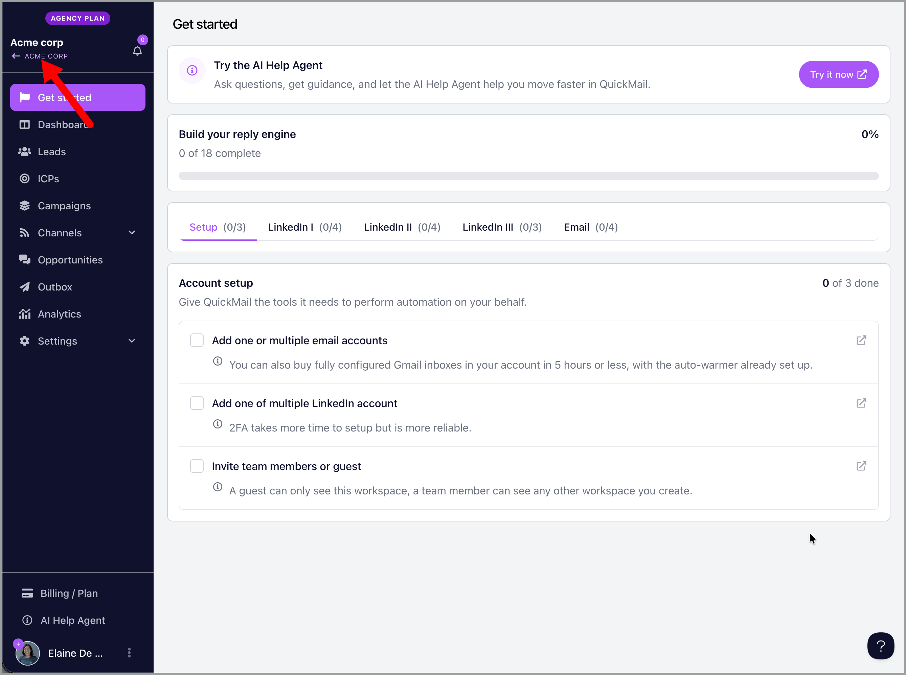

# Canceling your subscription

**

### In this account:

- [Single workspace](#Single-account-yYjEU)

- [Agency account](#Agency-accounts-fNiVP)

- [Trial account](#Trial-account-2RwZq)

- [I'm having an error canceling my subscription](#Im-having-an-error-canceling-the-account-YDfar)

## Single workspace

To cancel your workspace subscription, go to your billing page and click manage.

Then, click cancel subscription.

## Agency account

To cancel your agency subscription, go to your agency dashboard by clicking your agency name in one of the workspaces.

Then, go to -> billing -> manage.

Click cancel subscription

## Trial account

No need to cancel the account.

Once the 14-day trial expires, the account will not be charged. Instead, it will simply expire and be automatically deleted, no further action is required.

## I'm having an error canceling my subscription

- If you have Google inboxes bought from QuickMail, only support can cancel them at the moment. Please reach out to [support@quickmail.io](mailto:support@quickmail.io) to cancel your Google inboxes and subscription.

- Only email addresses admins can cancel the subscription. Please reach out to your account admin for help.
