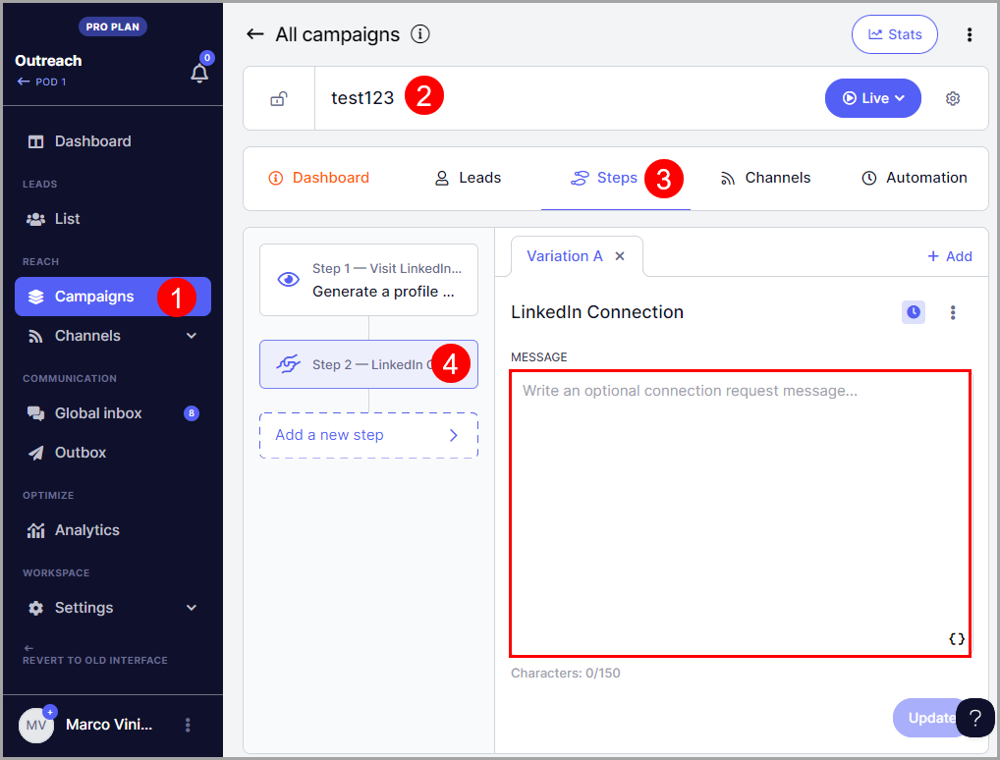

# Sending LinkedIn Connection Requests

💡 The number of LinkedIn accounts that you can add will depend on your plan. It's 1 for Basic, 5 for Pro, and 15 for Expert.

**In this article:**

- How does sending a LinkedIn connection request work?

- How many LinkedIn connection requests can I send?

- How to add a LinkedIn Connection Step to a campaign

- How to cancel a pending LinkedIn connection request

- How to see which LinkedIn account sent a connection request

- How can I change the daily limit for sending LinkedIn connection requests?

## How does sending a LinkedIn connection request work?

Two types of connection requests can be added to the Connection Request steps, personalized connection requests and blank connection requests.

With our LinkedIn Automation, you can effortlessly craft personalized connection requests and set up automated campaigns.

When a LinkedIn connection step is created, a LinkedIn Profile View step is automatically created before it. This notifies the prospect that someone has viewed their profile and makes the LinkedIn activity look less automated.

## How many LinkedIn connection requests can I send?

LinkedIn limits the number of connection requests that can be sent weekly.

In QuickMail, you can send up to 12 LinkedIn connection requests per day per LinkedIn Account to prevent the account from being suspended by LinkedIn.

If there's a need to send more, it's possible to add more LinkedIn accounts as needed without additional cost.

On the other hand, you can also set a different limit to the LinkedIn connection requests you send daily.

## How to add a LinkedIn connection step to a campaign?

- Setup LinkedIn Automation.

- From your campaign, go to Steps and click the Add Step button.

- An Add Campaign Step window will then pop up, click LinkedIn connection from it.

- Add a message that you want to send with the LinkedIn request. You can use attributes to personalize your message. Then, set whether you want the follow-ups to be sent to prospects even if they haven't accepted the connection.

**Note:** If your LinkedIn connection message exceeds 150 characters, the journey will run into an error and the request won't get sent. They won't be able to proceed to the next step until it's fixed

To fix this, you will need to shorten your LinkedIn connection request message and resume the journeys manually. (Here's a guide on canceling and resuming journeys.)

- The system checks the status of the LinkedIn connection request once a day. So when a prospect accepts the LinkedIn connection request and "Wait until the connection is accepted to resume campaign" is checked, the journey of the prospect won't move to the next step in real time.

💡**Pro tip:** You can send additional LinkedIn Messages once you've connected with the prospects.

## How to cancel a LinkedIn connection request?

To cancel a LinkedIn connection request, go to Prospects → Search for the prospect → Open prospects view → Click X to cancel pending connection request

## How to see which LinkedIn account sent the connection request?

It's possible to add multiple LinkedIn accounts in QuickMail.

To see which LinkedIn account sent the connection request, go to Sent → Search for the prospect's email or use an advanced filter to narrow down the list by category → Select a sent item

## How can I change the daily limit for sending LinkedIn connection requests?

- Go to Settings → LinkedIn → Select a LinkedIn account

- Scroll down and look for LinkedIn actions limit and throttling → Set your preferred limits

##
