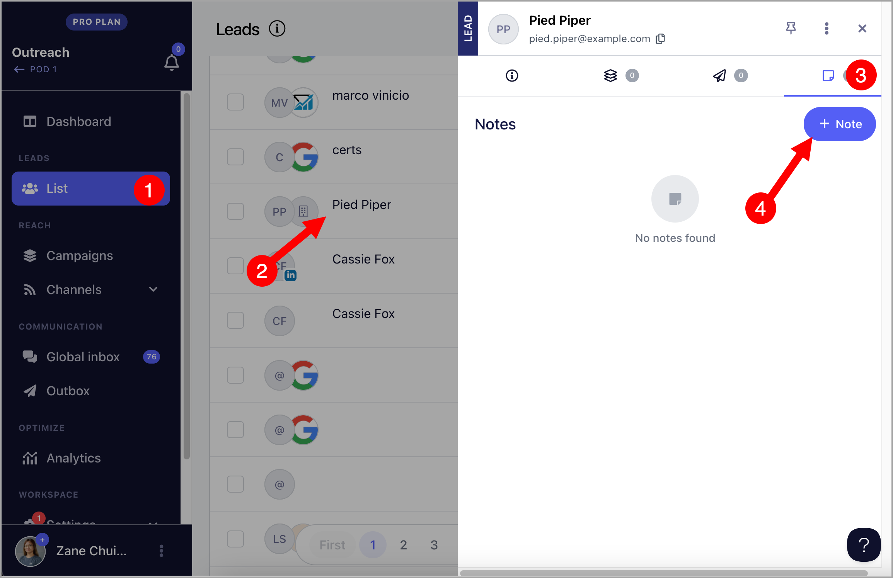
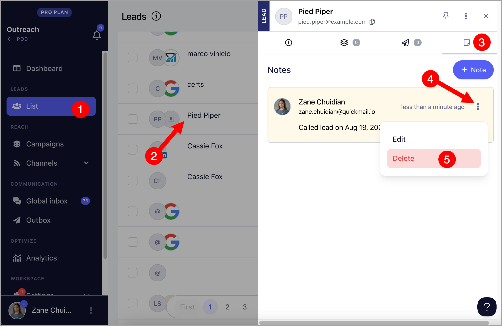

# Adding Notes

Adding notes to leads helps you communicate better, personalize interactions, and keep track of important details for more effective follow-ups and team collaboration.

## How to add notes?

Go to List → Click on a Lead → Go to the notes tab → Add Note

## How to add notes?

Go to List → Click on a Lead → Go to the notes tab → Click on the ellipsis on a specific note → Delete → Confirm delete

