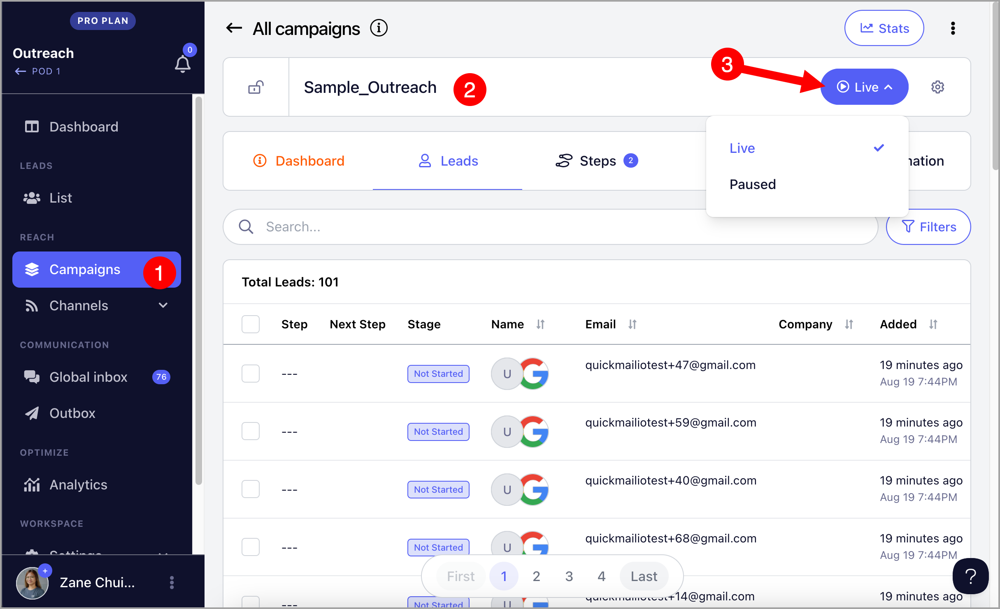
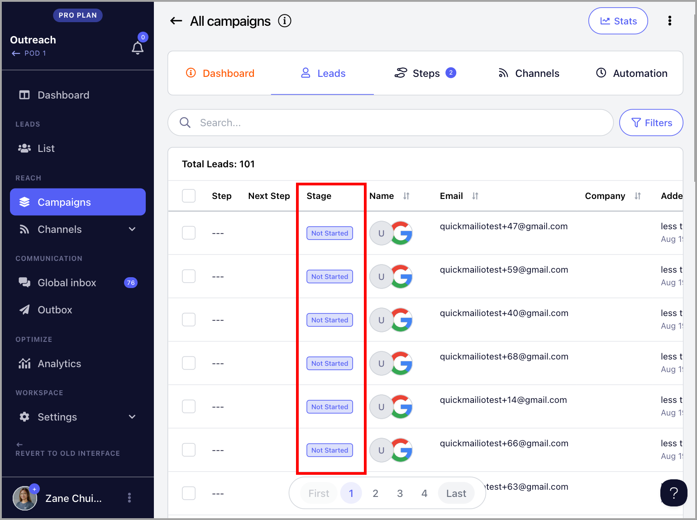
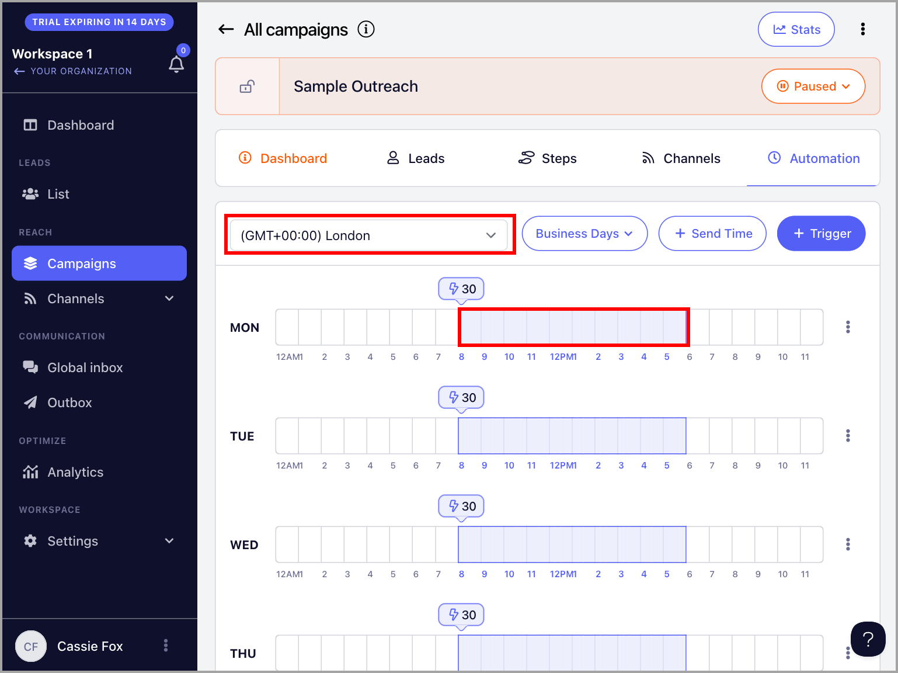
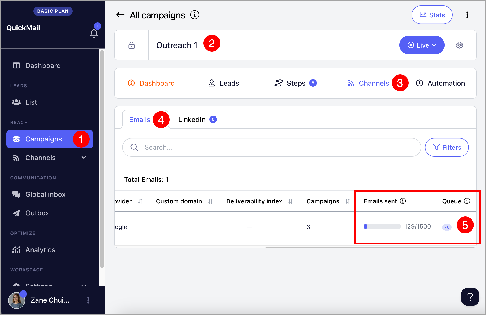
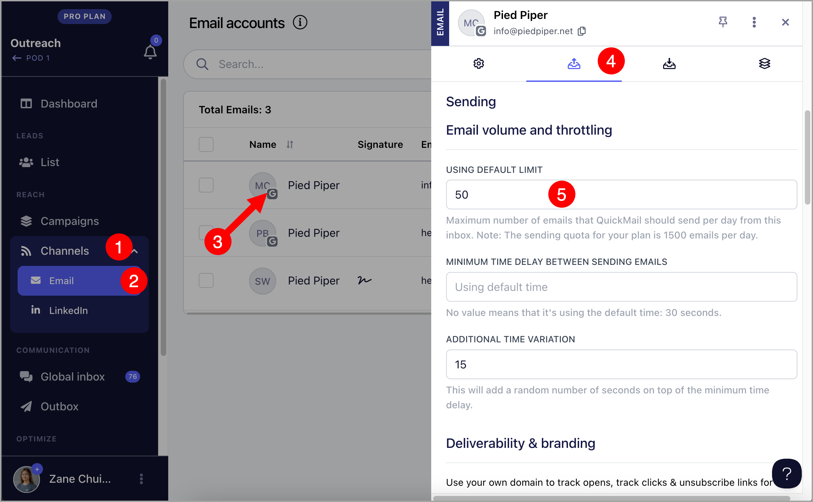
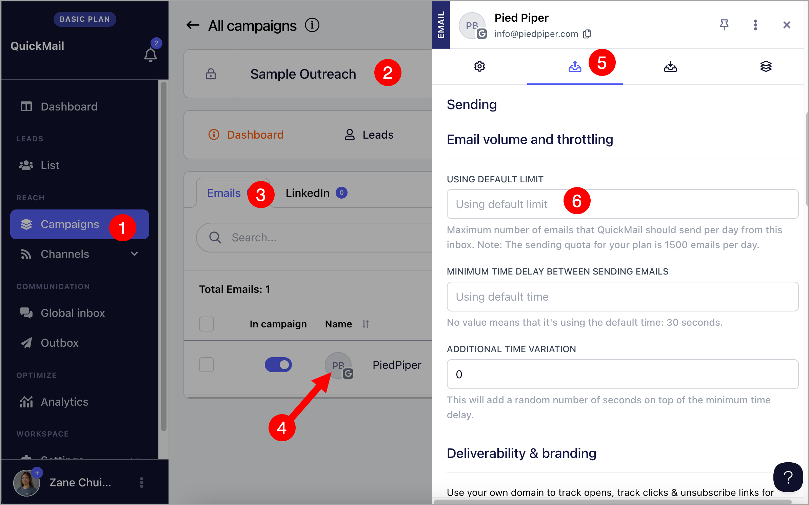
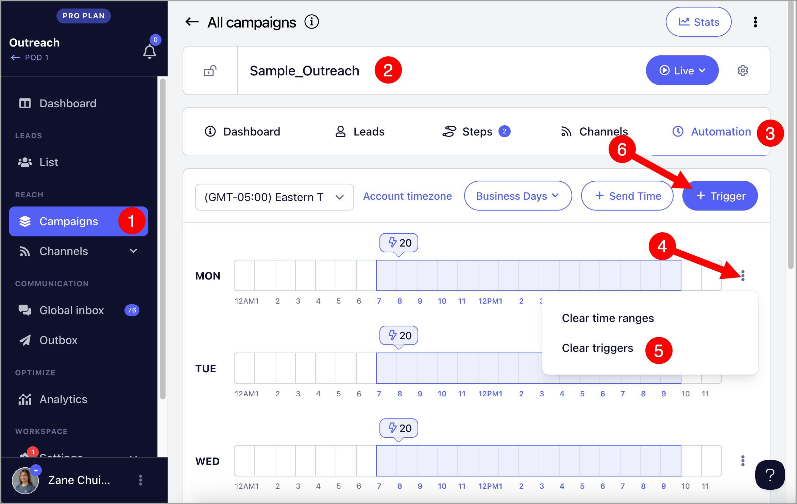
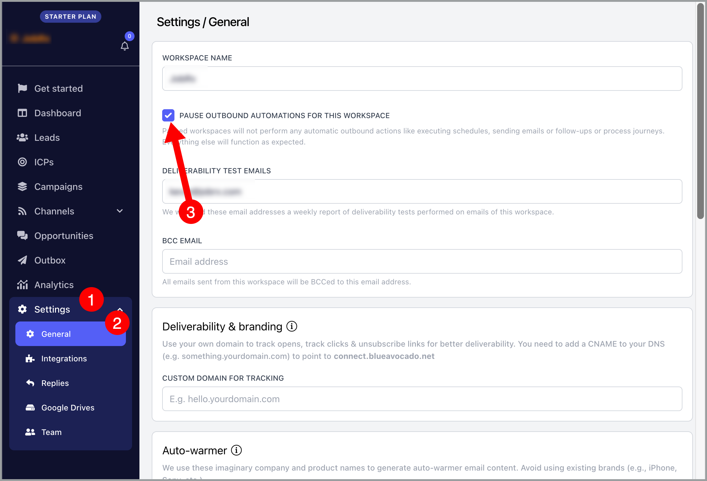

# Troubleshooting: Campaign/Inbox is not sending

There are several reasons why a campaign may not be sending emails. Here are some of the most common ones:

- ## Campaign is paused

When campaign is paused, no emails will be sent and Triggers won't also run.

**Solution: **To set the campaign live, go to the campaign → click the Paused button → set live

- ## Leads have not yet started

When leads are added to the campaign, their status will be on "Not Started" status.

Solution: **To start sending emails, the leads must be started . This can be done manually to start sending emails right away or by setting up Triggers.

- ## Triggers were created after the scheduled time for the day

Triggers allow users to automate when and how many leads start a campaign. However, they cannot be applied retroactively.

For example, if Triggers are set up or edited at 12 PM but scheduled to start leads at 9 AM, they will only take effect the next day because today's Triggers (9 AM) has already passed.

Solution 1: **If you'd like to start sending emails immediately, it's possible to manually start the leads

**Solution 2: **Create a temporary Trigger. When creating a Trigger, make sure to allow at least 15 minutes, as it sometimes takes time for the system to sync new Triggers.

**Solution 3:** Wait for the next scheduled Trigger to run

- ## Not enough time allowance when creating Triggers

It sometimes takes time for the system to sync new Triggers.

Solution**: When creating a Trigger, make sure to allow at least 15 minutes.

For example, if you want to start new leads at 9 AM on the same day, create the Trigger by 8:45 AM. Otherwise, wait for the next scheduled Trigger.

- ## Send times doesn't allow sending emails

Send times control when the campaign is allowed to send emails. If it's outside send times, no emails will be sent despite being queued.

To see the Send Times and Timezone, go to the campaign → Automation

- ## Email account for sending has reached the daily limit

When an email account reaches its daily sending limit, it will stop sending emails until the limit resets.

Technically, emails are sent on a first-come, first-served basis. This means the inbox will prioritize sending emails that are first in the send queue.

If several campaigns have emails due on the same day, follow-ups may wait in the queue until the next allowed send window / quota reset.

To check for the number of emails that have been sent and those queued to be sent, go to the campaign → Channels → Emails → Scroll to the right to see queue

To check for the daily email limit of the email account, go to Channels → Click on an email account to open inbox settings → Sending tab → Default limit

It's also possible to access the inbox settings by clicking on an email account under Channels in the Campaign.

To prevent and fix the issue caused by insufficient inbox daily sending limits, you have a few options:

- You can slightly increase the daily email limit so the inbox has more sending capacity.

- You can add additional email accounts to distribute and handle a higher sending volume.

- Alternatively, you can reduce the number of leads entering the campaigns via Triggers, so the inbox has enough capacity to handle both new emails and follow-ups at the same time.

This will help ensure follow-ups are sent on time without being queued or delayed.

To change the number of leads in the Triggers, go to the Automation page in the campaign → Clear triggers → Add new triggers

**Pro Tip:** You can copy and use[this calculator](https://docs.google.com/spreadsheets/d/1YmM0d3M6nlBLRcNcT_hCRf8Gatfnj8XTXYL9ZyZ5vUU/edit?usp=sharing) to see the ideal number of leads to add to your campaignTriggers.

- ## Workspace is paused

When a workspace is paused, no leads and automation will be processed. This includes triggers, sending the emails, leads moving to the next step, and others.

To solve the issue, please go to the general settings of your campaign and uncheck the checkbox "pause outbound automations for this workspace."

