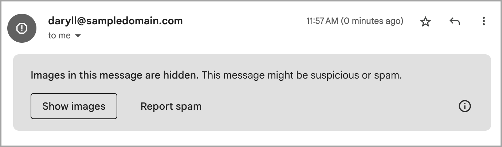
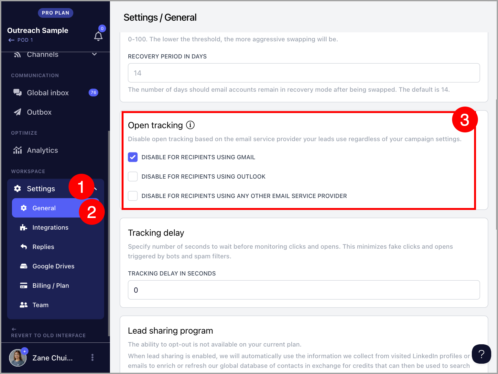

# Disabling open tracking based on recipient email provider

**

**NEW ✨**We recently rolled out Visible Image Tracking in addition to disabling open tracking as another solution to Gmail's latest spam policies

Gmail is now flagging emails with images, including tiny pixels used for open tracking in cold outreach.

Recipients see a banner that says, “Images in this message are hidden,” along with a prominent “Report spam” button, which could reduce reply rates and increase spam reports.

To address this, we've added a new feature in QuickMail that keeps open tracking enabled, but automatically disables it for emails sent to Gmail (or other email providers)

**

## How does it work?

By default, QuickMail inserts a tiny, invisible tracking pixel into your emails. When the recipient opens the email, this pixel loads, letting us know that the email has been read.

With this new feature, you can choose to exclude this tracking pixel for Gmail, Microsoft, or other email providers.

Meaning, the warning message won’t appear for recipients from the selected providers. It also means that opens for these emails won’t be tracked and won’t count towards your campaign's open rate.

However, you will still be able to track opens from the email providers you choose not to exclude.

Note:** Click, reply, bounce, and unsubscribe tracking will still work as usual.

**

## How to set it up?

Go to your workspace settings → General → Tick the box next to the recipient email provider for which you want to disable open tracking. Once disabled, the feature will take effect immediately.

Note: **When tracking is re-enabled, it can no longer track emails that were sent without the pixel.
