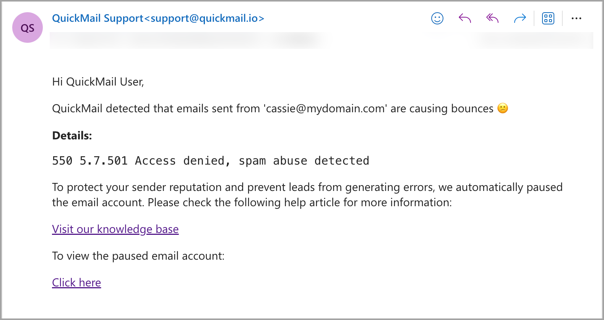
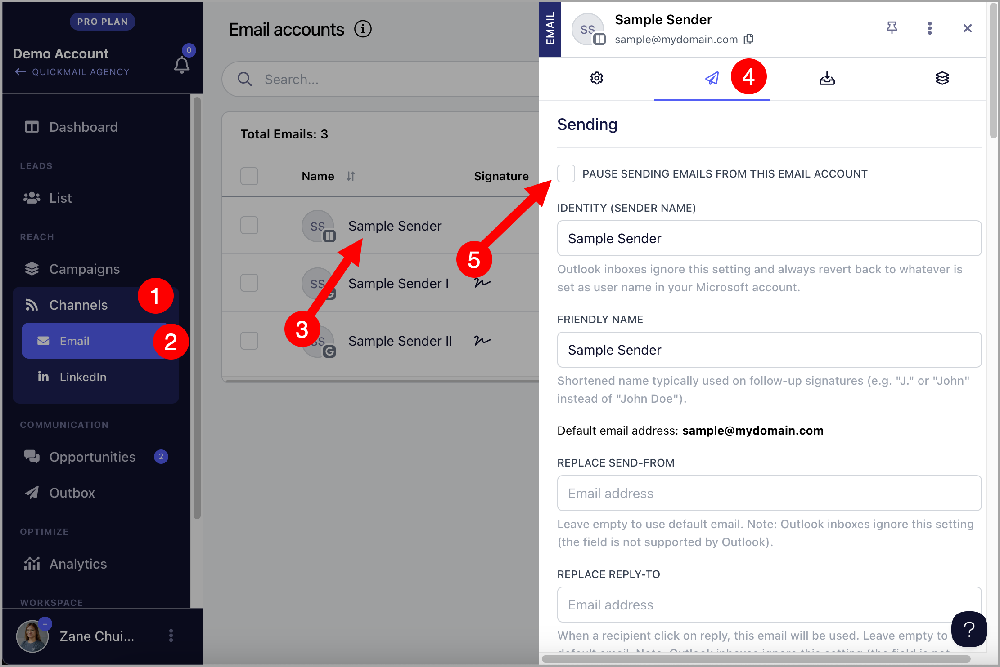

# Troubleshooting: Handling Sender-Related Bounces

**In this article:**

- Understanding Bounce Codes and Solutions

- What Happens When These Bounces Occur?

- Common Bounce Codes and Their Meaning

- How to Continue Sending Emails?

- Preventing These Bounce Codes

This guide focuses on **sender-related bounces**, which are issues you can directly manage, such as authentication errors, sending reputation, or email volume limits.

While recipient bounces do occur, our solutions are tailored to the sender side, where you have control. For recipient-related bounces, visit our Why Emails Bounce** article.

## Understanding Bounce Codes and Solutions

Bounce codes help explain why an email wasn’t delivered. They’re important for diagnosing issues and figuring out if the problem is on the sender’s or recipient’s end.

The bounce codes indicated in the table below are related to the sender, meaning they’re due to issues with the sender’s email, IP, or domain.

## What Happens When These Bounces Occur?

When sender-related bounces are detected from an email account, the system will automatically pause the email account to prevent further bounces.

An email notification will be sent to the sending account and admins, informing them that the account is causing bounces and providing the detected bounce code.

## Common Bounce Codes and Their Meaning

Bounce Code
Description

5.1.8 – Access denied, bad outbound sender
Indicates that the sender’s email or domain is blocked due to a poor reputation or blacklisting.

5.1.90 – Your message can’t be sent because you’ve reached your daily limit for message recipients
This happens when the sender exceeds the daily message limits set by the email provider.

5.2.121 – Recipient’s per hour message receive limit from specific sender exceeded
The recipient has a limit on how many messages they can receive from a specific sender in a given period.

5.7.501 – Access denied, spam abuse detected
The sender’s account or IP is flagged for spam or abuse.

5.7.502 – Access denied, banned sender
The sender has been banned from sending emails to this recipient.

5.7.506 – Access denied, bad HELO
The sending server’s identification (HELO) is invalid or misconfigured.

5.7.508 – Access denied, IP has exceeded permitted limits
The sender’s IP address has sent too many emails within a specified range and is temporarily blocked.

5.7.509 – Access denied, sending domain does not pass DMARC verification
The sender’s domain failed DMARC verification, and the recipient’s email system rejected the email based on their DMARC policy.

5.7.703 – Messages blocked by the recipient’s organization
The recipient’s organization has blocked emails from the sender’s domain.

5.7.705 – Access denied, tenant has exceeded the threshold
The sender’s email service provider has reached a specific sending threshold, causing emails to be blocked.

5.7.750 – Client blocked from sending from unregistered domains
The sender’s domain is not properly registered and has been blocked from sending emails.

## How to Continue Sending Emails?

To continue sending emails, your email account must be unblocked by your email provider. This can only be accomplished by contacting them, as we do not have direct access to do so.

Once the email account is unblocked, make sure to unpause it in QuickMail. To do this, go to Channels → Email Accounts → Click on the paused email account → Sending tab →

## Preventing these bounce codes

To prevent future bounces, consider the following practices:

•Warm Up New Accounts**: Gradually increase sending volumes when using new email accounts to avoid spam flags. Check out our guide on using the Auto-Warmer: [Integrating Mailflow with QuickMail](#).

•**Fix Your Domain Reputation**: Make sure your domain isn’t blacklisted. Use tools like MXToolbox to check your domain or IP reputation, and if you’re on a blacklist, request removal.

•**Follow Sending Limits**: Stick to the daily sending limits of your email provider, especially when scaling up campaigns.

•**Set Up DMARC, SPF, and DKIM**: Make sure your domain is properly configured with SPF, DKIM, and DMARC to pass authentication and improve deliverability. [Learn more here](#).

•**Avoid Spam Triggers**: Use spam-checking tools to ensure your email content isn’t triggering filters. Add text variations and avoid spammy words. Check out: [Text Variations](#).

•**Use Reword with AI**: Reword your emails using AI to keep content fresh and avoid repetition. Rewording with AI

•**Maximize Email Deliverability with QuickMail: ** QuickMail is a cold email platform focused on email deliverability, offering a range of features to optimize outreach and boost success rates. Here's a list of other tool that our users can leverage to enhance their email deliverability: Maximizing Email Deliverability in QuickMail

By understanding these bounce codes and addressing the issues, you’ll keep your sender reputation strong and ensure smoother email delivery in the future.
