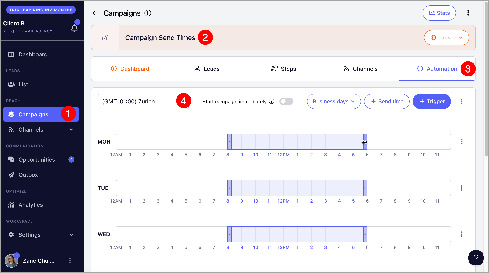
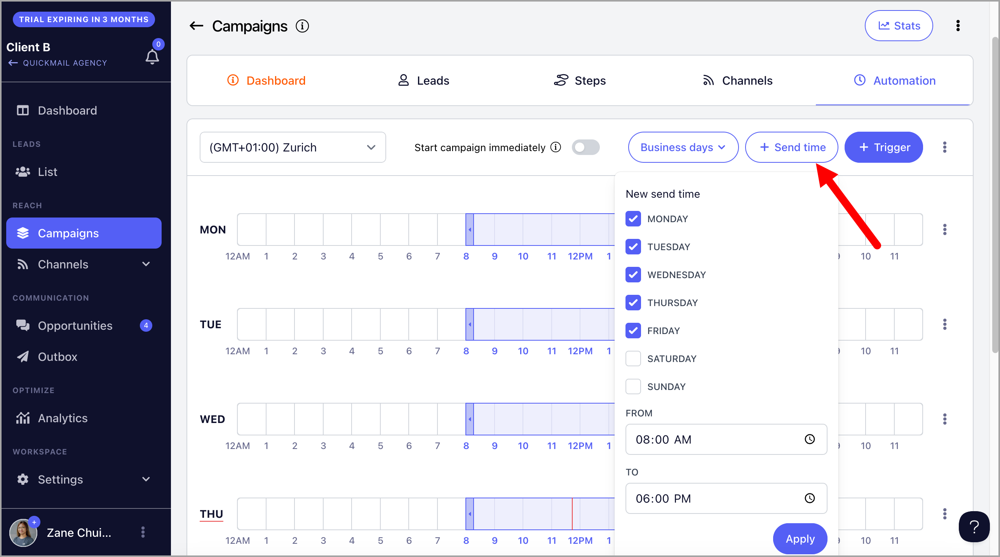
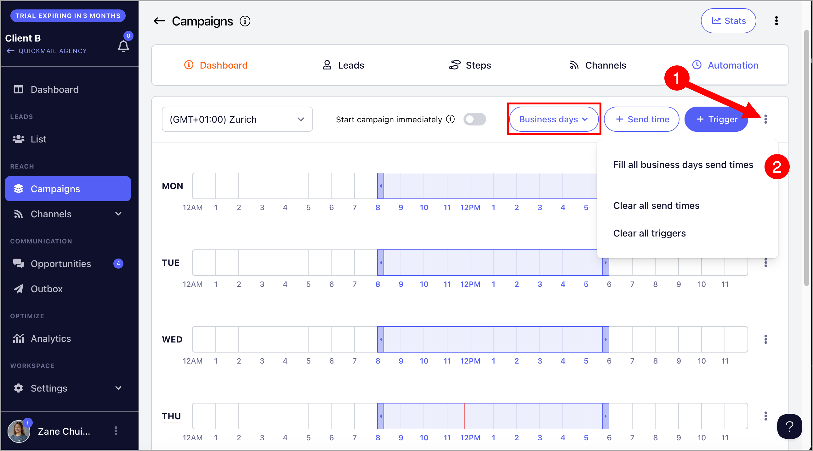
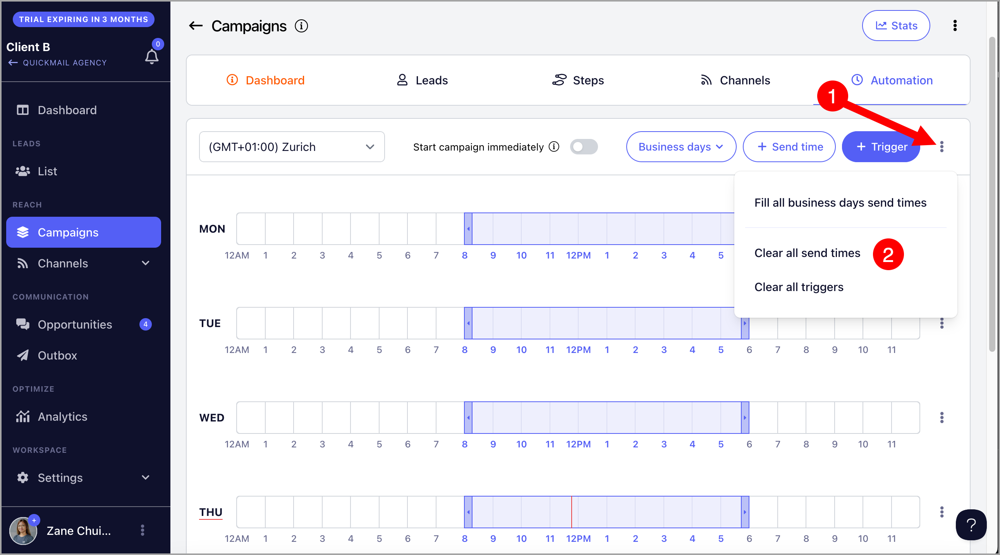

# Optimizing Send Times

**In this article:**

- What are Send Times for?

- How to Modify Send Times?

- How to Clear Send Times?

## What are Send Times for?

Send Times allows users to control when the campaign sends emails, helping to avoid sending at midnight or on weekends. The default Send Times for a campaign are set from 8 AM to 6 PM, Monday to Friday, based on the timezone in which the account was created.

## How to Modify Send Times?

First, go to your preferred campaign →  Automation tab → Make sure to select your preferred timezone.

After that, drag the send times as you prefer.

Alternatively, you can click on the 'Send time' button and enter your preferred Send Times

If you’d like to allow the campaign to send emails at any time during business hours, it's easier to click on the menu next to Triggers and click "Fill All Business Days Send Times."

**Tip:** The red line in Send Times indicates the current day and time.

## How to Clear Send Times?

To clear send times for a specific day, click on the menu for that day and select 'Clear Send Times.

Meanwhile, to clear all send times , it's easier to click on the menu next to Triggers and select "Clear All Send Times."

